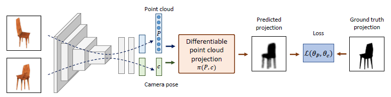
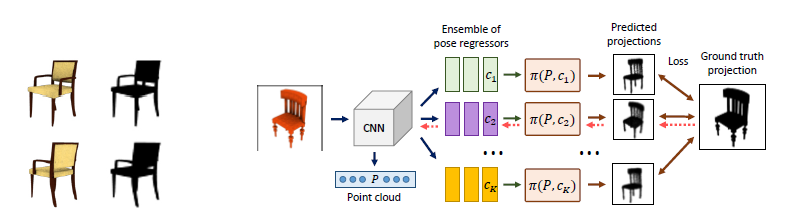
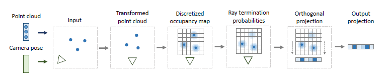
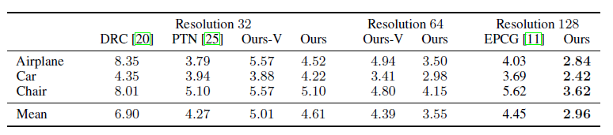
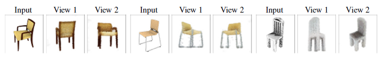
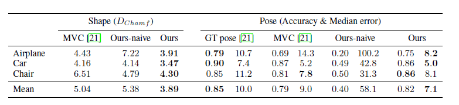
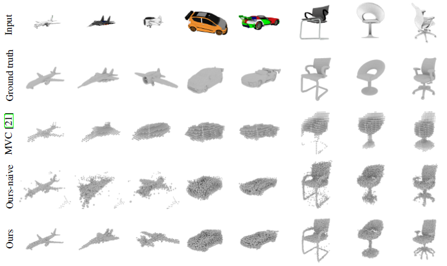
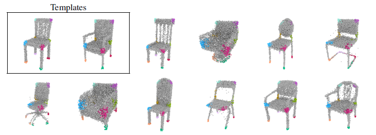

# Unsupervised Learning of Shape and Pose with Differentiable Point Clouds
> 利用可微点云进行形状和姿态的无监督学习

***
### 概述

我们解决了从一组 **未标记的特定类别的图像** 中学习精确的3D形状和相机姿态的问题。我们训练卷积网络，通过最小化重投影误差，从一张图像中预测形状和姿态: 给定 **一个对象的几个视图**，预测的形状到预测的相机姿态的投影应该与提供的视图相匹配。为了处理位姿不确定性，我们引入了一个位姿预测器集合，然后将其提取到单个“student”模型中。为了有效地学习高保真形状，我们通过点云来表示形状，并设计一个公式来允许这些形状的可微分投影。我们的实验表明，经过提取的位姿预测器集合能够准确地估计位姿，而点云表示能够预测详细的形状模型。

***
### 简介

给定一组物体的视图和相应的摄像机姿态，这些方法通过重投影误差学习三维形状：给定一个估计的形状，可以将它投射到已知的摄像机视图并与提供的图像进行比较。这些生成的投影与训练样本之间的差异为改进形状估计提供了训练信号。这种类型的现有方法有两个一般限制

1. 方法假设 **摄像机的姿势对于所有提供的图像都是已知的**。这是一个现实的和生物学上不现实的假设:一个典型的智能体只能访问它的观测结果，而不能访问它相对于世界上的物体的精确位置

2. 形状被预测为 **低分辨率**(通常是32^3个体素)体素化的体积。这种表示法只能描述物体非常粗糙的形状。应该可以从2D监督中学习更精细的形状细节

在这篇论文中，我们学习高保真形状模型仅仅从他们的投影，没有地面真理相机的姿势。这种设置之所以具有挑战性，有两个原因

1. 估计形状和姿势是一个鸡生蛋还是蛋生鸡的问题，没有一个良好的形状估计是不可能学习准确的姿态，因为预测将是没有信息。反之亦然，准确的姿态估计是学习形状的必要条件。

2. 姿态估计很容易因为模糊而导致局部极小值:一个对象可能从两个视点看起来很相似，如果网络在所有情况下都收敛于预测其中一个，那么它将无法学习预测另一个

我们发现，通过 **联合优化形状和姿态预测器**，可以很好地解决第一个问题。即使使用相对嘈杂的姿态预测，也可以学习好的形状估计。然而，第二个问题导致了姿态估计的严重错误。为了解决这个问题，我们训练了一组不同的姿态预测器，并将它们提取到一个student模型中。

为了使学习点云不需要明确的3D监督，我们实现了一个可微分投影算子，给定一个点集和一个摄像机姿态，生成一个2D投影——一个剪影、一个彩色图像或一个深度地图。我们评估提出的方法在估计形状和相机位姿的任务从一个单一对象的图像。该方法成功地学会了预测形状和姿态，与使用地面真实摄像机姿势训练的模型相比，只有轻微的性能下降。我们演示了从轮廓中学习点云，如果彩色图像在训练中可用，我们将用彩色图像增强这些点云。最后，我们将展示点云表示如何自动发现对象之间的语义对应。

***
### 相关工作

* Cashman和Fitzgibbon使用轮廓和关键点注释从小型类特定的图像集合中重建可变形的形状模型  
  ---- 2013

* Vicente 将类似的方法应用于大型Pascal VOC数据集  
  ---- 2014

* Tulsiani 利用电脑视觉技术减少所需的监督
  ---- 2017

然而，他们很难表现出复杂多样的形状。

* Loper和Black实现一个可微分的渲染器，并将其应用于分析合成  
  ---- 2014

我们的工作在精神上是相似的，但操作在点云上，并将可微渲染的思想与深度学习相结合。

* Yan等人通过基于沿射线选择最大占用值的投影操作，从剪影中学习3D形状  
  ---- 2016

* Tulsiani等人设计了一个基于射线碰撞概率的可微公式，并将其应用于从轮廓、深度图、彩色图像和语义分割图中学习  
  ---- 2017

* Lin等人用深度图表示点云，并使用高分辨率网格和反深度最大池重新投影点云  
  ---- 2018

* Kato等人提出了一个可微分网格渲染器，并使用它来学习基于网格的物体形状表示  
  ---- 2018

所有这些方法都需要与用于训练的2D投影相对应的准确的GT摄像机姿态。本文方法在预测中学习。

* Rezende等人探索了几种基于2D视图的3D形状生成建模方法，其中一种方法不需要知道GT摄像机姿态;然而，它仅在一个简单的几何基元纹理数据集上进行了演示
  ---- 2016

* Multi-view consistency as supervisory signal for learning shape and pose prediction，该工作将可微射线一致性公式(2017)扩展到无姿态监督的学习，该方法是基于体素的，利用强化学习和基于gan的先验处理无监督位姿学习的复杂性  
  ---- 2018

相比之下，我们使用点云表示，使用集合来预测姿态，并且不需要相机姿态的先验。

***
### 单视图形状和姿态估计

我们有一个数据集 $D$ ，其中由 $K$ 个物体各个视角，第 $i$ 个物体有 $m_i$ 个可用视角：
$$D=\bigcup^K_{i=1}\{\langle x^i_j,p^i_j\rangle\}^{m_i}_{j=1}$$
其中 $x^i_j$ 表示一个彩色图像， $p^i_j$ 表示在相同视角下某种形态的投射(彩色图像的剪影，深度图)。

  

  图1：给定同一物体的两个视图，我们预测相应的形状(用点云表示)和摄像机姿态。然后利用可微投影模块从预测的摄像机姿态生成预测形状的视图。该合成投影与GT视图的不同之处作为训练信号

假设我们有两幅相同物体的图像 $x_1$ 和 $x_2$。我们使用参数函数逼近器来预测其中一个的三维形状 $\hat P_1=F_P(x_1,\theta_P)$ 和另一个的相机位姿 $\hat c_2=F_c(x_2,\theta_c)$。$F_P$ 和 $F_c$ 都是卷积网络且共享大部分参数。利用全连通层将形状和位姿作为定长向量进行预测。

根据预测，我们从预测视图呈现预测的形状 $\hat p_{1,2}=\pi(\hat P_1,\hat c_2)$，其中 $\pi$ 表示可微点云渲染器。损失函数就是这个预测的投影与GT之间的差值。我们在这项工作中使用标准的MSE对所有的模式，整个数据集求和

$${\cal L}(\theta_P,\theta_c)=\sum_{i=1}^N\sum_{j_1,j_2=1}^{m_i}\lVert\hat p^i_{j_1,j_2}-\hat p^i_{j_2}\rVert^2$$

**Estimating pose with a distilled ensemble**。我们发现上面描述的基本实现并不能预测准确的姿态。这是由局部极小值引起的:位姿预测器收敛于估计从后面看到的所有对象，或从前面看到的所有对象。

  

  图2：左侧为姿势的歧义。右侧为提出的一种解决模糊度问题的位姿回归分析方法。网络预测了一个多样化的候选人集合 $\{c_k\}^K_{k=1}$ 每一个都用来计算预测点云P的投影。权重更新(以红色虚线表示的向后传递)仅对生成与GT最匹配的投影的候选姿态执行。

缓解这一问题，而不是单一姿态回归 $F_c(\cdot,\theta_c)$ ，提出了一组K位回归量 $F_c^k(\cdot,\theta_c^k)$ 并用'hindsight' loss来训练系统。

$${\cal L}_h(\theta_P,\theta_c^1,\cdots,\theta_c^K)=\min_{k\in[1,K]}{\cal L}(\theta_P,\theta_c^k)$$

这个想法是，每一个预测者都学会了专注于姿势的一个子集，他们一起涵盖了所有可能的值。不需要特殊的措施来确保这种专门化:如果网络体系结构合适，它自然会作为随机权重初始化的结果出现。也就是说，不同的位姿预测器需要有几个(根据我们的经验，至少有3个)非共享层。

在训练时根据上式确定损失，在测试时抛弃了集合，并使用蒸馏回归估计相机姿态。训练student的损失被计算为由四元数表示的两个旋转之间的角差 $L(q_1,q_2)=1-Re(q_1q_2^{-1}/\lVert q_1q_2^{-1}\rVert)$ ，其中 $Re$ 表示四元数的实部。我们发现标准MSE损失在回归旋转时表现较差。

**网络结构**。我们用一个具有两个分支的卷积网络实现了形状和姿态预测器。网络由一个卷积编码器开始，共7层，其中4层步长为2。然后是两个共享的全连接层，然后网络分成两个分支进行形状和姿态预测。形状分支是一个带有一个隐藏层的MLP。N个点的点云被预测为维数为3N(点位置)或6N(位置和RGB值)的向量。位姿分支是一个MLP，每个位姿预测器都有一个共享隐藏层和两个隐藏层。摄像机的姿态被预测为四元数。在集成模型中，我们使用K = 4位姿预测器。“student”模型是具有相同架构的另一个分支。

***

### 可微点云

给一个点云 $P$ 和一个相机姿势 $c$，生成一个视角 $p=\pi (P,c)$。点云可能有一个与之相关的信号，比如颜色，在这种情况下，可以将信号投射到视图中。

该方法的高层次思想是通过用密度函数表示点来平滑点云。形式上，我们假设点云是N个元组的集合 $P=\{\langle x_i,s_i,y_i\rangle\}^N_{i=1}$ ，每一组包含点的位置 $x_i=(x_{i,1},x_{i,2},x_{i,3})$，尺寸参数 $s_i$ 和相关信号 $y_i$ (例如RGB颜色)。在我们的大多数实验中，尺寸参数是一个二维向量，包括各向同性高斯分布的协方差和一个比例因子。然而，一般情况下，$s_i$ 可以表示任意的参数分布:例如在附录中，我们展示了用一个完整协方差矩阵的高斯函数进行的实验。尺寸参数可以手动指定，也可以与点位置一起学习。

  

  图3 点云的可微渲染，为了演示，我们展示2d到1d的投影，但实际上我们执行3d到2d的投影。根据摄像机参数对点进行变换、平滑和离散。我们以光线追踪的方式来执行遮挡推理，最后以正射投影出结果。

我们首先通过与感兴趣的摄像机姿态c相对应的投影变换 $T_c$ 将点的位置转换为标准坐标系 $X^{'}_i=T_cx_i$。转换 $T_c$ 同时考虑了相机的外部参数和内部参数。我们还计算了变换后的尺寸参数 $s^{'}$ (确切的转换规则取决于使用的分布)。我们建立了摄像机变换矩阵，使变换后的投影等于沿第三轴的正射投影。

为了允许梯度流，我们表示每个点 $\langle x_i,s_i\rangle$ 通过一个平滑函数 $f_i(\cdot)$。在这项工作中，我们设置 $f_i$ 为比例高斯密度。点云的占用函数是每个点函数的压缩和。

$$o(x)=clip(\sum^N_{i=1}f_i(x),[0,1]), \qquad f_i(x)=c_iexp\big(-\frac{1}{2}(x-x^{'}_i)^T\Sigma^{-1}_i(x-x^{'}_i)\big)$$

其中 $\langle c_i,\Sigma_i\rangle=s_i$ 是尺寸参数。我们把得到的函数离散成一个分辨率网格 $D_1\times D_2\times D_3$。注意，第三个索引对应于投影轴，索引1是离摄像机最近的，而D3是离摄像机最远的。

在将结果体投影到平面之前，我们需要确保来自被遮挡点的信号不会干扰前景点。为此，我们使用一种可微分的射线跟踪公式来执行遮挡推理，类似于Tulsiani等人。我们把被占据状态 $o$ 转换成射线终止概率 $r$ 如下

$$r_{k_1,k_2,k_3}=o_{k_1,k_2,k_3}\prod^{k_3-1}_{u=1}(1-o_{k_1,k_2,u}) \quad if \ k_3 \leq D_3, \quad r_{k_1,k_2,D_3+1}=\prod^{D_3}_{u=1}(1-o_{k_1,k_2,u})$$

直观地说，单元具有很高的终止概率 $r_{k_1,k_2,k_3}$ 如果它的占有概率 $o_{k_1,k_2,k_3}$ 很高并且所有前面的占有概率 $\{o_{k_1,k_2,u}\}_{u\leq k_3}$ 很低。额外的背景单元格 $r_{k_1,k_2,D_3+1}$ 服务以确保终止概率之和为1。

最终，我们把体积投射到平面上

$$p_{k_1,k_2}=\sum^{D_3+1}_{k_3=1}r_{k_1,k_2,k_3}y_{k_1,k_2,k_3}$$
为了获得轮廓，我们设置 $$
其中 $y$ 表示被投射的信号，定义了结果的形式。为了获得轮廓，我们设置 $y_{k_1,k_2,k_3}=1-\delta_{k_3,D_3+1}$。对于深度图，我们设置 $y_{k_1,k_2,k_3}=k_3/D_3$。最后，为了投影与点云相关的信号y，比如颜色，我们将y设置为归一化信号分布的离散版本 $y(x)=\sum^N_{i=1}y_if_i(x)/\sum^N_{i=1}f_i(x)$。

#### 实现细节

从技术上讲，该算法最复杂的部分是将点云转换为体积。我们已经尝试了这一步的两种实现一种是简单灵活的(我们称之为 **basic**)，另一种则不那么灵活，但效率高得多(我们称之为 **fast**)。在较高的层次上，在basic实现中，每个函数 $f_i$ 都在单独的体积网格上计算，并对结果进行求和。这样可以灵活地选择函数类，但是会导致计算和内存需求随点N的数量和网格V的体积线性增长，从而导致复杂度O(NV)。快速版本的扩展更加优雅，比如O(N + V)。这是以对所有函数使用相同的内核为代价的。fast实现分两个步骤执行操作:首先用三线性插值将所有点放在网格上，然后与核函数进行卷积。(附录A.2)

***
### 实验

#### 实验设置

**数据集**。ShapeNet。关注了三种通用类别：椅子，车和飞机。将模型分解为训练集、验证集和测试集，并使用随机光源位置和随机相机方位角和仰角呈现每个模型的5个随机视图，分别从 $[0^\circ,360^\circ)$ 和 $[-20^\circ,40^\circ]$ 均匀采样。

**评价标准**。我们使用倒角距离作为主要的评价指标，因为它已经被证明与人类对形状相似度的判断有很好的相关性。给一组 GT 点云 $P^{gt}=\{x^{gt}_n\}$ 和一组预测点云 $P^{pr}=\{x^{pr}_n\}$ ，距离被定义为:

$$d_{Chamf}(P^{gt},P^{pred})=\frac{1}{\lvert P^{pr}\rvert}\sum_{x^{pr}\in P^{pr}}\min_{x\in P^{gt}}\lVert x^{pr}-x\rVert_2+\frac{1}{\lvert P^{pt}\rvert}\sum_{x^{gt}\in P^{gt}}\min_{x\in P^{pr}}\lVert x^{gt}-x\rVert_2$$

第一个和通过计算离预测值最近的GT点的平均距离来评估预测值点云的精度。第二个和通过预测点云度量GT的覆盖范围:最接近的预测点到地面真实度点的平均距离。

为了测量姿态误差，我们使用与Tulsiani等人相同的测量方法。**准确性**(预测的角度与GT相差三十度以内的样本比例)和 **中值误差**(角度)。在开始姿态和形状评估之前，我们使用迭代最近点(ICP)算法对验证集中的前20个模型，将网络学习到的标准位姿与数据集中的标准位姿对齐。更多的细节在附录中提供(A.3)

**训练细节**。我们使用Adam优化器对网络进行了60万次mini-batch迭代的培训。我们使用了16个样本的mini-batch(4个对象的4个视图)。我们使用固定的学习率0.0001和标准的动量参数。我们在大多数实验中使用快速投射法，除非另有说明。我们根据用于监督的GT投影的分辨率来改变点云中的点数量和投影操作中使用的体积分辨率。我们使用与训练样本同侧的体块(例如，$64^2$个投影使用 $64^3$ 个体块)，$32^2$ 个投影使用2000个点，$64^2$ 个投影使用8000个点，$128^2$ 个投影使用16000个点。

在预测稠密点云时，我们发现将 **dropout** 应用到网络的预测中是很有用的，可以确保点在形状上的均匀分布。仅选择所有预测点的子集进行投影和损失计算时的dropout效应。在5.2节和5.3节中报告的实验中，我们从一个非常高的90%的dropout率开始，并在训练结束时线性减少到0。我们还实现了一个点大小参数的调整，在训练过程中从投影体积大小的5%线性减少到0.3%。所有的实验都学习了点的尺度系数。消融研究见附录(B.1)。

**计算效率**。对于32的分辨率，训练时间大致相同。对于64的分辨率，我们的方法训练时间大约为1天，而基于体素的对应方法训练时间为2.5天。对于128的分辨率，我们的方法的训练时间是3天，而基于体素的方法不适合12Gb的GPU内存与我们的批量大小。

#### 用已知姿态估计形状

**与基线进行比较**。Perspective Transformer Networks (PTN)、Differentiable Ray
Consistency (DRC)、Efficient Point Cloud Generation (EPCG)。PTN和DRC只适用于32输出体素网格分辨率。EPCG使用点云表示。

  

  表1 利用已知摄像机姿态进行形状预测的定量结果。我们报告归一化点云之间的倒角距离，乘以100。我们的基于点云的方法(我们的)比基于体素的方法(我们的-v)表现更好，并且得益于更高分辨率的训练样本。

总的来说，这是我们最好的模型(分辨率为128)与最佳基线相比，平均误差降低了30%。

我们的模型在EPCG点云方法的基础上实现了50%的改进，尽管它经过了深度图的训练，与我们的模型使用的轮廓相比，这是一个更强的监督。当只训练剪影监督时，EPCG的平均误差达到8.20，是我们的模型的2.7倍。我们相信我们的模型是比较成功的，因为我们的渲染程序是可微分的w.r.t所有三个点的坐标，而Lin等人的方法只有w.r.t的深度。

**彩色点云**。我们的配方支持培训与其他监督剪影，例如，颜色。我们用我们的方法证明了学习彩色点云的定性结果。尽管不同视图之间的光照和阴影变化带来了挑战，但是该方法能够正确地学习彩色点云。对于具有复杂纹理的对象，预测的颜色会变得模糊(最后一个例子)。

  

  图4 学习彩色点云。最好在屏幕上观看。我们展示了输入图像，以及来自其他视图的两个预测点云的渲染图。一般的颜色保存得很好，但细节可能会丢失。

**协方差**。在上述实验中，我们学习了所有点都具有相同的各向同性协方差矩阵的点云。我们进行了额外的实验，利用点位置联合学习协方差矩阵，允许更灵活地表示形状。结果报告在附录中(B.3)。

#### 估计形状和姿态

我们现在放弃了不切实际的假设，即在训练和实验中使用ground truth相机姿态来预测形状和相机姿态。在这些实验中，我们使用64像素分辨率的ground truth作为我们的方法。与Multi-View Consistency (MVC)比较。

  

  表2 形状和姿态预测的定量结果。每个指标的最佳结果以粗体突出显示。我们的方法的朴素版本可以很好地预测形状，但不能准确地预测姿态。完整的版本可以很好地预测形状和姿势

我们的朴素模型(Ours-naive)学习相当准确的形状(比MVC差7%)，尽管不能很好地预测姿势。我们的解释是，对于相似外观的投影预测错误的姿势并不会显著妨碍形状预测器的训练。完整模型(我们的)预测的形状更精确：比MVC精确28%，仅比ground truth姿势低10%。我们的姿态预测结果在两个指标上平均略优于MVC，在中位误差方面甚至优于使用ground truth pose标签训练的结果(Tulsiani等人的结果)。

  

  图5 形状预测的定性结果。最好在屏幕上观看。我们的朴素模型使用单姿态预测器(Ours-naive)预测的形状比MVC[21]更详细。该模型与一个集合的姿态预测器(我们的)产生更尖锐的形状。点云表示允许保留细的细节，比如细的椅子腿

图5显示了不同方法生成的形状的定性比较。即使是朴素模型(Ours-naive)的结果也优于MVC [21]。引入姿态集合可以学习到更精确的姿态，从而获得更精确的形状。并给出了典型的失效案例。其中一架飞机被旋转了180度，因为网络无法找到哪个方向被认为是正确的。这两把椅子的形状与实际形状有些不同。这是因为训练问题的复杂性，以及可能的过度拟合。然而，这些形状看起来很细致和真实。

#### 语义对应的发现

除了更高的形状保真度之外，“以物质为中心”的点云表示相对于“以空间为中心”的体素表示还有另一个优势。在不同的预测点云中，点之间存在一种自然的对应关系。由于我们预测的点是一个全连通层，所以同一个输出单元生成的不同形状的点可以被认为具有相似的语义。我们从chair类别的验证集中选择两个实例作为模板(如图6的左上角所示)并手动注释对应于特征部件的三维关键点位置，如座椅角、腿尖等。然后，对于每一个关键点，我们在距离关键点一小段距离内选择预测云中的所有点，并计算两个模板之间的点指数的交集。然后，我们用这些索引在其他几个对象实例上可视化点，用不同的颜色突出显示每一组点。正如假设的那样，所选的点往往表示不同对象实例中的相同对象部分。我们将此归因于模型的隐式能力，即学习输出形状空间的规则、平滑表示，这可以通过对相同对象部件重用相同的点来实现。

  

  图6 发现语义对应。相同颜色的点在不同实例之间对应于点云中的相同子集。这些点是在两个模板实例上选择的(左上角)。最佳视屏效果

