## Image-based 3D Object Reconstruction:State-of-the-Art and Trends in the DeepLearning Era
> 基于图像的三维物体重建:最先进的技术和趋势在深度学习的时代

***
### 摘要

&emsp;&emsp;3D重建是一个计算机视觉、计算机图形学和机器学习邻域已经探索了几十年长期存在的不适定问题。从2015年开始，使用卷积神经网络(CNN)进行基于图像的三维重建引起了越来越多的关注，并展示了令人印象深刻的性能。考虑到这个快速发展的新时代，本文对这一领域的最新发展作了全面的综述。我们的工作重点是使用深度学习技术，通过单幅或多幅RGB图像来预测一般物体的三维形状。我们根据 **形状表示** 、**网络架构** 和它们使用的 **训练机制** 来组织文献。虽然这项调查的目的是为重建一般对象的方法，但是我们也回顾了一些最近的集中于特定的对象类的工作，如人体形状和人脸。我们对一些关键论文的表现进行了分析和比较，总结了该领域存在的一些问题，并对未来的研究方向进行了展望。

**关键词** - 三维重建、深度估计、SLAM、Sfm、CNN、深度学习、LSTM、三维人脸、三维人体、三维视频
> 3D Reconstruction, Depth Estimation, SLAM, SfM, CNN, Deep Learning, LSTM, 3D face, 3D Human Body, 3D Video

***
### 
1 简介

&emsp;&emsp;基于图像的三维重建的目标是从一个或多个二维图像中推断出物体和场景的三维几何和结构。这个长期存在的不适定问题是机器人导航、物体识别和场景理解、三维建模和动画、工业控制和医疗诊断等许多应用的基础。  

&emsp;&emsp;从二维图像中恢复丢失的维数一直是经典 **多视点立体视觉** 和 **shape-from-X** 方法的目标，已经被广泛研究了几十年。**第一代方法从几何的角度来处理这个问题**，他们专注于理解和形式化，数学上，3D到2D的投影过程，目的是设计数学或算法解决不适定的反问题。有效的解决方案通常需要使用 **精确标定** 的摄像机拍摄 **多张** 图像。例如，基于立体几何的[[1]](#cite-1)技术要求从稍微不同的视角捕获的图像之间匹配特征，然后使用三角测量原理来恢复图像像素的三维坐标。shape-of-silhouette(从轮廓中恢复形状)或shape-by-space-carving(通过空间雕刻形状)，方法[[2]](#cite-2)需要精确的分割二维轮廓。这些使三维重建得到了合理的质量的方法需要相同对象的通过精准标定的相机得到的多张图像。*然而，这在许多情况下可能不实际或不可行*。  

&emsp;&emsp;有趣的是，人类善于利用先验知识来解决这种不适定的逆问题。他们只用一只眼睛就能推断出物体的大致大小和大致的几何形状。他们甚至可以从另一个角度来猜测它的样子。我们可以做到这一点，因为所有之前看到的物体和场景都使我们能够建立先验知识，并建立物体外观的心里的模型。**第二代三维重建方法试图利用这一先验知识，将三维重建问题转化为识别问题**。深度学习技术的发展，更重要的是大型训练数据集的不断增加，导致了新一代的方法能够从单幅或多幅RGB图像中恢复物体的3D几何和结构，而无需复杂的相机校准过程。尽管这些方法是最近才出现的，但它们已经在与计算机视觉和图形相关的各种任务中显示出令人兴奋和有希望的结果。

&emsp;&emsp;在这片文章中，我们提供了一个全面和结构化的回顾，使用深度学习技术的三维物体重建的最新进展。我们首先关注 **一般形状**，然后讨论特定的情况，如 **人体形状、面部重建** 和 **3D场景解析**。我们已经收集了149篇论文，这些论文自2015年以来发表在计算机视觉、计算机图形学、机器学习会议和期刊上。其目标是帮助读者在这个过去几年获得了重要发展势头的新兴领域做一个导航。与现有文献相比，这篇文章的主要贡献如下：
> 不包括一些ICCV2019及许多CVPR2019的文章

  1. 据我们所知，这是第一篇调查以图像为基础利用深度学习进行三维物体重建的论文的文献
  2. 我们涵盖了与这邻域有关的当代文献。我们对自2015年以来出现了149种方法提出了一个全面的回顾
  3. 我们对使用深度学习进行三维重建的各个方面进行了全面的回顾和深入的分析，包括训练数据、网络架构的选择及其对三维重建结果的影响、训练策略和应用场景
  4. 我们提供了一个关于对一般物体三维重建方法的性能和表现的比较性的总结。我们介绍了88种通用的三维物体重建算法，11种与三维人脸重建相关的方法，6种三维人体形态重建方法。
  5. 我们用表格的形式对这些方法进行了比较总结

本文的其余部分组织如下：
  * **[第二节](#section-2)** 提出问题并制定分类
  * **[第三节](#section-3)** 回顾潜在空间和输入编码机制
  * **[第四节](#section-4)** 体素重建调查(volumetric reconstruction)
  * **[第五节](#section-5)** 侧重于基于表面的技术
  * **[第六节](#section-6)** 展示了一些最先进的技术如何使用额外的线索来提高三维重建的性能
  * **[第七节](#section-7)** 讨论训练过程
  * **[第八节](#section-8)** 专注于特定的物体，如人体形状和脸
  * **[第九节](#section-9)** 总结了最常用的数据集来训练、测试和评估各种基于深度学习的三维重建算法的性能
  * **[第十节](#section-10)** 比较和讨论了几种关键方法的性能
  * **[第十一节](#section-11)** 讨论未来可能的研究方向
  * **[第十二节](#section-12)** 以一些重要的评语结束论文。

[1] R. Hartley and A. Zisserman, Multiple view geometry in computer vision. Cambridge university press, 2003

[2] A. Laurentini, “The visual hull concept for silhouette-based image understanding,” IEEE TPAMI, vol. 16, no. 2, pp. 150–162, 1994

***
### 
2 问题陈述和分类

&emsp;&emsp;让$I=\{I_k,k=1,\cdots,n\}$ 为一组$n\geq1$的关于一个或多个物体$X$的RGB图片。三维重建可以被描述为学习一个预测器$f_\theta$能够推断出一个形状 $\hat{X}$ 与未知的形状 $X$足够接近的过程。换句话说，函数$f_\theta$是最小化重建目标$L(I)=d(f_\theta(I), X)$ 的结果。这里 $\theta$是一组$f$的参数，$d(\cdot,\cdot)$ 是一种目标形状$X$与重建形状$f(I)$ 之间特定的距离。重建目标$L$在深度学习文献中也称为损失函数。

&emsp;&emsp;这个调查根据 **输入$I$**、**输出的表示**、**在训练和测试中使用深度神经网络结构来近似预测因子$f$**、**使用的训练方法** 和 **他们的监督** 的性质来讨论和分类当前的技术状态，见[表1](#table-1)查看一个可视化的摘要。特别地，输入$I$可以为
  - 单幅图像
  - 使用RGB相机拍摄的多幅图像，其内部和外部参数可以是已知的，也可以是未知的
  - 一段视频序列(e.g.具有时间相关性的图像序列)  

第一种情况非常具有挑战性，因为三维重建的模糊性。当输入是视频流时，可以利用时间相关性来实现三维重建，同时确保重建视频流的所有帧是平滑和一致的。此外，输入可以描绘一个或多个属于已知或未知形状类别的3D对象。它还可以包含额外的信息，如轮廓、分割掩码和语义标签，作为引导重建的先验。

  <table>
    <tr>
      <td rowspan='2'><strong>输入</strong></td>
      <td>训练</td>
      <td>1 vs. muti RGB 三维GT 分割</td>
      <td rowspan='2'>单个 vs 多个物体 一致的 vs 混乱的背景</td>
    </tr>
    <tr>
      <td>测试</td>
      <td>1 vs muti RGB 分割</td>
    </tr>
    <tr>
      <td rowspan='3'><strong>输出</strong></td>
      <td>体素</td>
      <td colspan='3' align='center'>高 vs 低分辨率</td>
    </tr>
    <tr>
      <td>表面</td>
      <td colspan='3' align='center'>参数化、模板变形、点云</td>
    </tr>
    <tr>
      <td colspan='4' align='center'>直接 vs 间接</td>
    </tr>
    <tr>
      <td rowspan='3'><strong>网络结构</strong></td>
      <td colspan='2' align='center'><strong>训练结构</strong></td>
      <td colspan='2' align='center'><strong>测试结构</strong></td>
    </tr>
    <tr>
      <td colspan='2' align='center'>Encoder-Decoder TL-Net (Conditional)GAN</td>
      <td align='center'>Encoder-Decoder</td>
    </tr>
    <tr>
      <td colspan='2' align='center'>3D-VAE-GAN</td>
      <td align='center'>3D-VAE</td>
    </tr>
    <tr>
      <td rowspan='2'><strong>训练</strong></td>
      <td>监督程度</td>
      <td colspan='2'>2D vs 3D监督，弱监督</td>
    </tr>
    <tr>
      <td>训练过程</td>
      <td colspan='2'>对抗训练,对应2D-3D嵌入,与其他任务联合培训</td>
    </tr>
  </table>
  表1 - 基于深度学习的图像三维物体重建分类方法

 

&emsp;&emsp;*输出的表示* 对网络体系结构的选择至关重要。这也影响了重建的计算效率和质量。特别地

  - **体素表示** 在早期基于深度学习的三维重建技术中被广泛采用，允许使用规则体素网格对三维形状进行参数化。因此，在图像分析中使用的2D卷积可以很容易地扩展到3D。然而，它们在内存需求方面非常昂贵，而且只有少数技术可以达到亚体素精度。
  - **基于表面的表示** 其他文章探索了基于表面的表现形式，如网格和点云。虽然这样的表示对于存储高效的，但它不是规则结构，因此不容易适合深度学习架构。
  - **中间媒介** 而一些三维重建算法则是从三维几何的角度通过RGB图像直接来预测物体的三维几何形状。其他的则将问题分解成连续的步骤，每一步都预测一个中间表示。

各种网络结构被用来实现预测器$f$。在训练和测试过程中可以使用的不同的骨干架构由一个编码器$h$跟随者一个解码器$g$构成，e.g.$f=g\circ h$。编码器使用一系列的卷积和池化操作，接着全连接层的神经元层，将输入映射到一个称为特征向量或编码的潜在变量$x$中。解码器，也称为生成器，通过使用 **全连接层** 或 **反卷积网络** *(卷积`convolution`和上采样`upsampling`操作的序列，也称为上卷积`upconvolution`)* 将特征向量解码成所需的输出。前者适用于 **非结构化的输出**，如三维点云；而后者用于重建 **体素网格或参数化表面**。自从引入这个基本架构以来，已经通过改变架构提出了几个扩展，或通过级联多个模块，每一个实现一个特定的任务。如ConvNet vs ResNet,CNN vs GAN,CNN vs VAE以及2D vs 3D卷积。

&emsp;&emsp;虽然网络的体系结构及其构建块很重要，但其性能在很大程度上取决于它的训练方式。在这个调查中，我们将着眼于:

  - **数据集** 目前有各种数据集可供训练和评估基于深度学习的三维重建。其中一些使用真实数据，另一些是CG生成的。
  - **损失函数** 损失函数的选择对重建质量影响很大。它还规定了监督的程度。
  - **训练过程以及监督程度** 有些方法需要用相应的3D模型标注真实图像，这是非常昂贵的。其他方法依赖于真实数据和合成数据的结合。剩下的通过损失函数利用容易获取的监督信号避免了完全的三维监督。

下面几节将详细讨论这些方面。

***
### 
3 编码阶段

&emsp;&emsp;基于深度学习的三维重建算法将输入$I$编码至一个特征向量$x=h(I)\in{\chi}$，其中 $\chi$是一个潜在空间。一个好的映射函数$h$需要满足以下的特性：

  - 两个表示相似三维物体的输入$I_1$和$I_2$被映射为$x_1和x_2\in\chi$需要在潜在空间中互相接近
  - 一个关于$x$的小波动 $\partial{x}$ 需要对应于输入形状的一个小扰动
  - 由$h$产生的潜在表示应该对摄像机姿态等外部因素保持不变
  - 三维模型及其对应的二维图像需要被映射到潜在空间的同一点上。这将确保表示是不模糊的，从而有助于重建。

前两个条件已经通过使用将输入映射到离散([Section 3.1](#section-3.1))或连续([Section 3.2](#section-3.2))的潜在空间的编码器解决。它们可以是平整的，也可以是层次化的([Section 3.3](#section-3.3))。第三点通过使用分离表示`disentangled representations`([Section 3.4](#section-3.4))解决。最后一点已经通过在训练阶段使用TL结构来解决。这在[Section 7.3.1](#section-7.3.1)中作为文献中使用的许多训练机制之一进行了介绍。[表2](#table-2)总结了这种分类法。

  <table>
    <tr>
      <th>潜在空间</th>
      <th>结构</th>
    </tr>
    <tr>
      <td>离散<a href='#section-3.1'>(3.1)</a> vs 连续<a href='#section-3.2'>(3.2)</a></td>
      <td rowspan='3'>ConvNet,ResNet, FC,3D-VAE</td>
    </tr>
    <tr>
      <td>平整 vs 层次化<a href='#section-3.3'>(3.3)</a></td>
    </tr>
    <tr>
      <td>分离表示<a href='#section-3.4'>(3.4)</a></td>
    </tr>
  </table>
  表2 - 编码阶段的分类。FC: 全连接层。VAE: 差分自编码器。

#### 
3.1 离散潜在空间

&emsp;&emsp;Wu等人在他们的开创性著作[[3]](#cite-3)中介绍了3D ShapeNet，这是一种映射3D形状的编码网络，表示尺寸为$30^3$的离散体积网格，映射到大小为4000*1的隐藏空间中。它的核心网络由$n_{conv}=3$个卷积层组成(每一个使用了三维卷积滤波器)，紧接着$n_{fc}=3$个全连接层。这个标准的香草架构已经被使用于三维形状分类和检索[[3]](#cite-3)，以及三维重建表示为体素网格[[3]](#cite-3)的深度图。它还被用于三维编码的分支，三维重建网络训练中的TL体系结构,详见[7.3.1节](#section-7.3.1)。

&emsp;&emsp;将输入图像映射到潜在空间的2D编码网络遵循与3D ShapeNet[[3]](#cite-3)相同的架构，但使用2D卷积[[4]](#cite-4), [[5]](#cite-5), [[6]](#cite-6), [[7]](#cite-7), [[8]](#cite-8), [[9]](#cite-9), [[10]](#cite-10), [[11]](#cite-11)。早期的工作层类型和层数不同。例如，Yan等人[[4]](#cite-4)使用$n_{conv}=3$个卷积层分别为64, 128, 256个通道，另外$n_{fc}=3$个全连接层分别包含1024, 1024, 512个神经元。Wiles和Zisserman[[10]](#cite-10)使用$n_{conv}=3$个卷积层分别为3, 64, 128, 256, 128, 160个通道。其他作品增加了池化层[[7]](#cite-7)，[[12]](#cite-12)，和leaky Rectified Linear Units(ReLU)[[7]](#cite-7)，[[12]](#cite-12)，[[13]](#cite-13)。比如，Wiles和Zisserman[[10]](#cite-10)在除了第一层后和最后一层前的每一对卷积层中间使用了最大池化层。ReLU层由于使梯度在反向传播时从不为0提高了训练效果。

&emsp;&emsp;二维和三维的编码网络都可以通过使用深度残差网络(ResNet)来实现，这种网络添加了卷积层之间的残差连接，如[[6]](#cite-6), [[7]](#cite-7), [[9]](#cite-9)。与VGGNet[[15]](#cite-15)等传统网络相比，ResNets改善并加快了深度网络的学习过程。

#### 
3.2 连续潜在空间

&emsp;&emsp;使用前一节中介绍的编码器，潜在空间 $\chi$可能不是连续的，因此它不允许简单的插值。换句话说，如果$x_1=h(I_1),x_2=h(I_2)$，那么将不保证 $\frac{1}{2}(x_1+x_2)$ 能够被解码成一个有效的三维形状。同样，对于$x_1$的小扰动并不一定对应于输入的小扰动。变分自编码器(VAE)[[16]](#cite-16)及其3D扩展(3D- vae)[[17]](#cite-17)具有一个基本的独特特性，使其适合于生成建模:**通过设计，它们的潜在空间是连续的，允许简单的采样和插值**。它的关键思想是，将输入映射到一个平均向量 $\mu$和一个标准差为 $\sigma$的多元高斯分布的向量中，而不是一个特征向量。采样层随后取这两个向量，通过高斯分布的随机采样，生成一个特征向量$x$，作为后续解码阶段的输入。

&emsp;&emsp;这个结构被用来学习为了基于体素[[17]](#cite-17)[[18]](#cite-18)，深度[[19]](#cite-19)，表面[[20]](#cite-20)，点云[[21]](#cite-21)[[22]](#cite-22)重建的连续潜在空间。比如，在Wu[[17]](#cite-17)等人的工作中，图像编码器接收一个256*256的RGB图像并输出两个200维的向量表示在200维空间中的高斯分布的均值和标准差。相比标准编码器，3D-VAE能够在潜在空间中随机采样用来生成输入，从而由一个输入图像生成多个合理的3D形状[[21]](#cite-21)[[22]](#cite-22)。它很好地概括了在训练中没有看到的图像。

#### 
3.3 分层潜在的空间

&emsp;&emsp;Liu[[18]](#cite-18)等人将输入映射到单个潜在表示的编码器不能提取丰富的结构，从而可能导致模糊重建。为了提升重建的质量，Liu等人提出了一个更加复杂的内部变量结构`internal variable structure`，具体目标是鼓励学习一种分层排列的潜在特征检测器。该方法从一个全局潜在变量层开始，该层被硬连接到一组局部潜在变量层，每个层负责表示一个级别的特征提取。跳跃连接以自顶向下的定向方式将潜在编码连接在一起:离输入越近的局部编码代表低层特征，而离输入越远的局部编码代表高层特征。最后，将局部潜码连接到一个平整结构`flatten`上，并将其输入到特定于任务的模型中，如三维重建模型。

#### 
3.4 分离表示

&emsp;&emsp;图像中物体的外观受到多种因素的影响，如**物体的形状**、**相机的姿态** 和 **照明条件**。标准编码器将所有这些可变的部分表示为学习到的编码 $x$。这在识别和分类等应用程序中是不可取的，这些应用程序应该**不受外部因素(如姿态和照明[[23]](#cite-23))的影响**。三维重建还可以受益于分离表示，其中形状、姿态和照明用不同的编码表示。为此，Grant等人[[5]](#cite-5)提出了一种编码器将RGB图像映射成形状码和转换码。前者被解码成三维形状。编码为光照条件和姿态的后者被解码为(1)另一个80*80的RGB图像和(2)通过全连接层得到的相机姿态。 为了实现一种分离的表示，网络的训练方式为在前向过程中图像解码器接受形状码和转换码。在反向传播中，从图像解码器到形状码的信号被抑制，以迫使其仅表示形状。  
&emsp;&emsp;Zhu等人[[24]](#cite-24)遵循了同样的想法，将6DOF的姿态参数和形状参数解耦。网络通过2D输入重建标准姿态的3D形状。同时，姿态回归估计了6DOF的姿态参数，然后将这些参数应用于重建的标准形状。解耦字条和形状减少了网络中自由参数的数量，从而提高了效率。

***
### 
4 体素解码

&emsp;&emsp;体素表示将一个三维对象空间离散化为一个三维体素栅格$V$。离散化越精细表示越准确。随后目标为恢复一个栅格 $\hat{V}=f_\theta(I)$ 使其表示的三维形状 $\hat{X}$ 尽可能得接近未知的三维形状 $X$。使用体素网格的主要优势是许多现有的深度学习架构设计为2D图像的分析可以很容易地扩展到三维数据通过取代二维像素矩阵的三维模拟,然后处理网格使用3D卷积和池化操作。本节讨论不同的体素表示([Section 4.1](#section-4.1))，并回顾用于低分辨率([Section 4.2](#section-4.2))和高分辨率([Section 4.3]((#section-4.3)))3D重建的解码器架构。

  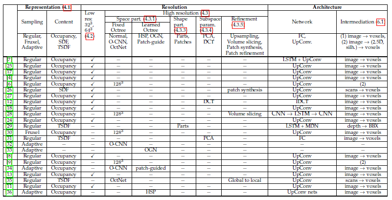 
  表三:文献中使用的各种体素解码器的分类。圆括号中的数字是对应的节号。MDN:混合密度网络。BBX:边界框原语。Part.:分区(partitioning)

#### 
4.1 三维形状的体素表示

&emsp;&emsp;在文献中有四种主要的体素表示:  

  + **二进制占用栅格**(Binary occupancy grid) 在这个表示中，如果一个体素属于感兴趣的对象，那么它被设置为1，而背景体素被设置为0。
  + **概率占用栅格**(Probabilistic occupancy grid) 概率占用网格中的每个体素都对其属于感兴趣对象的概率进行编码。
  + **符号距离函数**(The Signed Distance Function: SDF) 每个体素都对其到最近表面点的符号距离进行编码。如果体素位于对象内部，则为负，否则为正。
  + **截断符号距离函数**(Truncated Signed Distance Function: TSDF) TSDF由Curless和Levoy[[37](#cite-37)]引入，首先估计距离传感器的瞄准线距离，形成射影符号距离场，然后在小的正负值处截断该场，计算TSDF

&emsp;&emsp;概率占用网格特别适合输出概率的机器学习算法。SDFs提供了**表面位置**和**法线方向**的明确估计。然而，从深度图等部分数据构造它们并非易事。TSDFs牺牲了从表面几何形状无限延伸的*全符号距离场*，但允许基于部分观察的场的局部更新。它们适用于从一组深度地图重建三维体素[[26]](#cite-26)[[31]](#cite-31)[[35]](#cite-35)[[38]](#cite-38)。  
&emsp;&emsp;总的来说，体素表示通过对对象周围的体素进行规律的采样来创建。Knyaz等人[[30]](#cite-30)介绍了一种称为Frustum的表示方法或体素模型，其将深度表示法和体素网格相结合。它使用了相机3D截体的切片构建体素空间，从而提供了体素切片与输入图像中的轮廓的精确对齐。  
&emsp;&emsp;同时，普通SDF和TSDF表示均离散成了一个规则的栅格。但是最近Park等人[[39]](#cite-39)提出了**深度SDF(deepSDF)** ，一个生成式深度学习模型，从输入点云生成连续的SDF场。与传统的SDF表示不同，DeepSDF可以处理有噪声和不完整的数据。它还可以表示整个类的形状。

#### 
4.2 低分辨率三维体素重建

&emsp;&emsp;一旦使用编码器学习了输入的向量表示，下一步即为学习解码函数 $g$ ，这一步被称为 `generator`(生成器)或 `generative model`(生成模型)，它将向量表示映射为一个体积像素网格。标准方法往往使用卷积解码器，也称为反卷积网络镜像了卷积编码器。Wu等人[[3]](#cite-3)是最早提出利用深度图三维体素重建方法的学者之一。Wu等人[[6]](#cite-6)提出了一种两阶段重建网络，称为MarrNet。第一阶段从输入图像使用了编解码结构来重建深度图、法线图和剪影图。这三张图被称为2.5草图，然后被用作另一种编解码架构的输入，该架构回归了一个3D体素形状。这个网络后来被Sun等人[[9]](#cite-9)扩展为也可以回归得到输入的姿态。这种两阶段方法的主要优点是，与完整的3D模型相比，深度图、法线图和轮廓图更容易从2D图像中恢复。同样地，3D模型从这三种模式中恢复要比仅从2D图像中恢复容易得多。然而，这种方法不能重建复杂的或是薄结构。

&emsp;&emsp;Wu等人的工作[[3]](#cite-3)推进了研究的进展 [[7]](#cite-7), [[8]](#cite-8), [[17]](#cite-17), [[27]](#cite-27), [[40]](#cite-40)。特别是，最近的研究试图在没有中间过程的情况下直接回归三维体素网格[[8]](#cite-8), [[11]](#cite-11), [[13]](#cite-13), [[18]](#cite-18)。Tulsiani等人[[8]](#cite-8)以及后来的[[11]](#cite-11)使用由三维反卷积层组成的解码器来预测体素的占用概率。Liu等人[[18]](#cite-18)使用三维反卷积神经网络，加上随后使用的元素级逻辑sigmoid，将学习到的潜在特征解码为三维网格占用概率。这些方法已经成功地实现了从单个或一组未经校准的相机捕获的图像进行三维重建。它们的主要优点是提出的用于二维图像分析的深度学习架构可以很容易地适应三维模型，将解码器中的二维反卷积替换为三维反卷积，并且可以在GPU上有效地实现。然而，考虑到计算复杂性和内存需求，这些方法产生的网格**分辨率较低**，通常大小为 $32^3$ 或 $64^3$ 。因此，他们无法找到细节。

#### 
4.3 高分辨率三维体素重建

&emsp;&emsp;已经有人尝试提升深度学习体系结构的高分辨率体素重建。例如，Wu等人[[6]](#cite-6)通过简单地扩展网络，就可以重建大小为 $128^3$ 的体素网格。然而，体素网格在内存需求方面非常高，且内存需求随着网格分辨率的增大而增大。本节将回顾一些用于推断高分辨率容量网格的技术，同时使计算和内存需求易于处理。我们根据这些方法是使用 **空间划分**、**形状划分**、**子空间参数化**还是**粗-精细分策略**，将它们分为四类。

##### 
4.3.1 空间划分

&emsp;&emsp;虽然常规的体素网格有助于卷积运算，但它们非常稀疏，因为表面元素包含在很少的体素中。一些论文利用这种稀疏性来解决分辨率问题[[32]](#cite-32), [[33]](#cite-33), [[41]](#cite-41), [[42]](#cite-42)。他们能够利用诸如八叉树之类的空间划分技术来重建尺寸为 $256^3$ 到 $512^3$ 的三维立体网格。然而，在使用八叉树结构进行基于深度学习的重建时，存在两个主要的问题。第一个是**计算性**的，因为在常规网格上操作时，卷积操作更容易实现(尤其是在gpu上)。为此，Wang等人[[32]](#cite-32)设计了O-CNN，一种新型的八叉树数据结构，有效地将八分区信息和CNN特征存储到图形内存中，并在GPU上执行整个训练和评估。O-CNN支持各种不同的CNN结构和工作与3D形状的不同表示。O-CNN的存储和计算成本随着八叉树深度的增加呈二次增长，通过约束对三维曲面所占用的八分位数的计算，使得三维CNN对于高分辨率的三维模型是可行的。

&emsp;&emsp;第二个问题源于**八叉树结构依赖于对象**这一事实。因此，理想情况下，深度神经网络需要学习如何推断八叉树的结构和内容。在本节中，我们将讨论这些问题是如何处理的。

  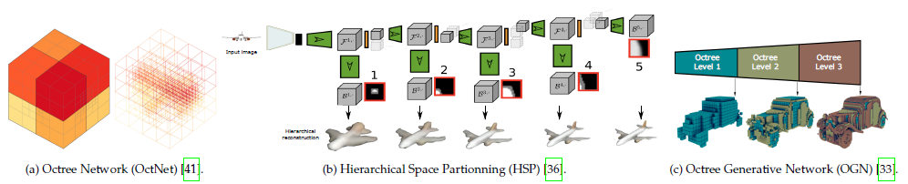

  图1：空间划分。OctNet[[41]](#cite-41)是一个能够实现深度和高分辨率的3D CNNs的混合八叉树网格。高分辨率八叉树也能够以深度优先的[[36]](#cite-36)或宽度优先的[[33]](#cite-33)方式逐步生成。

  

* **4.3.1.1**
  

  **使用预定义的八叉树结构**：最简单的方法是假设在运行时八叉树的结构是已知的。这对于诸如语义分割这样的应用程序来说是很好的，因为在这种情况下，可以将输出八叉树的结构设置为与输入的结构相同。然而，在许多重要的场景中，如三维重建、形状建模和RGB-D融合，八叉树的结构并不预先知道，必须进行预测。为此，Riegler等人[[41]](#cite-41)提出了一种混合网格-八叉树结构，称为OctNet([图1](#fig-1)-(a))。关键思想是将一个八叉树的最大深度限制在一个很小的数上，例如3，并将几个这样的浅八叉树放在一个规则的网格上。这种表示方法实现了深度和高分辨率的三维卷积网络。然而，在测试时，Riegler等人[[41]](#cite-41)假设单个八叉树的结构是已知的。因此，尽管该方法能够以 $256^3$ 的分辨率重建三维体块，但由于不同类型的对象可能需要不同的训练，因此**缺乏灵活性**。

* **4.3.1.2**
  

  **学习八叉树结构**：理想情况下，应该同时估计八叉树结构及其内容。可以这样做；
  + 首先，使用卷积编码器将输入编码成紧凑特征向量([Section 3](#section-3))

  + 然后，使用标准上卷积网络对特征向量进行解码，这导致输入的粗略体素重建，通常分辨率为 $32^3$ ([Section 4.2](#section-4.2))

  + 重建体素形成八叉树的根，被细分为八个部分。带有边界体素的子树被向上采样并进一步处理，以细化该八分区的区域的重建。

  + 子树被递归地处理，直到达到期望的分辨率

&emsp;&emsp;Hane等人[[36]](#cite-36)介绍了层级曲面预测`Hierarchical Surface Prediction`(HSP)，[图1](#fig-1)-(b)，它通过使用上述方法重建分辨率高达 $256^3$ 的体素栅格。在这个方法中，首先以深度优先的方式探索八叉树。另一方面，Tatarchenko等人[[33]](#cite-33)提出了八叉树生成网络(OGN)，它遵循相同的思想，但以广度优先的方式探索八叉树，见[图1](#fig-1)-(<text>c</text>)。因此，OGN生成三维形状的分层重建结果，该方法能够重建尺寸为 $512^3$ 的体素栅格。

&emsp;&emsp;Wang等人[[34]](#cite-34)引入了一种patch引导的剖分策略，核心思想是用八叉树表示三维形状，其中，每个叶节点近似一个平面曲面。为从潜在表示中推断出这样的结构，Wang等人[[34]](#cite-34)使用解码器级联，八叉树每层一个。在八叉树的每个层次，解码器预测每个细胞内的平面patch，且预测器(由全连接层组成)为每个子树预测patch近似状态，即:单元是否为'空'，是否用平面很好地近似曲面。未被很好近似的曲面patch的细胞被进一步细分并由下一层处理。这种方法将尺寸为 $256^3$ 的体素栅格的内存需求从 6.4GB[[32]](#cite-32) 减少到 1.7GB，计算时间从 1.39s 减少到 0.30s，同时保持相同的精度水平。它的主要缺陷是：**相邻的面片不能无缝重建**。另外，由于一个平面与每个八叉树细胞拟合，所以它不能很好地逼近曲面。

##### 
4.3.2 占用网络

&emsp;&emsp;虽然可以通过使用各种空间划分技术来减少内存占用，但是这些方法导致实现复杂，且现有的数据自适应算法仍然局限于相对较小的体素栅格($256^3到512^2$)。最近，有几篇论文提出用深度神经网络来学习三维形状的**隐式表示**(`implicit representation`)。例如，Chen和Zhang[[43]](#cite-43)提出了一个解码器来获取形状和三维点的潜在表示，并返回一个指示该点是在形状外部还是内部的值。该网络可用于重建高分辨率三维体素模型，但是当检索生成的形状时，体素CNN只需要一次学习(one-shot)就可以得到体素模型，而这种方法需要将体素栅格中的每一个点传递到网络中才可以得到其值。因此，生成样本所需的时间取决于采样分辨率。

&emsp;&emsp;Tatarchenko等人[[44]](#cite-44)引入了占有网络，它隐式地将物体的三维曲面表示为*深度神经网络分类器的连续决策边界*，该方法没有在固定分辨率下预测体素化表示，而是使用可以在**任意分辨率**下评估的神经网络来预测完全占用函数。这大大减少了训练期间的内存占用，在推理时可以使用简单的多分辨率等值面(iossurface)提取算法从学习模型中提取栅格。

##### 
4.3.3 形状剖分

&emsp;&emsp;另一种方法不是剖分嵌入三维形状的体素空间，而是 **将形状视为几何部件的排列**，独立地重构各个部分，然后将这些部分缝合在一起形成完整三维形状。。已经有一些工作尝试了这种方法。例如，Li等人[[42]](#cite-42)仅生成部件层次的体素表示，他们提出了一种用于形状结构的生成递归自编码器(GRASS)。这个想法将问题分成两个步骤。第一步使用递归神经网络(RvNN)编码器-解码器架构与生成对抗网络相结合，学习如何将形状结构最佳地组织为对称层次，以及如何合成部件排列。第二步，使用另一个生成模型，学习如何合成每个部件的几何图形，表示为大小为 $32^3$ 的体素栅格。因此，尽管部件生成网络仅以 $32^3$ 分辨率合成部件的三维几何图形，但单独处理单个部件的事实使其能以高分辨率重建三维形状。

&emsp;&emsp;Zou等人[[29]](#cite-29)使用称为3D-PRNN的生成递归神经网络将3D对象重建为基元(primitive)集，该结构使用编码器网络将输入转换为尺寸为 32 的特征向量；然后，由堆叠的长短期记忆模块(LSTM)和混合密度网络(MDN)组成的递归生成器从特征向量中依次预测形状的不同部分。在每个时间阶段，网络预测以特征向量和先前估计的单个基元为条件的基元组。然后，将预测部分组合在一起形成重建结果。这种方法只预测以长方体(cuboid)形式的抽象表示。将其与将重点放在单个长方体上的基于体素重建技术相结合，可以在部件层次上实现精确的三维重建。

##### 
4.3.4 子空间参数化

&emsp;&emsp;**所有可能的形状空间都可以使用一组正交基 $B=\{b_1,\cdots,b_n\}$ 参数化**。然后可以将每个形状 $X$ 表示为基的线性组合，即 $X = \sum^n_{i=1}a_ib_i$，其中 $a_i\in \Bbb{R}$ 。此公式简化了重建问题，不必尝试学习如何重建体素栅格 $V$ ，可以设计由全连接层组成的解码器来从潜在表示中估计系数 $a_i,i=1,\cdots,n$ ，然后恢复整个三维体。Johonston等人[[12]](#cite-12)使用离散余弦变换-II(DCT-II)定义 $B$ ，然后他们提出卷积编码器来预测低频DCT-II系数$a_i$，然后通过建的DCT(IDCT)线性逆变换替代解码网络，并将这些系数转换为实体3D像素。这对训练和推理的计算成本产生了较大的影响：使用 $n = 20^3$ 个DCT系数，网络能够在尺寸 $128^3$ 的体素栅格上重建曲面。

&emsp;&emsp;使用通用基(如 DCT基)的主要问题是：通常需要大量的基元素才能准确地表示复杂的3D对象。实践中，我们通常处理已知类别的对象，例如：人脸和三维物体，且通常可以获得训练数据，见[Section 8](#section-8)。为此，可以使用从训练数据中学习到的主成分(PCA)基来参数化形状空间[[31]](#cite-31)，这需要的基数量(大约10)比通用基数量(大约数千)少得多。

##### 
4.3.5 由粗到精细化

&emsp;&emsp;提高体素化方法分辨率的另一种方法是使用 **多阶段方法**[[26]](#cite-26)[[28]](#cite-28)[[35]](#cite-35)[[45]](#cite-45)[[46]](#cite-46)。第一阶段使用编解码架构恢复低分辨力的体素栅格，例如 $32^3$。后续有上采样功能的阶段，通过聚焦局部区域来细化重建。Yang等人[[46]](#cite-46)使用简单的由两个上卷积层组成的上采样模块。这个简单的上采样模块将输出的3D形状升级为 $256^3$ 的更高分辨率。

&emsp;&emsp;Wang等人[[28]](#cite-28)将重建的粗略体素栅格视为一些列图像(或切片)，然后以高分辨率逐片重建三维物体。虽然此方法允许使用二维上卷积进行有效地细化，但是用于训练的三维形状应一直对齐，以可以沿着第一个主方向对体素切片。此外，独立地重建各个切片可能会导致最终体积的*不连续和不连贯*。为捕捉切片之间的依赖关系，Wang等人使用由3D编码器、LSTM单元和2D解码器组成的长期递归卷积网络(LRCN)[[47]](#cite-47)。每次，3D编码器处理五个连续的切片以生成固定长度的矢量表示作为LSTM的输入，LSTM的输出被传递到2D卷积解码器以生成高分辨率图像，高分辨率二维图像再拼接成高分辨率三维体素。

&emsp;&emsp;其他论文没有使用 **体素切片**，而是使用 **额外的CNN模块**，这些模块关注需要细化的区域。例如，Dai等人[[26]](#cite-26)首先预测大小为 $32^3$ 的粗糙但完整的形状体素，然后通过迭代体块合成过程将其细化为 $128^3$ 的栅格，该合成过程复制粘贴从3D模型数据库中k近邻检索的体素。Han等人[[45]](#cite-45)通过引入一个执行patch级曲面优化的局部3DCNN来扩展Dai的方法。Cao等人[[35]](#cite-35)在第一阶段恢复尺寸为 $128^3$ 的体素栅格，取尺寸为 $16^3$ 的体素块并预测它们是否需要进一步细化；需要细化的块被重采样到 $512^3$ 中，并输入到另一个细化的编解码器中，并与初始粗略一起知道细化。两个子网络都采用 `U-net` 架构[[48]](#cite-48)，同时用 `OctNet` 的相应操作替换卷积和池化层[[41]](#cite-41)。

&emsp;&emsp;注意：这些方法在 **局部推理前需要单独的步骤且有时非常耗时**。例如，Dai等人[[26]](#cite-26)需要从3D数据库中尽心最近邻搜索；Han等人[[45]](#cite-45)需要3D边界检测；而Cao等人[[35]](#cite-35)需要评估一个块是否需要进一步细化。

#### 
4.4 深度移动立方体

&emsp;&emsp;虽然体素表示可以处理任意拓扑的三维形状，但它们需要一个后处理步骤，例如：移动立方体(`marching cubes`)或等值面提取(`isosurface extraction`)算法[[49]](#cite-49)，以检索实际的三维曲面栅格，这是三维重建中大量关注的。因此**整个流程不能被训练成端到端的形式**。为了克服这一局限性，Liao等人[[50]](#cite-50)介绍了一种端到端的可训练网络`Deep-Marching Cubes`，它预测任意拓扑的显示表面表示。他们使用一个经过修改的可微表示，将栅格拓扑与几何体分离。该网络由一个编码器和一个双分支解码器组成。第一个分支不是预测有符号距离值，而是预测每个体素的占用概率；然后，栅格拓扑由其角点处的占用变量的状态隐式地(且概率得)定义。解码器的第二个分支预测每个单元的每条边的顶点位置。隐式定义的拓扑和顶点位置的组合定义了栅格上的分布，该分布是可微的且可用于反向传播。虽然该方法是可端到端训练，但它仅限于大小为 $32^3$ 的低分辨率栅格。

&emsp;&emsp;有些方法不直接估计高分辨率体素栅格，而是生成多视图深度图，并将其融合到输出体中。主要优点是：在解码阶段，可以使用2D卷积，这在计算和存储方面比3D卷积更有效。但是，这样的主要限制是深度图只对**外部曲面进行编码**。为捕捉内部结构，Richter等人[[51]](#cite-51)引入了Matryoshka网络，它使用 `L` 嵌套深度层，通过先融合第一层的深度图，再在偶数层减去形状和再奇数层中添加形状，递归地重建形状。该方法能够重建尺寸为 $256^3$ 的体素栅格。

***
### 
5 3D 表面解码

&emsp;&emsp;基于体素表示的方法在计算上非常浪费，因为**信息只在三维形状的表面或其附近丰富**。直接处理曲面时的主要挑战是：网格或点云等常见表示没有规则的结构，因此它们不易适应深度学习体系结构，特别是使用CNN的体系结构。本节回顾用于解决此问题的技术。我们将最新技术分为三大类：基于参数化([Section 5.1](#section-5.1))、基于模板变形([Section 5.2](#section-5.2))和基于点的方法([Section 5.3](#section-5.3))。

#### 
5.1 基于参数化的三维重建

&emsp;&emsp;与直接使用三角网格不同，我们可以将三维形状 $X$ 的曲面表示为映射 $\zeta: \cal{D}\rightarrow\Bbb{R}^3$ ，其中 $\cal{D}$ 是规则参数化域。然后，3D重建过程的目标是从输入 $I$ 恢复形状函数 $\zeta$ 。当 $\cal{D}$ 是3D域时，此类方法属于第四节描述的体素技术。这里，我们重点讨论 $\cal{D}$ 是规则2D域的情况，它可以是二维平面的子集，例如， $\cal{D}=[0,1]^2$ ，或是单位球面，即： $\cal{D} = \cal{S}^2$。在第一种情况下，可以使用标准的2D卷积操作来实现编解码结构；后一种情况下，必须使用球面卷积[[61]](#cite-61)，因为域是球面的。

&emsp;&emsp;球面参数化和几何图像[[62]](#cite-62)[[63]](#cite-63)[[64]](#cite-64)是最常用的参数化。然而，它们只适用于零亏格(`ganus-0`)和盘装(`disk-like`)曲面。任意拓扑的曲面需要切割成圆盘装的曲面片，然后展开成规则的二维区域。找到给定曲面的最佳切割，更重要的是在同一类别的形状之间找到一致的切割是一项挑战。事实上，自然地为形状类别创建独立的几何图像并将其输入深层神经网络将无法生成连贯的三维形状曲面[[52]](#cite-52)。

&emsp;&emsp;若要为零亏格曲面创建在跨形状类别一致的健壮几何图像，应首先将类别中的三维对象对应起来[[65]](#cite-65)[[66]](#cite-66)[[67]](#cite-67)。Sinha等人[[52]](#cite-52)提出了一种分割不变的过程(`cut-invariant procedure`)，它解决了规模较大的对应问题，并扩展了深度残差网络来自动生成编码以 `x, y, z` 为曲面坐标的几何图像。该方法使用了三个独立的编解码网络，分别地学习 `x, y, z` 几何图像，这三个网络由 *标准卷积*、*上残差* 和 *下残差块* 组成，他们以深度图像或RGB图像作为输入，并通过最小化形状敏感(`shape-aware`)的 $L_2$ 损失函数来学习三维重建。

&emsp;&emsp;Pumarola等人[[53]](#cite-53)使用具有两个分支的网络重建形变曲面的形状：并行操作的检测分支和深度估计分支，及将检测掩码和深度图合并为参数曲面的第三个形状分支。Groueix等人[[54]](#cite-54)将三维对象的曲面分解为 $m$ 个分支组成的解码器，每个分支 $i$ 通过估计函数 $\zeta_i : \cal{D}=[0, 1]^2 \mapsto \Bbb{R}^3$；然后他们设计了一个由 $m$ 个分支组成的解码器，每个分支 $i$ 通过估计函数 $\zeta_i$ 来重建第 $i$ 个面片；最后将重建的面片合并在一起形成整个曲面。尽管这种方法可以处理高亏格的曲面，但它仍然不够通用，无法处理任意亏格的曲面。实际上最佳的面片依赖于曲面的亏格(`n=1表示零亏格，n=2表示1亏格`等等)。此外，尽管实践中仍然可以对结果进行后处理并填补未连接的面片间的间隙，但面片依旧不能保证是连接的。

&emsp;&emsp;总之，**参数化方法仅限于低亏格曲面**，因此它们适合于重建属于给定形状类别的对象，例如人脸和身体。

#### 
5.2 基于形变的三维重建

&emsp;&emsp;这类方法取输入 $I$ 并估计形变场 $\Delta$ ，施加到三维形状模板生成重建的3D模型 $X$。现有技术的差异在于它们使用的形变模型的类型不同([Section 5.2.1](#section-5.2.1))，定义模板的方式([Section 5.2.2](#section-5.2.2))以及用于估算形变场 $\Delta$ 的网络结构([Section 5.2.3](#section-5.2.3))。下面内容中，我么假设三维形状 $X = (\cal{V, F})$ 由 $n$ 个顶点 $\cal{V} = (v_1, \cdots, v_n)$ 和面 $\cal{F}$ 表示。让 $\tilde{X} = (\tilde{\cal{V}}, \cal{F})$ 表示模板形状。

##### 
5.2.1 由粗到精细化

  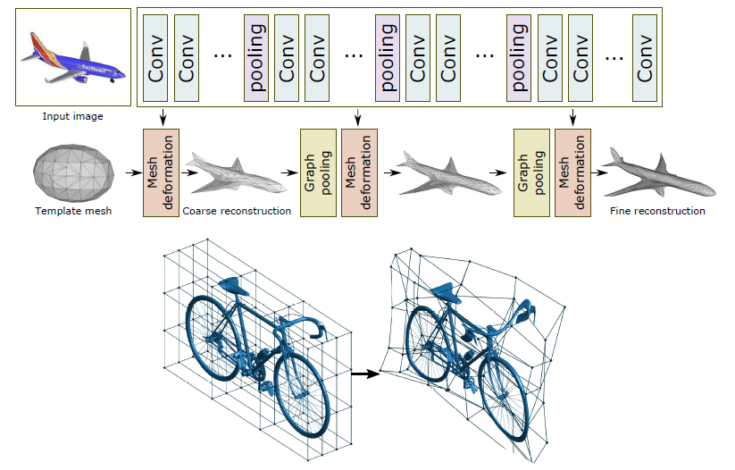

  图2：模型形变(上) [[56]](#cite-56)与域变形(下) [[60]](#cite-60)

&emsp;&emsp;**(1) 顶点形变(Vertex deformation)**。这个模型假设三维形状 $X$ 可以记为根据模板各个顶点的线性位移，即 $\forall v_i \in \cal{V}, v_i = \tilde{v_i} + \delta_i$，其中 $\delta_i \in \Bbb{R^3}$；形变场定义为 $\Delta = (\delta_1, \cdots, \delta_n)$。这个形变模型如[图2-上](#fig-2)所示，在[[55]](#cite-55)[[56]](#cite-56)[[57]](#cite-57)中使用。它假设

  1. 形状 $X$ 的顶点与模板 $\tilde{X}$ 的顶点存在一对一的对应关系
  2. 形状 $X$ 与模板 $\tilde{X}$ 具有相同的拓扑结构

&emsp;&emsp;**(2) 形变模型(Morphable models)**。可以使用学习的变形模板[[68]](#cite-68)来参数化三维网格，而不是使用通用模板。设：$\tilde{\cal{V}}$ 为平均形状， $\Lambda_1, \cdots, \Lambda_k$为一组正交基。任何形状 $\cal{V}$ 都可以用表示为

<text id='formula-1'><text/>
$$ \cal{V} = \tilde{\cal{V}} + \sum^K_{i=1}\alpha_i\Lambda_i, \alpha_i \in \Bbb{R} \tag{1}$$

[式(1)](#formula-1)的第二项可视为形变场 $\Delta=\sum^K_{i=1}a_i\Lambda_i$，应用于平均形状的顶点 $\tilde{\cal{V}}$。通过设置 $\Lambda_0=\tilde{\cal{V}} , a_0=0$ ，[式(1)](#formula-1)可以写成 $\cal{V} = \sum^K_{i=1}a_i\Lambda_i$。在这种情况下，平均值 $\tilde{\cal{V}}$ 被视为一个偏差项。

&emsp;&emsp;学习形变模型的一种方法是在一组干净的三维网格示例上使用主成分分析(PCA)[[68]](#cite-68)。最近的技术表明：仅使用2D注释，就可能从2D轮廓或2D图像中构建特定类别的3D形变模型[[69]](#cite-69)[[70]](#cite-70)。这些方法需要对目标进行有效的检测和分割及利用基于CNN技术的摄像机姿态估计。

&emsp;&emsp;**(3) 自由形变(Free-Form Deformation)**。与其直接形变模板 $\tilde{X}$ 的顶点，不如形变其周围的空间，见[图2-下](#fig-2)，这可以通过在 $\tilde{X}$ 周围定于大约 $m$ 个控制点(称为形变柄)的集合 $P \in \Bbb{R}^{m*3}$ 来实现。当形变场 $\Delta = (\delta_1, \cdots, \delta_m),m\ll n$ 应用于这些控制点时，它们会变形形状周围的空间，因此它们还会根据以下公式变形形状的顶点 $\cal{V}$:

<text id='formula-2'><text/>
$$\cal{V}^\tau = B\Phi(P+\Delta)^\tau\tag{2}$$

其中形变矩阵 $B \in \Bbb{R}^{n*m}$ 是一组多项式基，例如:Bernstein多项式[[60]](#cite-60)。$\Phi$ 是用来施加在FFD场中对称性的 $m * n$ 矩阵[[71]](#cite-71)，$\Delta$ 是位移。

&emsp;&emsp;Kuryenkov等人[[59]](#cite-59),Pontes等人[[60]](#cite-60)和Jack等人[[58]](#cite-58)使用了这种方法。**自由形变的主要优点是形状和模板之间不需要一一对应**。但是**由模板的FFD**近似的形状仅是**与模板具有相同拓扑的那些形状**。

##### 
5.2.2 定义模板

&emsp;&emsp;Kato等人[[55]](#cite-55)使用球体作为模板，Wang等人[[56]](#cite-56)使用椭圆。Henderson 等[[20]](#cite-20)定义了两种类型的模板：**抽象为立方基元的复杂形状** 和 **细分为多个顶点的立方体**。前者适用于具有多个组件的人造形状，后者则适用于表示零亏格形状并与使用球体或椭球体相比没有优势。

&emsp;&emsp;为加快收敛速度，Kuryenkov等人[[59]](#cite-59)引入DeformNet，它以图像为输入，从数据库中搜索最接近的形状，然后使用[式(2)](#formula-2)的FFD模型对检索到的模型进行形变，以匹配查询图像。这种方法允许保留细节(detail-preserving)的三维重建。

&emsp;&emsp;Pontes等人[[60]](#cite-60)使用了类似于DeformNet[[59]](#cite-59)的方法。然而，一旦FFD场被估计并应用于模板，则通过添加从字典中检索的一些3D模型的加权和的残差来进一步细化结果。深度神经网络的作用是学习如何估计形变场 $\Delta$ 和用于计算细化残差的权重。另一方面，Jack等人[[58]](#cite-58)使用FFD形变多个模板，并选择一个提供最佳拟合精度的模板。

&emsp;&emsp;另一种方法是 **学习模板**。分别使用统计形状分析技术(例如PCA)在训练数据集上进行学习，或者使用深度学习技术与形变场联合学习。例如Tulsiani等人[[70]](#cite-70)使用每类三维模型的平均形状作为类别特定的模板，深度神经网络既估计了用于选择类别特定平均形状(`class-specific mean shape`)的输入形状的类，又估计了需要应用于类别特定平均形状的形变场。Kanazawa等人[[57]](#cite-57)同时学习平均形状和形变场，因此，该方法不需要单独的3D训练集来学习形变模型。在两种情况下，**重建结果都缺乏细节，仅限于汽车和鸟类等热门类别**。

##### 
5.2.3 网络结构

&emsp;&emsp;基于形变的方法也使用编解码结构。编码器使用连续卷积操作将输入映射到潜在变量 $x$。如在[[20]](#cite-20)中那样，潜在空间可以是离散的或连续的，它使用了一个变分自编码器([Section 3](#section-3))，解码器通常由全连接层组成，例如Kato等人[[55]](#cite-55)使用两个全连接层来估计要应用到球体的形变场以匹配输入的轮廓。

&emsp;&emsp;Kuryenkov等人[59]不是形变一个球体或椭圆，而是从数据库中检索与输入 $I$ 最相似的三维模型，然后估计使其形变以匹配输入所需的FFD。检索到的模板先被体素化并使用3DCNN被编码到另一个潜在变量 $x_t$ 中；然后，使用上卷积网络将输入图像的潜在表示和检索到模板的潜在表示连接起来并解码为定义在体素网格顶点上的FFD 场。

&emsp;&emsp;Pontes等人[[60]](#cite-60)使用了类似的方法，但是，潜在变量 $x$ 被用作分类器的输入，该分类器从数据库中找到与输入最接近的模型。同时，使用前馈网络将潜在变量解码为形变场 $\Delta$ 和权重 $a_i , i =1, \cdots, K$ ，然后使用形变场 $\Delta$ 进行变形并使用权重 $a_i$ 与CAD模型的字典进行加权组合。

&emsp;&emsp;**注意**：可为这些方法设计多个变体。例如，可以使用类别特定的平均形状，而不是使用从数据库检索的三维模型作为模板。在这种情况下，潜在变量 $x$ 可用于将输入分类为形状类别之一，然后选择该类别学习到的平均形状作为模板[[70]](#cite-70)。此外，Kanazawa等人[[57]](#cite-57)没有使用形变模型来分别学习平均形状，而是将平均形状视为一个偏差项，然后可以通过网络与形变场 $\Delta$ 一起来预测该偏差项。最后，Wang 等人[[56]](#cite-56)采用从粗到精的策略，使程序更加稳定；他们提出了一个由三个形变体组成的形变网络，每个块是由两个图上采样层(graph unpooling layers)相交的图CNN(GCNN)，形变块会更新顶点的位置，而图形上采样层会增加顶点的数量。

&emsp;&emsp;**基于参数化和变形的技术只能重建固定拓扑的曲面，前者仅限于低亏格的曲面，后者仅限于模板的拓扑结构。**

#### 
5.3 基于点的技术

&emsp;&emsp;三维形状可以用 $N$ 个点的无序集 $S = \{(x_i, y_i, z_i)\}^N_{i=1}$ 来表示。这种基于点的方法很简单，但在内存需求方面是很有效的，它非常适合于具有奇怪部分和精细细节的对象。因此，越来越多的论文，2017年[[72]](#cite-72)至少有一篇，2018年[[21]](#cite-21)[[22]](#cite-22)[[73]](#cite-73)[[74]](#cite-74)[[75]](#cite-75)[[76]](#cite-76)[[77]](#cite-77)[[78]](#cite-78)[[79]](#cite-79)[[80]](#cite-80)[[82]](#cite-82)超过12篇和2019年[[81]](#cite-81)一些，探讨了它们在基于深度学习的重建中的应用。本节讨论了最新的基于点表示及其对应的网络体系结构。

##### 
5.3.1 表示

&emsp;&emsp;点云的主要挑战在于它们 **不是规则结构** 且 **不易适合利用空间规则性的卷积结构**。为了克服这一限制，提出了三种表述:

* 点集表示将点云视为尺寸为 $N * 3$ 的矩阵[[21]](#cite-21)[[22]](#cite-22)[[72]](#cite-72)[[75]](#cite-75)[[77]](#cite-77)[[81]](#cite-81)

* 一个或多个尺寸为 $H * W * 3$的三通道网格[[72]](#cite-72)[[73]](#cite-73)[[82]](#cite-82)，网格中的每个像素对三维点的 $(x, y, z)$ 坐标进行编码

* 多视角深度图[[78]](#cite-78)[[83]](#cite-83)

&emsp;&emsp;后两种表示，以下称为网络表示，非常适合卷积网络。由于它们能仅用二维卷积来推断，它们的计算效率也很高。注意：基于深度图的方法需要额外的融合步骤来推断对象的整个三维形状。如果相机参数已知，则可以使用直接的方式来实现；否则，可以使用点云配准技术[[84]](#cite-84)[[85]](#cite-85)或融合网络(`fusion network`)[[86]](#cite-86)来完成融合。此外，**点表示** 需要预先 **固定** 点 $N$ 的数目，而在使用 **网格表示** 的方法中，点的数量可以 **根据对象的性质而变化**，而它总是由网格分辨率限定。

##### 
5.3.2 网络结构

&emsp;&emsp;与基于体素和曲面的表示类似，使用基于点的表示的技术遵循编解码模型。虽然它们的 **编码器都是用相同的结构**，但它们在 **解码器的类型和架构上有所不同，见[[图3]](#fig-3)**。通常，网格表示使用上采样卷积网络来解码潜在变量[[72]](#cite-72)[[73]](#cite-73)[[78]](#cite-78)[[82]](#cite-82)，参见[图3(a)](#fig-3a)和[图3(b)](#fig-3b)。点集表示([图3(c)](#fig-3c))使用全连接层[[21]](#cite-21)[[72]](#cite-72)[[74]](#cite-74)[[77]](#cite-77)[[81]](#cite-81)，因为点云是无序的，全连接层的主要优点是它们捕获全局信息。然而，与卷积运算相比，它们在计算上是昂贵的。的主要优点是它们捕获全局信息。然而，与卷积运算相比，它们在计算上是昂贵的。为从卷积运算的效率中获益，Gadelha等人[[22]](#cite-22)在空间上使用空间分割树(如KD树)对点云进行排序，然后使用一维卷积操作对其进行处理，见[图3(d)](#fig-3d)。使用传统 CNN，每个卷积操作都具有受限的接受野(`receptive field`)，并且无法有效地利用全局和局部信息。Gadelha等人 [[22]](#cite-22)通过维持三种不同的分辨率来解决这个问题。也就是说，将潜在变量解码成三种不同的分辨率，然后将其汇聚并用一维卷积层进一步处理来生成4K大小的点云。

&emsp;&emsp;Fan等人[[72]](#cite-72)提出了一种点集表示和网格表示结合的生成深度网络([图3(a)](#fig-3a))，该网络由级联的编解码模块组成：

* 第一块获取输入图像并将其映射为一个潜在表示，然后将其解码为一个尺寸为 $H * W$ 的三通道图像。每个像素处的三个值是一个点的坐标。

* 后续的每个块获取其先前块的输出，并进一步将其编码和解码为尺寸为 $H * W$ 的三通道图像。

* 最后一个块是与前面类型相同的编码器，跟随的是由两个分支组成的预测器。第一个分支是预测尺寸为 $H * W$ (本例中为 $32×24$)三通道图像的解码器，其中，图像中每个像素处的三个值是点的坐标。第二个分支是全连接网络，它预测尺寸为 $N * 3$ 的矩阵，每行是三维点($N=256$)。

* 使用集合的并操作将这两个分支的预测合并以生成尺寸为1024的三维点集。

Jiang等人[[74]](#cite-74)也使用了这种方法。两者的主要区别在于训练过程，我们将在[Section 7](#section-7)讨论。

  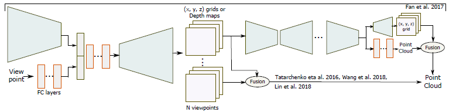

  (a) Fan等人[[72]](#cite-72)，Tatarchenko等人[[83]](#cite-83)，Wang等人[[82]](#cite-82)以及Lin等人[[73]](#cite-73)

  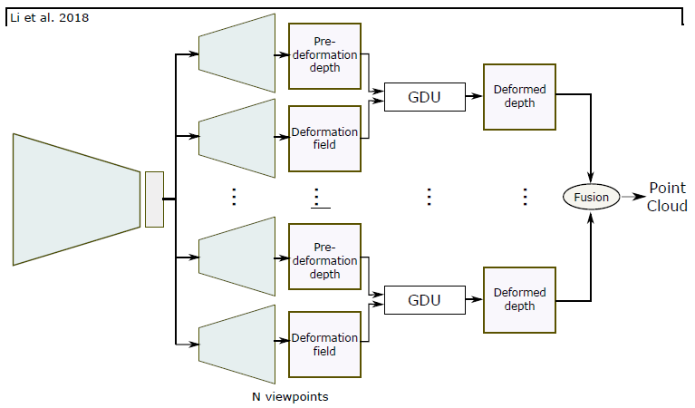

  (b) Li等人[[78]](#cite-78)

  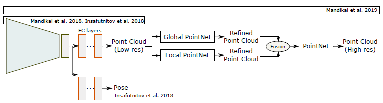

  (<text>c</text>) Mandikal等人[[21]](#cite-21)，Insafutdinov[[77]](#cite-77)以及Mandikal等人[[81]](#cite-81)

  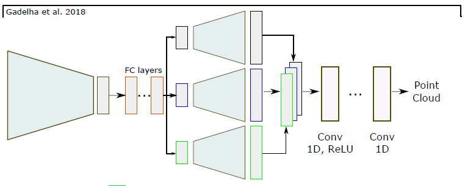

  (d) Gadelha等人[[22]](#cite-22)

  **图3:** 不同的网络结构在基于点的三维重建中的应用

&emsp;&emsp;Tatarchenki等人[[83]](#cite-83)、Wang等人[[82]](#cite-82)和Lin等人[[73]](#cite-73)遵循同样的想法，但是他们的解码器回归N个网格，参见[图3(a)](#fig-3a)。每个网格对深度图[[83]](#cite-83)或从该视点可见的表面(x, y, z)坐标[[73]](#cite-72)[[82]](#cite-82)进行编码。由一系列全连接层编码的视点连同输入图像的潜在表示一起被作为解码器输入。另一方面，Li等人[[78]](#cite-78)使用每个视点一个的多分支解码器，参见[图3(b)](#fig-3b)。与[[83]](#cite-83)不同，每个分支从一个给定视点和一个形变场回归一个标准深度图，该形变场使用网格形变单元(GDU)将估计的标准深度图形变化到与输入匹配，然后将重建的网格提升到三维并合并到一起。

&emsp;&emsp;与体素技术类似，基于点的三维重建的香草结构仅恢复低分辨率几何体。对于高分辨率重建，Mandikal 等人[[81]](#cite-81)使用级联的多个网络，参见[图3(c)](#fig-3c)。第一个网络预测低分辨率点云，每个后续块采用先前预测的点云，使用类似于 PointNet[[87]](#cite-87) 或 PointNet++[[88]](#cite-88) 的多层感知器架构(MLP)计算全局特征，并通过在每个点周围的球中应用MLP计算局部特征；然后，局部和全局特征被聚合并反馈给另一个预测稠密点云的MLP；该过程可以递归地重复，直到达到所需的分辨率。

&emsp;&emsp;Mandikal等人[[21]](#cite-21)结合TL嵌入和变分自编码器([图3(c)](#fig-3c))。前者允许将三维点云及其对应视图映射到潜在空间中的同一位置；后者使得能从输入图像重建多个可能的点云。

&emsp;&emsp;最后，基于点的表示可以处理任意拓扑的三维形状。然而，它们需要一个十分受关注的例如Poisson曲面重建[[89]](#cite-89)或SSD[[90]](#cite-90)的后处理步骤来检索3D曲面网格。从输入到获得最终网格的管道无法进行端到端训练，因此，这些方法仅优化在中间表示上定义的辅助损失。

  <table style="line-height:8px">
    <tr>
      <td rowspan='3'></td>
      <th rowspan='2'>Param.-based</th>
      <th colspan='2'>Deformation-based</th>
      <th rowspan='2'>Decoder architecture</th>
    </tr>
    <tr>
      <td>Defo.model</td>
      <td>Template</td>
    </tr>
    <tr style="line-height:20px">
      <td align='center'>Geometry Images Spherical maps Patch-based</td>
      <td align='center'>Vertex defo. Morphable FFD</td>
      <td align='center'>Sphere/ellipse (k-)NN Learned(PCA) Learned(CNN)</td>
      <td align='center'>FC layers UpConv</td>
    </tr>
    <tr align='center'>
      <td><a href='#cite-52'>[52]</a></td>
      <td>Geometry Image</td>
      <td>-</td>
      <td>-</td>
      <td>UpConv</td>
    </tr>
    <tr align='center' style="line-height:20px">
      <td><a href='#cite-53'>[53]</a></td>
      <td>Geometry Image</td>
      <td>-</td>
      <td>-</td>
      <td>ResNet blocks +  2 Conv layers</td>
    </tr>
    <tr align='center'>
      <td><a href='#cite-54'>[54]</a></td>
      <td>Patch-based</td>
      <td>-</td>
      <td>-</td>
      <td>MLP</td>
    </tr>
    <tr align='center'>
      <td><a href='#cite-55'>[55]</a></td>
      <td>Mesh</td>
      <td>vertex defo.</td>
      <td>sphere</td>
      <td>FC</td>
    </tr>
    <tr align='center'>
      <td><a href='#cite-56'>[56]</a></td>
      <td>Mesh</td>
      <td>vertex defo.</td>
      <td>ellipse</td>
      <td>GCNN blocks</td>
    </tr>
    <tr align='center'>
      <td><a href='#cite-20'>[20]</a></td>
      <td>Mesh</td>
      <td>vertex</td>
      <td>cube</td>
      <td>UpConv</td>
    </tr>
    <tr align='center'>
      <td><a href='#cite-57'>[57]</a></td>
      <td>Mesh</td>
      <td>vertex defo.</td>
      <td>Learned(CNN)</td>
      <td>FC layer</td>
    </tr>
    <tr align='center'>
      <td><a href='#cite-58'>[58]</a></td>
      <td>Mesh</td>
      <td>FFD</td>
      <td>k-NN</td>
      <td>FC</td>
    </tr>
    <tr align='center'>
      <td><a href='#cite-59'>[59]</a></td>
      <td>Mesh</td>
      <td>FFD</td>
      <td>NN</td>
      <td>UpConv</td>
    </tr>
    <tr align='center'>
      <td><a href='#cite-60'>[60]</a></td>
      <td>Mesh</td>
      <td>FFD</td>
      <td>k-NN</td>
      <td>Feed-forward</td>
    </tr>
  </table>

***
### 
6 利用其他线索

&emsp;&emsp;前面几节讨论了直接从二维观测中重建三维对象的方法。本节展示了如何使用附加提示，如：**中间表示**(intermediate representation)([Section 6.1](#section-6.1))和**时间相关性**(temporal correlations)([Section 6.2](#section-6.2))来促进三维重建。

#### 
6.1 中间表示

&emsp;&emsp;许多基于深度学习的三维重建算法直接从RGB图像中预测对象的三维几何形状。然而，一些技术将问题分解为一系列的步骤，它估计诸如**深度图**(`depth maps`)、**法线图**(`normal maps`)和/或**分割掩码**(`segmentation mask`)等2.5D信息，见[图4](#fig-4)。最后一步可以使用诸如**空间雕刻**(`spacecarving`)或**三维反投影**(`3D back-projection`)等传统技术并跟随过滤和配准来实现，恢复完整的三维几何和输入的姿态。

  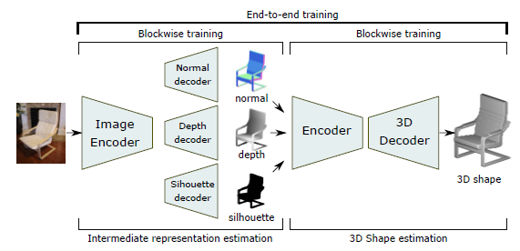

  图4：通过2.5维草图(深度、法线和轮廓)进行中间表示

&emsp;&emsp;早期的方法分别训练不同模块，最近的工作提出了端到端解决方案[[6]](#cite-6)[[9]](#cite-9)[[38]](#cite-38)[[53]](#cite-53)[[80]](#cite-80)[[91]](#cite-91)[[92]](#cite-92)。例如，Wu等人[[6]](#cite-6)及后来的Sun等人[[9]](#cite-9)用了两个模块，第一个是一个编码器，接着的是一个估计深度图、法线图和分割掩码(称为2.5D轮廓)的三分支解码器；然后将它们汇聚并馈送到另一个回归完整三维体素栅格[[6]](#cite-6)[[9]](#cite-9)[[91]](#cite-91)的编解码器和回归相机姿态的一组全连接层中，整个网络都是端到端训练的。

&emsp;&emsp;其它技术 **将中间深度图转换** 为：**(1)** 3D占用栅格[[46]](#cite-46)或截断的符号化距离函数体[[38]](#cite-38)，然后使用三维编解码网络进行处理来补全和细化，或 **(2)** 部分点云，再使用点云补全模块进行进一步处理[[80]](#cite-80)。Zhang等人[[92]](#cite-92)使用另一个编解码器，将推断出的深度图转换为球形图，且不绘制它以填充孔隙，然后将未绘制的球面深度图反投影到三维，并使用尺寸约为 $128^3$ 的体素占用栅格的体素细化网络进行细化。

&emsp;&emsp;其它技术 **从预定义或任意视点估计多个深度图**。Tatarchenko等人[[83]](#cite-83)提出了一种网络，该网络以RGB图像和目标视点 $v$ 作为输入，并从视点 $v$ 中推断出目标的深度图。通过改变视点，该网络能够估计出多个深度，然后将这些深度合并成一个完整的三维模型。该方法使用标准的编解码器和由三个全连接层组成的附加网络来对视点进行编码。Soltani等人[[19]](#cite-19)以及Lin等人[[73]](#cite-73)遵循同样的方法，但从预定义的视角预测深度图及其二值掩码。这两种方法中，合并操作在后处理步骤中执行。Smith等人[[93]](#cite-93)首先估计低分辨率体素栅格；然后，他们获取低分辨率体素栅格的深度图，从六个轴对齐的视图中计算并使用剪影和深度细化网络
(silhouette and depth refinement network)来细化它们；最终，使用空间雕刻技术将细化的深度图组合成尺为 $256^3$ 的体素栅格。

&emsp;&emsp;Tatarchenko等人[[83]](#cite-83)、Lin等人[[73]](#cite-73)和Sun等人[[9]](#cite-9)同时估计二值/轮廓掩码及深度图。二值掩码被用来滤除没有反投影到三维空间中曲面上的点。这些基于深度掩码方法的副作用是：由于大量点被丢弃，这是一个巨大的计算资源浪费，尤其对于具有薄结构的对象。Li等人[[78]](#cite-78)通过使用学习到的形变场对规则深度图进行形变来解决此问题。Li等人[[78]](#cite-78)没有直接推断最匹配输入的深度图，而是以预先定义的规范视点，推导出一组二维预形变深度图及其对应的形变场，它们分别传递给将深度图的规则栅格转换为形变深度图的栅格变形单元(GDU)；最后将形变吼的深度图转化进公共坐标系并融合成稠密点云。

&emsp;&emsp;多阶段方法的主要优点是：**深度、法线和剪影图更容易从二维图像中恢复**。同样，从这三种模式中恢复三维模型比仅从二维图像中恢复要容易得多。

#### 
6.2 利用时空关联性

&emsp;&emsp;许多情况下，同一对象的多个空间分布图像在一段较长的时间内被获取。基于单个图像的重建技术可以通过独立处理各个帧，然后使用配准技术合并来重建三维形状。理想情况下，我们想利用在帧之间存在的时空相关性来解决歧义，尤其是存在遮挡和高度杂乱场景中。特别地，在时间 $t$ 时的网络应该记住在时间 $t+1$ 之前重建的内容，且除使用新的输入外，还使用它来重建时间 $t$ 时的场景或对象。通过使用使网络能够记住一段时间内输入的递归神经网络(RNN)和长短期记忆(LSTM)网络来解决处理时序数据的这个问题。

&emsp;&emsp;Choy等人[[7]](#cite-7)提出了一种称为3D递归重建网络(`3D-R2N2`)的体系结构，该结构允许网络在不同视点(潜在冲突的)的信息可用时自适应且一致地学习对象的合适3D表示，网络可以在每次新视图可用时执行增量细化。它由两部分组成：一个标准卷积编解码器和一组放置在卷积解码器起始处的3D卷积长短期存储单元(`3D-LSTM`)。它们获取编码器的输出，然后选择性地更新它们的单元状态，或者通过关闭输入门来保留状态。然后，解码器解码LSTM单元的隐藏状态，并以体素占用图的形式生成概率重建。

&emsp;&emsp;3D-LSTM允许网络保留所看到的内容，并在看到新图像时更新存储。当多个视图被输入到网络中时，它能够有效地处理对象的自遮挡。在每个时间步骤中，它有选择地更新对应于部件的存储单元，该部件在保持其它部件的状态的同时变得可见。

&emsp;&emsp;**LSTM和RNN是非常耗时的**，因为输入图像是顺序地处理的，没有并行化。另外，当给定同组不同次序的图像时，RNN 由于排列变化(permutation variance)而无法一致地估计对象的3D形状。为克服这些限制，Xie 等人[[86]](#cite-86)引入了Pix2Vox，它由多个并行运行的编解码器模块组成，每个块从其输入帧预测一个粗略的体素栅格。这样可以消除输入图像次序的影响，加快计算速度。然后，一个上下文感知的融合模块从粗略三维形状中选择高质量的重建，并生成一个融合的三维形状，它充分利用所有输入图像的信息，而不会造成长期的记忆损失。

***
### 
7 训练

&emsp;&emsp;除它们的体系结构之外，深度学习网络的性能还取决于它们的训练方式。本节讨论了文献中使用的各种监督模式([Section 7.1](#section-7.1))和训练程序([Section 7.3](#section-7.3)))。

#### 
7.1 监督的程度

&emsp;&emsp;早期的方法依赖于三维监督(第7.1.1 节)。然而，无论是人工获取，还是利用传统的三维重建技术，获取基准三维数据都是极其困难和昂贵的。因此，最近的技术试图通过利用其它监督信号(如：视图间的一致性)来最小化3D 监督的数量(第7.1.2 节)。

##### 
7.1.1 利用三维监督训练

&emsp;&emsp;有监督的方法需要使用与其对应的基准3D 形状配对的图像进行训练。然后，训练过程最小化一个损失函数，该函数测量重建的三维形状与相应的基准三维模型之间的差异。这种差异是用损失函数来测量的，损失函数必须是可微的，这样才能计算出梯度。这种函数的例子包括：

  1. **体素损失(Volumetric loss)**。它被定义为重建体与基准体之间的距离:

  <text id='formula-3'></text>
  $${\cal L}_{vol}(I) =  d(f(I), X) \tag{3}$$

  其中 $d(\cdot, \cdot)$ 可以使两个体素之间的 $L_2$ 距离，也可以是负覆盖率(`negative IoU: Intersection over Union`) $\cal L_{\mit IoU}$ (见[式16](#fomula-16))。两种度量都适用于二值占用栅格和TSDF表示。对于概率占用栅格，交叉熵损失是最常用的[[25]](#cite-25)：

  <text id='formula-4'></text>
  $${\cal L}_{CE} = -\frac{1}{N}\sum^N_{i=1}{p_ilog\hat{p_i}+(1-p_i)log(1-\hat{p_i})} \tag{4}$$

  其中 $p_i$ 是被占用的体素 $i$ 的基准概率， $\hat{p_i}$ 是估计的概率， $N$ 是体素的个数。

  2. **点集损失(Point set loss)**。当使用基于点的表示时，可以使用搬土距离(`EMD: Earth Mover’s Distanc`)[[59]](#cite-59)[[72]](#cite-72)或倒角距离(CD: Chamfer Distance)[[59]](#cite-59)[[72]](#cite-72)来测量重建损失。`EMD` 被定义为一个集合中的一个点和另一个集合中的一个点之间的距离之和在所有可能的对应排列上的最小值。更正式地说，给定 $S_{gt}$ 和 $S_{rec}$ 两组点，EMD 定义为：

  <text id='formula-5'></text>
  $${\cal{L}}_{EMD} = \min_{S_{gt}\rightarrow S_{rec}} \sum_p\in S_{gt} \lVert p-\phi(p)\lVert \tag{5}$$

  这里， $\phi(p)\in S_{rec}$ 是 $S_{rec}$ 上最接近 $p\in S_{gt}$ 的点。另一方面，$CD$ 损失定义为：

  <text id='formula-6'></text>
  $${\cal{L}}_{CD} = \frac{1}{N_{gt}}\min_{p\in S_{gt}}\sum_{p\in S_{gt}}\lVert p-q\lVert^2+\frac{1}{N_{rec}}\min_{q\in S_{rec}}\sum_{q\in S_{rec}}\lVert p-q\lVert^2 \tag{6}$$

  这里，$N_{gt} 和 N_{rec}$ 分别是 $S_{gt} 和 S_{rec}$ 的大小。由于 $CD$ 使用子优化匹配来确定成对关系，因此在计算上它比 $EMD$ 更容易。

  3. **学习来生成多重合理的重建**。从单个图像进行三维重建是个**不适定问题**，因此，对于给定输入，可能存在多个合理的重建。。Fan等人[[72]](#cite-72)提出了`Min-of-N(MoN)`损失来训练神经网络以生成分布输出。这个方法是使用从某个分布中提取的随机向量 $r$ 来扰动输入。网络学习从输入的每一个扰动生成一个合理的三维形状。它是使用定义如下的损失来训练：

  <text id='formula-7'></text>
  $${\cal{L}}_{MoN} = \sum_i\min_{r\sim \Bbb{N}(0,I)}{d(f(I,r),S_{gt})} \tag{7}$$

  这里， $f(I,r)$ 是从多元正态分布 $\Bbb{N}(0,I)$ 中采样的随机向量 $r$ 扰动输入后重建的三维点云， $S_{gt}$ 是基准点云， $d(\cdot,\cdot)$ 是重建损失，它可以是上面定义的任何损失函数。在运行时，通过从 $\Bbb{N}(0,I)$ 中采样不同的随机向量 $r$ ，可以从给定的输入生成各种合理的重构。

##### 
7.1.2 利用二维监督训练

&emsp;&emsp;即使是小规模的训练，获取三维基准数据进行监督也是一个昂贵而繁琐的过程。然而，获得用于训练的多视图 2D 或 2.5D 图像相对容易。这类方法基于这样的事实：如果估计的三维形状尽可能接近基准，那么三维模型的视图与重建的三维模型投影到这视图中的任意一个视图间的差异也将最小化。实现这一想法需要定义一个从给定视点渲染重建的三维模型的投影算子([Section 7.1.2.1](#section-7.1.2.1))及一个测量重投影误差的损失函数([Section 7.1.2.2](#section-7.1.2.2))。

* **<text id='section-7.1.2.1'>7.1.2.1 投影算子</text>**

&emsp;&emsp;射影几何中的技术可以用来渲染三维对象的视图。然而，为实现**无梯度近似**的端到端训练[[55]](#cite-55)，投影算子应该是**可微**的。Gadelha等人[[27]](#cite-27)引入了一个可微投影算子 $P$ ，定义为 $P((i,\ j),\ V)=1-e^{-\sum_kV(i,j,k)}$，其中，$V$ 是三维体素栅格。此算子汇总沿每条视线的体素占用值。但是，它假定是*正投影*。Loper和Black[[94]](#cite-94)引入了OpenDR，一个近似可微的渲染器，它适合于*正投影*和*透视投影*。

&emsp;&emsp;Petersen等人[[95]](#cite-95)提出了一种用于图像到几何重建的 $C^{\infty}$ 光滑可微渲染器，其思想是：该方法不是进行对像素的三角形可见的离散决策，而是对它们的可见性进行软混合。用相机空间中 $z$ 位置的 $SoftMin$ 构成一个光顺的 $z-buffer$，从而生成一个 $C^{\infty}$ 光顺的渲染器，其中三角形的 $z$ 位置相对于遮挡是可微的。在以前的渲染器中，只有 $xy$ 坐标相对于遮挡是局部可微的。

&emsp;&emsp;最后，Rezende等人[[96]](#cite-96)没有使用固定的渲染器，提出了一种学习的投影算子或可学习的摄像机，它的构建是先通过将仿射变换应用于重建体，紧随的是将三维体映射到二维图像上的 3D 和 2D 卷积层的组合。

* **<text id='section-7.1.2.2'>7.1.2.2 重投影损失函数</text>**

&emsp;&emsp;对于二维监督的三维重建，已经提出了许多损失函数。我们将它们分为两大类：(1) 基于轮廓的损失函数；(2) 基于法线和深度的损失函数。

1. **基于轮廓的损失函数**。其思想是在一定的摄像机内外参数下，从重建体投影出的二维轮廓应与输入图像的基准二维轮廓相匹配。这种差异是受空间雕刻的启发而产生的：

<text id='formula-8'></text>
$${\cal{L}}_{proj}(I)=\frac{1}{n}\sum^n_{j=1}d((P(I);\alpha^{(j)}),S^{(j)}) \tag{8}$$

这里 $S^{(j)}$ 是原始三维对象 $X$ 的第 $j$ 个基准二维轮廓， $n$ 是每个三维模型使用的轮廓或视图数量， $P(\cdot,\cdot)$ 是三维到二维投影函数及 $\alpha^{(j)}$ 是第 $j$ 个轮廓的相机参数。距离度量 $d(\cdot,\cdot)$ 可以是标准 $L_2$ 度量[[77]](#cite-77)、基准轮廓和重建轮廓之间的负覆盖率(IoU)或二元交叉熵损失[[4]](#cite-4)[[24]](#cite-24)。

&emsp;&emsp;Kundu等人[[31]](#cite-31)介绍了渲染和比较损失(`render-and-compare loss`)，它是根据基准轮廓 $G_s$ 和渲染轮廓 $R_s$ 之间的 $IoU$ 以及基准深度 $G_d$ 和渲染深度 $R_d$ 之间的 $L_2$ 距离定义的，即：

<text id='formula-9'></text>
$${\cal{L_r}}=1-IoU(R_s,G_s;I_s)+d_{L_2}(R_d,G_d;I_d) \tag{9}$$

这里 $I_s 和 I_d$ 是二进制忽略掩码(`binary ignore mask`)，在不会给损失贡献的像素处的值为1。因为这种损失是不可微的，Kundu等人[[31]](#cite-31)利用有限差分来逼近其梯度。

&emsp;&emsp;基于轮廓的损失函数在某些视图间无法区分，例如：前视图和后视图。为缓解这个问题，Insafutdinov和Dosovitskiy[[77]](#cite-77)在训练过程中使用了多姿态回归，每个都使用轮廓损失。整个网络是用最小的个体损失来训练，在测试时使用损失最小的预测器。

&emsp;&emsp;Gwak等人[[97]](#cite-97)受制于重建形状是某个类(例如椅子)的有效成员而最小化重投影误差。为将重建限制在形状类的流形中，该方法定义了一个屏障函数(barrier function) $\phi$ ，如果形状在流形中，则将其设置为1，否则设置为0。损失函数是：

<text id='formula-10'></text>
$${\cal L} = {\cal L_{reprojection}} - \frac{1}{t}log\phi (\hat{X}) \tag{10}$$

屏障函数被理解为 $GAN$ 的判别函数，见[Section 7.3.2](#section7.3.2)。

&emsp;&emsp;最后，Tulsiani等人[[8]](#cite-8)使用可微射线一致性损失(`differentiable ray consistency loss`)定义体素重建的重投影损失。首先，假设估计的形状 $\hat{X}$ 是根据概率占用栅格定义的，让 $(O,C)$ 是一对观察摄影机，也设 $\cal{R}$ 为一组光线，其中每条光线 $r\in \cal{R}$ 以相机中心为原点，并通过相机 $C$ 的图像平面投射。光线一致性损失定义为：

<text id='formula-11'></text>
$${\cal{L}_{ray\_cons}}(\hat{X};(O,C))=\sum_{r\in \cal{R}}{\cal L_r}(\hat{X}) \tag{11}$$

这里 ${\cal L_r}(\hat{X})$ 捕捉的是：推断的三维模型 $\hat{X}$ 是否正确解释了与特定光线 $r$ 相关的观察。如果观察 $O$ 是基准前景掩码，则在前景像素处取0，在其他地方取1；然后 ${\cal L_r}$ 是光线 $r$ 穿越由在与光线 $r$ 相关联的像素处的掩码值加权的曲面体素的概率，在这个损失相对于网络网络预测是可微的。**注意**：当使用前景掩码作为观察时，这种需要已知相机参数的损失类似于设计来专门使用掩码监督的方法，这种方法使用学习的[[25]](#cite-25)或固定的[[4]](#cite-4)重投影功能。此外，在[[4]](#cite-4)[[24]](#cite-24)中使用的二元交叉熵损失可以被认为是使用射线一致性导出的二元交叉熵损失。

2. **基于法向和深度损失**。诸如曲面法线和深度值等额外线索可用于指导训练过程。设 $n_{x,y}=(n_a,n_b,n_c)$ 为点 $(x,y,z)$ 处曲面的法向量。向量 $n_x=(0,-n_c,n_b)$ 和 $(-n_c,0,n_a)$ 与 $n_{x,y}$ 正交。通过规范化，我们得到两个向量 $n^{'}_x=(0,-1,n_b/n_c)$ 和 $n^{'}_y=(-1,0,n_a/n_c)$。法线损失尝试确保 $(x,y,z)\pm n^{'}_x 和 (x,y,z)\pm n^{'}_y$ 处的体素应为1，以匹配估计的曲面法线。这个约束仅应用于目标体素位于估计轮廓内的情况。投影的表面法向损失为：

<text id='formula-12'></text>
$${\cal{L}_{normal}}=(1-v_{x,y-1,z+n_b/n_c})^2 + (1-v_{x,y+1,z-n_b/n_c})^2 + (1-v_{x-1,y,z+n_a/n_c})^2 + (1-v_{x+1,y,z-n_a/n_c})^2 \tag{12}$$

&emsp;&emsp;Wu等人[[6]](#cite-6)利用了这一损失，除法向损失外，还包括预计深度损失。其思想是：深度为 $v_{x,y,d_{x,y}}$ 的体素应为1，其前面的所有体素应为0。深度损失定义为：

<text id='formula-13'></text>
$${\cal L_{depth}}(x,y,z)=\begin{cases}v^2_{x,y,z} & \text{if $z<d_{x,y^{'}}$} \\ (1-v_{x,y,z})^2 & \text{if $z=d_{x,y^{'}}$} \\ 0 & \text{otherwise} \end{cases} \tag{13}$$

这将确保估计的三维形状与估计的深度值匹配。

3. **合并多重损失**。还可以将二维和三维损失组合起来。当某些基准三维数据可用时，这尤其有用。例如，我们可以先使用3D监督训练网络，然后使用二维监督对其进行微调。另一方面，Yan等人[[4]](#cite-4)取二维和三维损失的加权和。

&emsp;&emsp;除重建损失外，还可以对解决方案施加额外的约束。例如，Kato等人[[55]](#cite-55)使用轮廓损失的加权和，定义为真实轮廓和重建轮廓间的负覆盖度(IoU)和光顺度损失。对于曲面，光顺度损失确保相邻面之间的角度接近180度，从而激励平整度。

* **<text id='section-7.1.2.3'>7.1.2.3 摄像机参数与视点估计</text>**

&emsp;&emsp;基于重投影的损失函数使用相机参数将估计的三维形状渲染到图像平面上。一些方法假设一对或多对观测相机可用[[4]](#cite-4)[[8]](#cite-8)[[10]](#cite-10)。这里，观察可以是RGB图像、轮廓/前景掩码或目标3D形状的深度图。其它方法同时对摄像机参数和最能描述输入的3D重建进行优化[[27]](#cite-27)[[77]](#cite-77)。

&emsp;&emsp;Gadelha等人[[27]](#cite27)使用全连接层将输入图像编码为潜在表示和姿势编码，然后将姿势编码用作2D投影模块的输入，该模块将估计的3D体素渲染到输入的视图上。另一方面，Insafutdinov和Dosovitskiy [[77]](#cite77)获取同一个对象的两个视图，从第一个视图预测相应的形状(表示为点云)，从第二个视图预测相机姿势(表示为四元数)；然后，该方法使用可微投影模块从预测的相机姿态生成预测形状的视图。形状和姿态预测器被实现为具有两个分支的卷积网络，该网络从一个卷积编码器开始，共有7层，随后是2个共享的全连接层，然后网络分成用于形状和姿势预测的两个分支，姿势分支被实现为多层感知器。

&emsp;&emsp;有几篇论文只估计了相机姿态[[70]](#cite-70)[[98]](#cite-98)[[99]](#cite-99)。与同时进行重建的技术不同，这些方法只使用姿势标注进行训练。例如，Kendall等人[[98]](#cite-98)介绍了一种卷积神经网络PoseNet，它可以从单个图像估计摄像机的姿态。该网络利用其位置矢量和方向四元数来表示摄像机的姿态，通过训练使基准和估计的姿态之间的 $L_2$ 损失最小。Su等人[[99]](#cite-99)发现：训练用于一个类的视点估计的CNN在另一个类上表现不好，可能由于类之间的巨大几何变化，因此，他们提出了一种网络架构，其中较低层(卷积层和全连接层)由所有类共享，而类别依赖的全连接层堆叠在它们之上。

#### 
7.2 利用视频监督

&emsp;&emsp;另一种显著降低学习对象三维几何所需的监督层次的方法是用运动代替三维监督。为此，Novotni 等[[100]](#cite-100)使用从运动中恢复结构(SfM)来从视频中生成监督信号。也就是说，在训练时，该方法采用视频序列，使用SfM 生成部分点云和相关相机参数[[101]](#cite-101)。然后，使用估计深度图、不确定图和相机参数的网络对每个RGB帧进行处理。使用估计的相机参数将不同的深度估计融合到部分点云中，然后使用点云补全网络PointNet[[87]](#cite-87)进一步处理完成。利用SfM估计值作为监督信号对网络进行训练，也就是说，**损失函数度量由网络估计的深度图与SfM估计的深度图间的差异及网络估计的摄像机参数与SfM估计的摄像机参数间的差异**；在测试时，该网络能够从单个RGB图像恢复完整的3D几何体。

#### 
7.3 训练过程

&emsp;&emsp;除数据集、损失函数和监督程度(degree of supervision)外，在训练用于三维重建的深度学习体系结构时，还需要考虑几个实际方面。

##### 
7.3.1 联合2D-3D嵌入

&emsp;&emsp;大多数最新工作将输入(如RGB图像)映射为一个潜在表示，然后将潜在的表示解码为一个3D模型。一个好的潜在表示应该是：**(1)** 在3D中是可生成的(generative)，也就是说我们应该能够从中重建三维中的物体；**(2)** 它必须从2D中可预测，也就是说我们应该能够很容易地从图像中推断出这种表示[[25]](#cite-25)。已经通过在训练阶段使用TL嵌入网络来实现这两个目标，见[图5(a)和(b)](#fig-5)，它由两个联合训练的编码分支组成：2D编码器和3D编码器。它们分别将二维图像及其相应的三维标注映射到潜在空间中的同一点上[[24]](#cite-24)[[25]](#cite-25)。

  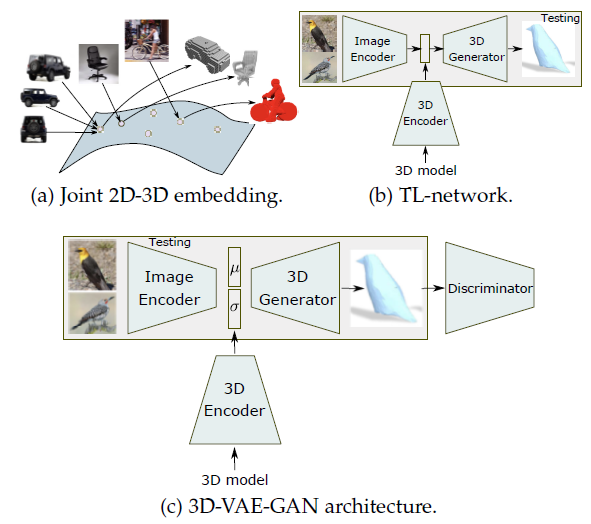

  图5：在测试时，3D编码器和鉴别器被移除并且只保留突出显示的模块。

&emsp;&emsp;Gidhar等人[[25]](#cite-25)使用TL嵌入网络从RGB图像重建体素形状，使用成批(图像、体素)对来训练网络通过渲染三维模型生成图像，然后对网络进行三阶段训练。

* 第一阶段中，随机初始化网络的3D编码器部分及其解码器，然后用sigmoid交叉熵损失进行独立于二维编码器的端到端训练。

* 第二阶段中，训练2D编码器来回归潜在表示编码器为体素生成嵌入，并训练图像网络来回归嵌入。

* 最后阶段联合微调整个网络。

Li等人[[79]](#cite-79)和Mandikal等人[[21]](#cite-21)通过使用点云自编码器替换体素编码器，为基于点云的三维重建扩展了这种方法。

##### 
7.3.2 对抗训练

&emsp;&emsp;一般来说，**一个好的重建模型应该能够超越训练中所看到的**。使用标准程序训练的网络可能无法很好得将其推广到看不见的数据。另外，Yang等人[[46]](#cite-46)注意到：标准技术的结果往往是表面粗糙的，缺乏精细的细节。为克服这些问题，最近几篇论文使用生成对抗网络(**GAN**)来训练具有对抗损失的网络。GAN从给定的随机向量生成信号[[102]](#cite-102)，另一方面，条件GAN在输入图像上调节生成的信号，见[[图5-(<text>c</text>)]](#fig-5)，它由 *镜像编码器h的生成器g* 和 *镜像生成器的判别器D* 组成。

&emsp;&emsp;在三维重建的情况下，编码器可以是ConvNet/ResNet[[46]](#cite-46)[[103]](#cite-103)或变分自编码器(VAE)[[17]](#cite-17)。生成器将潜在向量 $x$ 解码为三维形状 $X = g(x)$。判别器只在训练期间使用，它评估解码数据的确实性，它输出三维对象 $X$ 是真实还是合成的(即来自生成器)的0到1间的置信度 $C(X)$。其目的是联合训练生成器和判别器，使重建的形状尽可能接近基准。

&emsp;&emsp;GAN的核心是用于联合训练判别器和生成器的对抗损失函数。遵循Goodfellow等人[[102]](#cite-102)的观点，Wu等人[[17]](#cite-17)用二元交叉熵作为分类损失。总体对抗损失功能定义为：

<text id='formula-14'></text>
$${\cal{L}}_{3D-GAN}=log(D(X)) + log(1 - D(g(X))) \tag{14}$$

这里 $x=h(I)$ 中 $I$ 是训练形状 $X$ 的二维图像。Yang等人[[46]](#cite-46)[[103]](#cite-103)观察到：原始GAN损失函数呈现真实和假输入间的总体损失；然后，他们提出使用WGAN-GP损失[[104]](#cite-104)[[105]](#cite-105)，它分别表示用于生成伪重构对(`fake reconstruction pair`)的损失和用于区分伪重构对和真实重构对的损失。

&emsp;&emsp;为联合训练网络的三个组件，即：编码器、生成器和判别器，总损失被定义为重建损失之和([Section 7.1](#section-7.1))和GAN损失。当网络使用变分自编码器时，例如：3D VAE-GAN[[17]](#cite-17)，则在总损失中添加一个附加项，以便将变分分布(variational distribution)推向先验分布(prior distribution)。例如，Wu等人[[17]](#cite-17)使用KL散度度量(KL-divergence metric)及具有零中值和单位方差的多元高斯分布(multivariate Gaussian distribution)作为先验分布。

&emsp;&emsp;GAN 的潜力是巨大的，因为它们可以学习模拟数据的任何分布。它们也非常适合于**单视图三维形状重建**，它们已用于体素[[13]](#cite-13)[[17]](#cite-17)[[30]](#cite-30)[[40]](#cite-40)[[46]](#cite-46)[[103]](#cite-103)和点云[[74]](#cite-74)[[75]](#cite-75)重建。它们已用于三维监督[[17]](#cite-17)[[30]](#cite-30)[[40]](#cite-40)[[46]](#cite-46)[[103]](#cite-103)和二维监督[[13]](#cite-13)[[27]](#cite-27)[[97]](#cite-97)，见[Section 7.1.2](#section-7.1.2)。后一种方法用二维轮廓图像训练单个判别器。然而，在看似合理的形状中，仍有同样适合二维图像的多个形状。为解决这种模糊性，Wu等人[[91]](#cite-91)在预测的3D形状不自然时使用GAN的判别器来惩罚3D估计器。另一方面，Li等人[[106]](#cite-106)使用多个判别器，每个视图一个，从而产生更好的生成质量。

&emsp;&emsp;GAN很难训练，特别是对于许多类别和方向的三维对象上的复杂联合数据分布。对于高分辨率形状，它们也变得不稳定。事实上，我们必须仔细平衡生成器和判别器的学习，否则梯度可能消失，这将阻止优化[[40]](#cite-40)。为解决这个问题，Smith和Meger[[40]](#cite-40)及后来的Wu等人[[91]](#cite-91)以用梯度惩罚法进行归一化的Wasserstein距离为训练目标。

##### 
7.3.3 利用其它任务联合训练

&emsp;&emsp;与单任务训练相比，重建和分割的联合训练以提高两个任务的性能。Mandikal等人[[107]](#cite-107)提出了一种从一幅RGB图像中生成部件分割(part-segmented)的3D点云重建方法，其思想是：在两个任务间传播信息，以在提高分割精度的同时生成更可靠的部件重建，这是通过使用倒角距离定义的重建损失和使用对称softmax交叉熵损失定义的分割损失的加权和来完成的。

***
### 
8 应用与特定状况

***
### 
9 数据集

&emsp;&emsp;[表5](#table-5)列出并总结了最常用数据集的属性。与传统技术不同，基于深度学习的三维重建算法的成功与否取决于大型训练数据集的可用性。监督技术要求以下列形式的图像及其相应的3D标注:**(1)** 表示为体素化栅格、三角形网格或点云的完整3D模型，或 **(2)** 可以是密集或稀疏的深度图。另一方面，弱监督和无监督技术依赖于额外的监督信号，如外部和内部摄像机参数以及分割掩模。

&emsp;&emsp;为基于深度学习的三维重建收集训练数据集的主要挑战是两方面的。首先，虽然人们可以很容易地收集到二维图像，但获取它们相应的三维 基准 是一项挑战。因此，在许多数据集IKEA、PASCAL 3D+和ObjectNet3D中，只有相对较小的图像子集使用其相应的3D模型进行了标注。其次，诸如 ShapeNet和 ModelNet等数据集是目前可用的最大的三维数据集，它们包含的三维CAD模型没有相应的自然图像，因为它们最初用于基准三维形状检索算法。

&emsp;&emsp;这一问题已在文献中通过数据增强得到解决，即使用合成生成的数据增强原始集的过程。例如，可以通过应用几何变换(例如：平移、旋转和缩放)来生成新的图像和新的3D模型。注意：尽管有些变换是保持相似性的，但它们仍然丰富了数据集。还可以从现有3D模型中合成地绘制从各种(随机)视点、姿态、照明条件和背景的新的2D和2.5D(深度)视图，它们也可以覆盖自然图像或随机纹理。然而，这会导致 **域迁移问题**(domain shift problem)，即：合成图像的空间与真实图像的空间不同，当在完全不同类型的图像上测试方法时，这通常会导致性能下降。

&emsp;&emsp;传统上，机器学习中的域迁移问题是通过域适应或转换技术(domain adaptation or translation technique)来解决的，而域适应或转换技术正逐渐成为深度估计的主流[[153]](#cite-153)。然而，它们并不常用于三维重建。Petersen等人[[95]](#cite-95)的工作是一个例外，他观察到：在无监督技术中使用的可微渲染器可以生成外观上与输入图像不同的图像，这已经通过使用图像域转换得到了缓解。

&emsp;&emsp;最后，弱监督和无监督技术([Section 7.1.2](#section-7.1.2))最大限度地减少了对3D标注的依赖。然而，它们需要 **(1)** 分割掩码，它可以使用最新先进的目标检测和分割算法[[154]](#cite-154)获得，和/或 **(2)** 摄像机参数。联合训练三维重建、分割和摄像机参数估计是未来研究的一个有前途的方向。

  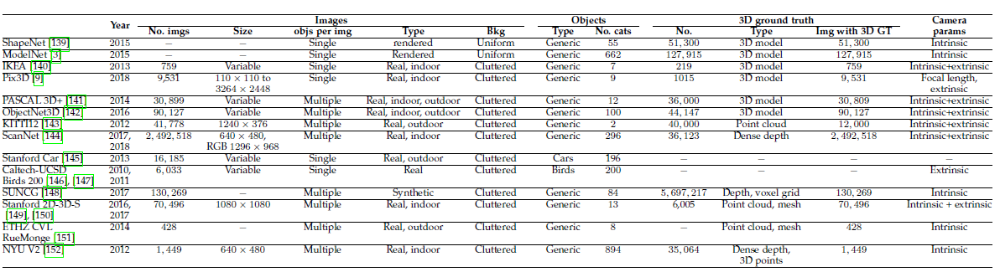

***
### 
10 性能比较

&emsp;&emsp;本节讨论一些关键方法的性能。我们将介绍各种性能标准和度量([Section 10.1](#section-10.1))，并讨论和比较一些关键方法的性能([Section 10.2](#section-10.2))。

#### 
10.1 精度矩阵和性能矩阵

&emsp;&emsp;设 $X$ 为基准三维形状, $\hat X$ 为重建形状。下面，我们将讨论一些用于比较三维重建算法的精度指标([Section 10.1.1](#section-10.1.1))和性能标准([Section 10.1.2](#section-10.1.2))。

##### 
10.1.1 精度矩阵

&emsp;&emsp;评估三维重建算法精度最常用的量化指标包括：

1. **均方误差 MSE**[[60]](#cite-60)。它被定义为重建形状 $\hat X$ 和基准形状 $X$ 之间的对称表面距离，即：

<text id='formula-15'></text>
$$d(\hat X, X)=\frac{1}{n_x}\sum_{p\in X}d(p, \hat X)+\frac{1}{n_{\hat X}}\sum_{\hat p\in \hat X}d(\hat p, X) \tag{15}$$

其中 $n_X$ 和 $n_{\hat X}$ 分别是 $X$ 和 $\hat X$ 上密集采样点的数目， $d(p, X)$ 是 $p$ 到 $X$ 沿垂直方向到 $X$ 的距离，例如： $L_1$ 或 $L_2$ 距离。这个度量值越小重建越好。

2. **覆盖率 IoU**。IoU测量预测的形状体素与基准体素的交集与两个体素的并集的比率，即：

<text id='formula-16'></text>
$$IoU_\epsilon= \frac{\hat V \cap V}{\hat V \cup V}=\frac{\sum_i\{I(\hat V_i>\epsilon)* I(V_i)\}}{\sum_i\{I(I(\hat V_i > \epsilon))+I(V_i)\}}\tag{16}$$

其中 $I(\cdot)$ 是指示函数， $\hat V_i$ 是第 $i$ 个体素的预测值， $V_i$ 是基准值， $\epsilon$ 是阈值。IoU值越高重见效果越好。该度量适用于体素重建，因此，在处理基于曲面的表示时，需要对重建的赫尔基准三维模型进行体素化。

3. **平均交叉熵 CE**[[103]](#cite-103)。定义如下：

<text id='formula-17'></text>
$$CE=\frac{1}{N}\sum_{i=1}^N\{p_ilog\hat p_i+(1-p_i)log(1-\hat p_i)\} \tag{17}$$

其中 $N$ 是体素或点的总数，具体取决于是使用体素表示还是基于点的表示。$p_i$ 和 $\hat p_i$分别是 $i$ 个体素或点的基准值和预测值。 $CE$ 值越低，重建效果越好。

4. **推土距离 EMD 和倒角距离 CD**。这些距离分别在[式(5)](#formula-5)和[式(6)](#formula-6)中定义。

##### 
10.1.2 性能标准

&emsp;&emsp;除这些定量指标外，还有几个定性方面用于评估这些方法的效率，这包括：

1. **三维监督程度**。基于深度学习的三维重建方法的一个重要方面是训练时它们需要的三维监督程度。事实上，虽然获取RGB图像很容易，但获取其相应的基准3D数据却相当具有挑战性，因此训练过程中，与那些需要基准三维信息的技术相比，通常更倾向于需要更少或不需要三维监督的技术。

2. **计算时间**。虽然训练速度可以很慢，但是通常希望在运行时实现实时性能。

3. **内存占用**。深层神经网络具有大量的参数，其中一些实用三维卷积对体素进行操作，因此它们通常需要很大的内存存储，这会影响它们运行时的性能并限制它们的使用。

#### 
10.2 比较和讨论

&emsp;&emsp;我们在[图6](#fig-6)中介绍了过去4年重建精度的改进及[表6](#table-6)中一些有代表性的方法的性能。

&emsp;&emsp;早期的研究大多采用体素表示[[4]](#cite-4)[[7]](#cite-7)[[17]](#cite-17)[[25]](#cite-25)[[156]](#cite-156)，它既能表示任意拓扑复杂物体的表面细节，又能表示其内部细节。随着诸如 O-CNN[[32]](#cite-32)、OGN[[33]](#cite-33)和OctNet[[41]](#cite-41)等空间分割技术的引入，体素技术可以获得相对较高的分辨率，例如 $512^3$。这是由于内存效率的显著提高。例如，[[33]](#cite-33)的OGN将大小为 $32^3$ 的体素栅格的重建所需的内存从 [[7]](#cite-7) 中的4.5GB和 [[12]](#cite-12) 中的1.7GB减少到只有0.29GB(见[表6](#fig-6)。然而只有少数论文，例如[[35]](#cite-35)，采用了这些技术，因为其实现的复杂性。为实现高分辨率的三维体素重建，最近的许多论文都使用了中间结果，通过多个深度图，然后是体素[[38]](#cite-38)[[46]](#cite-46)[[51]](#cite-51)[[92]](#cite-92)或基于点的[[80]](#cite-80)融合。最近，有几篇论文开始关注学习连续符号化距离函数的机制[[39]](#cite-39)[[43]](#cite-43)或连续占用栅格[[157]](#cite-157)，这些机制在内存需求方面要求较低。它们的优点是由于它们学习了一个连续场，因此可以在所需分辨率下提取重建的三维物体。

  **表6**：一些有代表性的方法的性能总结。Obj：对象；Time是指以毫秒为单位的计时；U3D：为标记的3D；#params：网络参数的数目；mem：内存需求；Resol：分辨率；Bkg：背景。
   
  

&emsp;&emsp;[图6](#fig-6)显示了自2016年以来，使用ShapeNet数据集[[3]](#cite-3)作为基准的几年来性能的演变。在大小为 $32^3$ 的体素栅格上计算的 IoU 度量上，我们可以看到在训练和/或测试时使用多个视图的方法优于仅基于单个视图的方法。此外，2017年开始出现的基于曲面技术(基于网格的[[60]](#cite-60)和基于点的[[59]](#cite-59)[[72]](#cite-72))略优于体素方法。然而，基于网格的技术仅限于与模板拓扑结构相同的零亏格曲面。

&emsp;&emsp;[图6](#fig-6)显示，自Yan等人[[4]](#cite-4)于2017年的出现以来，基于2D监督的方法在性能上显著提高。然而，[图6(a)和(b)](#fig-6)的IoU曲线表明使用三维监督的方法取得了稍好的性能，这可以归因于基于2D的监督方法使用基于2D二值掩模和轮廓的损失函数。但多个三维对象可以解释相同的二维投影，这种2D到3D的模糊性可以通过使用只能重建视觉外壳(visual hull)而精度受限制的从多个视点捕获多个二元掩模[[19]](#cite-19)，或通过使用将重建的3D形状限制在有效类的流形内的对抗训练[[91]](#cite-91)[[97]](#cite-97)来解决。

  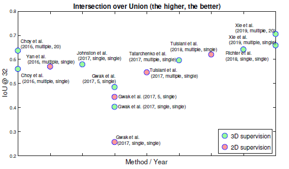  

  ($a$) 体素化方法的 IoU

    

  ($b$) 基于曲面方法的 IoU

    

  ($c$) 基于曲面方法的 CD  
  **图6**：ShapeNet上一些关键方法的性能。以红色高亮显示的参照是基于点的。IoU在 $32^3$ 网格上的计算

***
### 
11 未来研究方向

&emsp;&emsp;经过近五年的广泛研究，利用深度学习技术实现了基于图像的三维重建有希望的结果。然而，这一专题仍处于初级阶段，有待进一步发展。本节中，我们将介绍当前问题和未来研究的重点方向。

1. **训练数据问题**。

### 
参考文献

[3] Z. Wu, S. Song, A. Khosla, F. Yu, L. Zhang, X. Tang, and J. Xiao, “3D shapenets: A deep representation for volumetric shapes,” in IEEE CVPR, 2015, pp. 1912–1920.

[4] X. Yan, J. Yang, E. Yumer, Y. Guo, and H. Lee, “Perspective Transformer Nets: Learning single-view 3D object reconstruction without 3D supervision,” in NIPS, 2016, pp. 1696–1704.

[5] E. Grant, P. Kohli, and M. van Gerven, “Deep disentangled representations for volumetric reconstruction,” in ECCV, 2016, pp. 266–279.

[6] J. Wu, Y. Wang, T. Xue, X. Sun, B. Freeman, and J. Tenenbaum, “MarrNet: 3D shape reconstruction via 2.5D sketches,” in NIPS, 2017, pp. 540–550.

[7] C. B. Choy, D. Xu, J. Gwak, K. Chen, and S. Savarese, “3DR2N2: A unified approach for single and multi-view 3D object reconstruction,” in ECCV, 2016, pp. 628–644.

[8] S. Tulsiani, T. Zhou, A. A. Efros, and J. Malik, “Multi-view supervision for single-view reconstruction via differentiable ray consistency,” in IEEE CVPR, vol. 1, no. 2, 2017, p. 3.

[9] X. Z. Xingyuan Sun, Jiajun Wu and Z. Zhang, “Pix3D: Dataset and Methods for Single-Image 3D Shape Modeling,” in IEEE CVPR, 2018.

[10] O. Wiles and A. Zisserman, “SilNet: Single-and Multi-View Reconstruction by Learning from Silhouettes,” BMVC, 2017.

[11] S. Tulsiani, A. A. Efros, and J. Malik, “Multi-View Consistency as Supervisory Signal for Learning Shape and Pose Prediction,” in IEEE CVPR, 2018.

[12]A. Johnston, R. Garg, G. Carneiro, I. Reid, and A. van den Hengel, “Scaling CNNs for High Resolution Volumetric Reconstruction From a Single Image,” in IEEE CVPR, 2017, pp. 939–948.

[13]G. Yang, Y. Cui, S. Belongie, and B. Hariharan, “Learning singleview 3d reconstruction with limited pose supervision,” in ECCV, 2018.

[14]K. He, X. Zhang, S. Ren, and J. Sun, “Deep residual learning for image recognition,” in IEEE CVPR, 2016, pp. 770–778.

[15]K. Simonyan and A. Zisserman, “Very deep convolutional networks for large-scale image recognition,” arXiv preprint arXiv:1409.1556, 2014.

[16] D. P. Kingma and M.Welling, “Auto-encoding variational bayes,” ICLR, 2014.
  

[17] J. Wu, C. Zhang, T. Xue, B. Freeman, and J. Tenenbaum, “Learning a probabilistic latent space of object shapes via 3D generativeadversarial modeling,” in NIPS, 2016, pp. 82–90.
  

[18] S. Liu, C. L. Giles, I. Ororbia, and G. Alexander, “Learning a Hierarchical Latent-Variable Model of 3D Shapes,” International Conference on 3D Vision, 2018.
  

[19] A. A. Soltani, H. Huang, J. Wu, T. D. Kulkarni, and J. B. Tenenbaum, “Synthesizing 3D shapes via modeling multi-view depth maps and silhouettes with deep generative networks,” in IEEE CVPR, 2017, pp. 1511–1519.
  

[20] P. Henderson and V. Ferrari, “Learning to generate and reconstruct 3D meshes with only 2D supervision,” BMVC, 2018.
  

[21] P. Mandikal, N. Murthy, M. Agarwal, and R. V. Babu, “3DLMNet: Latent Embedding Matching for Accurate and Diverse 3D Point Cloud Reconstruction from a Single Image,” BMVC, pp. 662–674, 2018.
  

[22] M. Gadelha, R.Wang, and S. Maji, “Multiresolution tree networks for 3D point cloud processing,” in ECCV, 2018, pp. 103–118.

[23] H. Laga, Y. Guo, H. Tabia, R. B. Fisher, and M. Bennamoun, 3D Shape Analysis: Fundamentals, Theory, and Applications. JohnWiley & Sons, 2019

[24] R. Zhu, H. K. Galoogahi, C. Wang, and S. Lucey, “Rethinking reprojection: Closing the loop for pose-aware shape reconstruction from a single image,” in IEEE ICCV, 2017, pp. 57–65

[25] R. Girdhar, D. F. Fouhey, M. Rodriguez, and A. Gupta, “Learning a predictable and generative vector representation for objects,” in ECCV, 2016, pp. 484–499

[26] Ns and shape synthesis,” in IEEE CVPR, 2017, pp. 5868–5877

[27] M. Gadelha, S. Maji, and R. Wang, “3D shape induction from 2D views of multiple objects,” in 3D Vision, 2017, pp. 402–411

[28] W. Wang, Q. Huang, S. You, C. Yang, and U. Neumann, “Shape inpainting using 3D generative adversarial network and recurrent convolutional networks,” ICCV, 2017

[29] C. Zou, E. Yumer, J. Yang, D. Ceylan, and D. Hoiem, “3D-PRNN: Generating shape primitives with recurrent neural networks,” in IEEE ICCV, 2017

[30] V. A. Knyaz, V. V. Kniaz, and F. Remondino, “Image-to-Voxel Model Translation with Conditional Adversarial Networks,” in ECCV, 2018, pp. 0–0

[31] A. Kundu, Y. Li, and J. M. Rehg, “3D-RCNN: Instance-Level 3D Object Reconstruction via Render-and-Compare,” in IEEE CVPR, 2018, pp. 3559–3568

[32] P.-S. Wang, Y. Liu, Y.-X. Guo, C.-Y. Sun, and X. Tong, “OCNN: Octree-based convolutional neural networks for 3D shape analysis,” ACM TOG, vol. 36, no. 4, p. 72, 2017

[33] M. Tatarchenko, A. Dosovitskiy, and T. Brox, “Octree generating networks: Efficient convolutional architectures for highresolution 3D outputs,” in IEEE CVPR, 2017, pp. 2088–2096

[34] P.-S. Wang, C.-Y. Sun, Y. Liu, and X. Tong, “Adaptive O-CNN: a patch-based deep representation of 3D shapes,” ACM ToG, p. 217, 2018

[35] Y.-P. Cao, Z.-N. Liu, Z.-F. Kuang, L. Kobbelt, and S.-M. Hu, “Learning to reconstruct high-quality 3D shapes with cascaded fully convolutional networks,” in ECCV, 2018

[36] C. Hane, S. Tulsiani, and J. Malik, “Hierarchical Surface Prediction,” IEEE PAMI, no. 1, pp. 1–1, 2019

[37] B. Curless and M. Levoy, “A volumetric method for building complex models from range images,” CUMINCAD, 1996.

[38] I. Cherabier, J. L. Schonberger, M. R. Oswald, M. Pollefeys, and A. Geiger, “Learning Priors for Semantic 3D Reconstruction,” in ECCV, 2018.

[39] J. J. Park, P. Florence, J. Straub, R. Newcombe, and S. Lovegrove, “DeepSDF: Learning Continuous Signed Distance Functions for Shape Representation,” in IEEE CVPR, 2019, pp. 165–174.

[40] E. Smith and D. Meger, “Improved Adversarial Systems for 3D Object Generation and Reconstruction,” arXiv:1707.09557, 2017

[41] G. Riegler, A. O. Ulusoy, and A. Geiger, “OctNet: Learning deep 3D representations at high resolutions,” in IEEE CVPR, vol. 3, 2017.

[42] J. Li, K. Xu, S. Chaudhuri, E. Yumer, H. Zhang, and L. Guibas, “GRASS: Generative Recursive Autoencoders for Shape Structures,” ACM TOG, vol. 36, no. 4, p. 52, 2017.

[43] Z. Chen and H. Zhang, “Learning implicit fields for generative shape modeling,” in IEEE CVPR, 2019, pp. 5939–5948.

[44] M. Tatarchenko, S. R. Richter, R. Ranftl, Z. Li, V. Koltun, and T. Brox, “What do single-view 3d reconstruction networks learn?” in IEEE CVPR, June 2019.

[45] X. Han, Z. Li, H. Huang, E. Kalogerakis, and Y. Yu, “Highresolution shape completion using deep neural networks for global structure and local geometry inference,” in IEEE CVPR, 2017, pp. 85–93.

[46] B. Yang, S. Rosa, A. Markham, N. Trigoni, and H. Wen, “Dense 3D object reconstruction from a single depth view,” IEEE PAMI, 2018.

[47] J. Donahue, L. Anne Hendricks, S. Guadarrama, M. Rohrbach, S. Venugopalan, K. Saenko, and T. Darrell, “Long-term recurrent convolutional networks for visual recognition and description,” in IEEE CVPR, 2015, pp. 2625–2634.

[48] O. Ronneberger, P. Fischer, and T. Brox, “U-net: Convolutional networks for biologically-motivatedge segmentation,” in MICCAI, 2015, pp. 234–241.

[49] W. E. Lorensen and H. E. Cline, “Marching cubes: A high resolution 3D surface construction algorithm,” vol. 21, no. 4, pp. 163–169, 1987.

[50] Y. Liao, S. Donn´e, and A. Geiger, “Deep Marching Cubes: Learning Explicit Surface Representations,” in IEEE CVPR, 2018, pp. 2916–2925.

[51] S. R. Richter and S. Roth, “Matryoshka Networks: Predicting 3D Geometry via Nested Shape Layers,” in IEEE CVPR, 2018.

[52] A. Sinha, A. Unmesh, Q. Huang, and K. Ramani, “SurfNet: Generating 3D shape surfaces using deep residual networks,” in IEEE CVPR, vol. 1, no. 2, 2017.

[53] A. Pumarola, A. Agudo, L. Porzi, A. Sanfeliu, V. Lepetit, and F. Moreno-Noguer, “Geometry-Aware Network for Non-Rigid Shape Prediction From a Single View,” in IEEE CVPR, June 2018.

[54] T. Groueix, M. Fisher, V. G. Kim, B. C. Russell, and M. Aubry, “AtlasNet: A papier-Mache Approach to Learning 3D Surface Generation,” in IEEE CVPR, 2018.

[55] H. Kato, Y. Ushiku, and T. Harada, “Neural 3D Mesh Renderer,” in IEEE CVPR, 2018.

[56] N. Wang, Y. Zhang, Z. Li, Y. Fu, W. Liu, and Y.-G. Jiang, “Pixel2Mesh: Generating 3D Mesh Models from Single RGB Images,” in ECCV, 2018.

[57] A. Kanazawa, S. Tulsiani, A. A. Efros, and J. Malik, “Learning Category-Specific Mesh Reconstruction from Image Collections,” ECCV, 2018.

[58] D. Jack, J. K. Pontes, S. Sridharan, C. Fookes, S. Shirazi, F. Maire, and A. Eriksson, “Learning free-form deformations for 3D object reconstruction,” ACCV, 2018.

[59] A. Kurenkov, J. Ji, A. Garg, V. Mehta, J. Gwak, C. Choy, and S. Savarese, “DeformNet: Free-Form Deformation Network for 3D Shape Reconstruction from a Single Image,” IEEE WACV, 2018.

[60] J. K. Pontes, C. Kong, S. Sridharan, S. Lucey, A. Eriksson, and C. Fookes, “Image2Mesh: A Learning Framework for Single Image 3D Reconstruction,” ACCV, 2018.

[61] F. Monti, D. Boscaini, J. Masci, E. Rodola, J. Svoboda, and M. M. Bronstein, “Geometric deep learning on graphs and manifolds using mixture model cnns,” in CVPR, vol. 1, no. 2, 2017, p. 3.

[62] C. Gotsman, X. Gu, and A. Sheffer, “Fundamentals of spherical parameterization for 3d meshes,” ACM TOG, vol. 22, no. 3, pp. 358–363, 2003.

[63] E. Praun and H. Hoppe, “Spherical parametrization and remeshing,” ACM TOG, vol. 22, no. 3, pp. 340–349, 2003.

[64] A. Sheffer, E. Praun, K. Rose et al., “Mesh parameterization methods and their applications,” Foundations and Trends R in Computer Graphics and Vision, vol. 2, no. 2, pp. 105–171, 2007.

[65] H. Laga, Q. Xie, I. H. Jermyn, A. Srivastava et al., “Numerical inversion of srnf maps for elastic shape analysis of genus-zero surfaces,” IEEE PAMI, vol. 39, no. 12, pp. 2451–2464, 2017.

[66] G. Wang, H. Laga, N. Xie, J. Jia, and H. Tabia, “The shape space of 3d botanical tree models,” ACM TOG, vol. 37, no. 1, p. 7, 2018.

[67] G. Wang, H. Laga, J. Jia, N. Xie, and H. Tabia, “Statistical modeling of the 3d geometry and topology of botanical trees,” CGF, vol. 37, no. 5, pp. 185–198, 2018.

[68] V. Blanz and T. Vetter, “A morphable model for the synthesis of 3d faces,” in Siggraph, 1999, pp. 187–194.

[69] S. Vicente, J. Carreira, L. Agapito, and J. Batista, “Reconstructing PASCAL VOC,” in IEEE CVPR, 2014, pp. 41–48.

[70] S. Tulsiani, A. Kar, J. Carreira, and J. Malik, “Learning categoryspecific deformable 3D models for object reconstruction,” IEEE PAMI, vol. 39, no. 4, pp. 719–731, 2017

[71] J. K. Pontes, C. Kong, A. Eriksson, C. Fookes, S. Sridharan, and S. Lucey, “Compact model representation for 3D reconstruction,” 3DV, 2017

[72] H. Fan, H. Su, and L. Guibas, “A point set generation network for 3D object reconstruction from a single image,” in IEEE CVPR, vol. 38, 2017.

[73] C.-H. Lin, C. Kong, and S. Lucey, “Learning Efficient Point Cloud Generation for Dense 3D Object Reconstruction,” AAAI, 2018

[74] L. Jiang, S. Shi, X. Qi, and J. Jia, “GAL: Geometric Adversarial Loss for Single-View 3D-Object Reconstruction,” in ECCV, 2018

[75] C.-L. Li, M. Zaheer, Y. Zhang, B. Poczos, and R. Salakhutdinov, “Point cloud GAN,” ICLR Workshop on Deep Generative Models for Highly Structured Data, 2019.

[76] Y. Sun, Y. Wang, Z. Liu, J. E. Siegel, and S. E. Sarma, “Point-Grow: Autoregressively learned point cloud generation with selfattention,” arXiv:1810.05591, 2018

[77] E. Insafutdinov and A. Dosovitskiy, “Unsupervised learning of shape and pose with differentiable point clouds,” in NIPS, 2018, pp. 2802–2812

[78] K. Li, T. Pham, H. Zhan, and I. Reid, “Efficient dense point cloud object reconstruction using deformation vector fields,” in ECCV, 2018, pp. 497–513

[79] K. Li, R. Garg, M. Cai, and I. Reid, “Single-view object shape reconstruction using deep shape prior and silhouette,” arXiv:1811.11921, 2019

[80] W. Zeng, S. Karaoglu, and T. Gevers, “Inferring Point Clouds from Single Monocular Images by Depth Intermediation,” arXiv:1812.01402, 2018

[81] P. Mandikal and V. B. Radhakrishnan, “Dense 3D Point Cloud Reconstruction Using a Deep Pyramid Network,” in IEEEWACV, 2019, pp. 1052–1060

[82] J. Wang, B. Sun, and Y. Lu, “MVPNet: Multi-View Point Regression Networks for 3D Object Reconstruction from A Single Image,” arXiv:1811.09410, 2018

[83] M. Tatarchenko, A. Dosovitskiy, and T. Brox, “Multi-view 3D models from single images with a convolutional network,” in ECCV, 2016, pp. 322–337

[84] P. J. Besl and N. D. McKay, “Method for registration of 3-d shapes,” in Sensor Fusion IV: Control Paradigms and Data Structures, vol. 1611. International Society for Optics and Photonics, 1992, pp. 586–607

[85] Y. Chen and G. Medioni, “Object modelling by registration of multiple range images,” Image and vision computing, vol. 10, no. 3, pp. 145–155, 1992

[86] H. Xie, H. Yao, X. Sun, S. Zhou, S. Zhang, and X. Tong, “Pix2Vox: Context-aware 3D Reconstruction from Single and Multi-view Images,” IEEE ICCV, 2019

[87] C. R. Qi, H. Su, K. Mo, and L. J. Guibas, “PointNet: Deep learning on point sets for 3d classification and segmentation,” in IEEE CVPR, 2017, pp. 652–660

[88] C. R. Qi, L. Yi, H. Su, and L. J. Guibas, “PointNet++: Deep hierarchical feature learning on point sets in a metric space,” in NIPS, 2017, pp. 5099–5108.

[89] M. Kazhdan and H. Hoppe, “Screened poisson surface reconstruction,” ACM TOG, vol. 32, no. 3, p. 29, 2013

[90] F. Calakli and G. Taubin, “Ssd: Smooth signed distance surface reconstruction,” CGF, vol. 30, no. 7, pp. 1993–2002, 2011

[91] J. Wu, C. Zhang, X. Zhang, Z. Zhang, W. T. Freeman, and J. B. Tenenbaum, “Learning shape priors for single-view 3d completion and reconstruction,” in ECCV, 2018

[92] X. Zhang, Z. Zhang, C. Zhang, J. Tenenbaum, B. Freeman, and J. Wu, “Learning to reconstruct shapes from unseen classes,” in NIPS, 2018, pp. 2257–2268

[93] E. Smith, S. Fujimoto, and D. Meger, “Multi-view silhouette and depth decomposition for high resolution 3D object representation,” in NIPS, 2018, pp. 6478–6488

[94] M. M. Loper and M. J. Black, “Opendr: An approximate differentiable renderer,” in ECCV, 2014, pp. 154–169

[95] F. Petersen, A. H. Bermano, O. Deussen, and D. Cohen-Or, “Pix2Vex: Image-to-Geometry Reconstruction using a Smooth Differentiable Renderer,” arXiv:1903.11149, 2019

[96] D. t. Rezende, S. A. Eslami, S. Mohamed, P. Battaglia, M. Jaderberg, and N. Heess, “Unsupervised learning of 3D structure from images,” in NIPS, 2016, pp. 4996–5004

[97] J. Gwak, C. B. Choy, A. Garg, M. Chandraker, and S. Savarese, “Weakly Supervised Generative Adversarial Networks for 3D Reconstruction,” 3D Vision, 2017

[98] A. Kendall, M. Grimes, and R. Cipolla, “PoseNet: A convolutional network for real-time 6-DOF camera relocalization,” in IEEE ICCV, 2015, pp. 2938–2946

[99] H. Su, C. R. Qi, Y. Li, and L. J. Guibas, “Render for CNN: Viewpoint estimation in images using CNNs trained with rendered 3D model views,” in IEEE ICCV, 2015, pp. 2686–2694

[100] D. Novotny, D. Larlus, and A. Vedaldi, “Capturing the geometry of object categories from video supervision,” IEEE PAMI, 2018

[101] J. L. Schonberger and J.-M. Frahm, “Structure-from-motion revisited,” in IEEE CVPR, 2016, pp. 4104–4113

[102] I. Goodfellow, J. Pouget-Abadie, M. Mirza, B. Xu, D. Warde-Farley, S. Ozair, A. Courville, and Y. Bengio, “Generative Adversarial Nets,” in NIPS, 2014, pp. 2672–2680

[103] B. Yang, H. Wen, S. Wang, R. Clark, A. Markham, and N. Trigoni, “3D object reconstruction from a single depth view with adversarial learning,” in IEEE ICCV Workshops, 2017, pp. 679–688.

[104] M. Arjovsky, S. Chintala, and L. Bottou, “Wasserstein GAN,” ICML, 2017

[105] I. Gulrajani, F. Ahmed, M. Arjovsky, V. Dumoulin, and A. C. Courville, “Improved training of Wasserstein GANs,” in NIPS, 2017, pp. 5767–5777

[106] X. Li, Y. Dong, P. Peers, and X. Tong, “Synthesizing 3d shapes from silhouette image collections using multi-projection generative adversarial networks,” in IEEE CVPR, June 2019

[107] P. Mandikal, N. KL, and R. Venkatesh Babu, “3D-PSRNet: Part segmented 3D point cloud reconstruction from a single image,” in ECCV, 2018, pp. 0–0

[108] E. Dibra, H. Jain, C. O¨ ztireli, R. Ziegler, and M. Gross, “Hs-nets: Estimating human body shape from silhouettes with convolutional neural networks,” in 3D Vision, 2016, pp. 108–117

[109] E. Dibra, H. Jain, C. Oztireli, R. Ziegler, and M. Gross, “Human shape from silhouettes using generative hks descriptors and cross-modal neural networks,” in IEEE CVPR (CVPR), Honolulu, HI, USA, vol. 5, 2017

[110] T. Alldieck, M. Magnor, B. L. Bhatnagar, C. Theobalt, and G. Pons-Moll, “Learning to Reconstruct People in Clothing from a Single RGB Camera,” in IEEE CVPR, 2019

[111] B. L. Bhatnagar, G. Tiwari, C. Theobalt, and G. Pons-Moll, “Multi-Garment Net: Learning to Dress 3D People from Images,” in IEEE ICCV, 2019

[112] B. Allen, B. Curless, and Z. Popovi´c, “The space of human body shapes: reconstruction and parameterization from range scans,” ACM TOG, vol. 22, no. 3, pp. 587–594, 2003

[113] D. Anguelov, P. Srinivasan, D. Koller, S. Thrun, J. Rodgers, and J. Davis, “Scape: shape completion and animation of people,” ACM TOG, vol. 24, no. 3, pp. 408–416, 2005

[114] M. Loper, N. Mahmood, J. Romero, G. Pons-Moll, and M. J. Black, “SMPL: A skinned multi-person linear model,” ACM TOG, vol. 34, no. 6, p. 248, 2015

[115] J. Sun, M. Ovsjanikov, and L. Guibas, “A concise and provably informative multi-scale signature based on heat diffusion,” CGF, vol. 28, no. 5, pp. 1383–1392, 2009

[116] F. Bogo, A. Kanazawa, C. Lassner, P. Gehler, J. Romero, and M. J. Black, “Keep it SMPL: Automatic estimation of 3D human pose and shape from a single image,” in ECCV, 2016, pp. 561–578

[117] M. Omran, C. Lassner, G. Pons-Moll, P. Gehler, and B. Schiele, “Neural Body Fitting: Unifying Deep Learning and Model Based Human Pose and Shape Estimation,” in 3DV, 2018

[118] T. Alldieck, G. Pons-Moll, C. Theobalt, and M. Magnor, “Tex2Shape: Detailed Full Human Body Geometry from a Single Image,” in IEEE ICCV, 2019

[119] L. Pishchulin, E. Insafutdinov, S. Tang, B. Andres, M. Andriluka, P. V. Gehler, and B. Schiele, “Deepcut: Joint subset partition and labeling for multi person pose estimation,” in IEEE CVPR, 2016, pp. 4929–4937

[120] A. Kanazawa, M. J. Black, D.W. Jacobs, and J. Malik, “End-to-end recovery of human shape and pose,” CVPR, 2018

[121] Z. Huang, T. Li, W. Chen, Y. Zhao, J. Xing, C. LeGendre, L. Luo, C. Ma, and H. Li, “Deep volumetric video from very sparse multiview performance capture,” in ECCV, 2018, pp. 336–354

[122] G. Varol, D. Ceylan, B. Russell, J. Yang, E. Yumer, I. Laptev, and C. Schmid, “BodyNet: Volumetric Inference of 3D Human Body Shapes,” in ECCV, 2018

[123] T. F. Cootes, G. J. Edwards, and C. J. Taylor, “Active appearance models,” IEEE PAMI, no. 6, pp. 681–685, 2001

[124] T. Gerig, A. Morel-Forster, C. Blumer, B. Egger, M. Luthi, S. Sch¨onborn, and T. Vetter, “Morphable face models-an open framework,” in IEEE FG, 2018, pp. 75–82

[125] O. M. Parkhi, A. Vedaldi, A. Zisserman et al., “Deep face recognition.” in BMVC, vol. 1, no. 3, 2015, p. 6

[126] F. Schroff, D. Kalenichenko, and J. Philbin, “Facenet: A unified embedding for face recognition and clustering,” in IEEE CVPR, 2015, pp. 815–823

[127] A. T. Tran, T. Hassner, I. Masi, and G. Medioni, “Regressing robust and discriminative 3D morphable models with a very deep neural network,” in IEEE CVPR, 2017, pp. 1493–1502

[128] E. Richardson, M. Sela, and R. Kimmel, “3D face reconstruction by learning from synthetic data,” in 3D Vision, 2016, pp. 460–469

[129] E. Richardson, M. Sela, R. Or-El, and R. Kimmel, “Learning detailed face reconstruction from a single image,” CoRR, vol. abs/1611.05053, 2016. [Online]. Available: http://arxiv.org/abs/1611.05053

[130] K. Genova, F. Cole, A. Maschinot, A. Sarna, D. Vlasic, and W. T. Freeman, “Unsupervised Training for 3D Morphable Model Regression,” in IEEE CVPR, 2018

