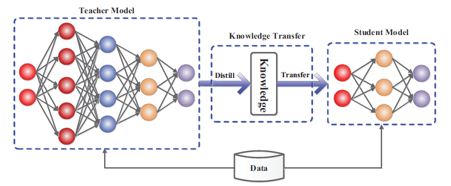
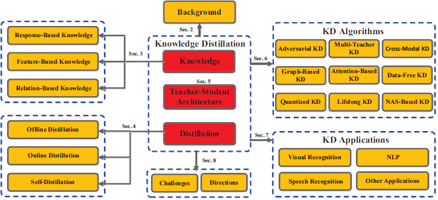
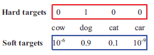
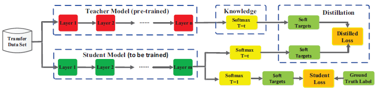
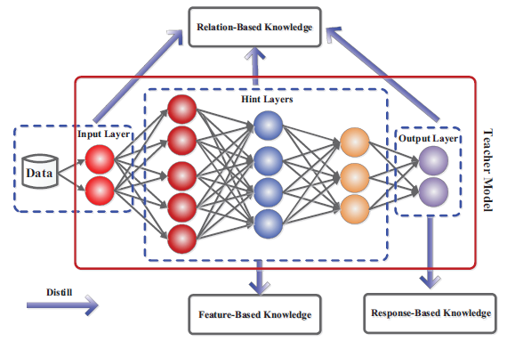
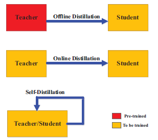

# Knowledge Distillation: A Survey

***

## 摘要

  近年来，深度神经网络在工业和学术界都取得了成功，特别是在计算机视觉任务方面。深度学习的巨大成功主要是因为它可以对大规模数据进行编码，并且可以操纵数十亿个模型参数。然而，在资源有限的设备(如移动电话和嵌入式设备)上部署这些笨重的深模型是一个挑战，不仅因为计算复杂度高，而且存储需求大。为此，开发了各种 *模型压缩* 和 *加速技术* 。作为模型压缩和加速的典型类型， **知识蒸馏** 有效地从大教师模型中学习小学生模型。社会对这个问题的关注迅速增加。本文从<big>**知识分类**、**训练方案**、**提取算法** 和 **应用**</big>等方面对知识提取进行了综述。在此基础上，简要回顾了知识蒸馏面临的挑战，并对未来的研究方向进行了讨论和展望。

## 概述

在过去的几年里，深度学习已经成为人工智能许多成功的基础，包括计算机视觉的各种应用，强化学习和自然语言处理。借助许多最新技术的帮助，包括残差连接、批次标准化，在强大的GPU或TPU集群上训练具有数千层的深度模型是很容易的。例如，在具有数百万张图像的流行图像识别基准测试中训练ResNet模型只需要不到10分钟。训练一个强大的BERT语言理解模型只需要不到一个半小时。大规模的深度模型已经取得了巨大的成功，但是巨大的计算复杂性和巨大的存储需求使得在实时应用中部署它们成为一个巨大的挑战，特别是在资源有限的设备上，比如视频监控和自动驾驶汽车。

为了开发高效的深层模型，最近的工作通常集中于

  * 构建深层模型的高效模块，包括深度可分离卷积，就像MobileNet一样和ShuffleNets

  * 模型压缩和加速技术，有以下类别

    - **参数剪枝和共享**: 这些方法主要从深度神经网络中去除不必要的参数，而对性能没有任何显著影响。这一类别又分为模型量化、模型二值化，结构矩阵和参数共享。

    - **低秩分解**: 这些方法利用矩阵分解和张量分解来识别深度神经网络的冗余参数

    - **迁移压缩卷积滤波器**: 这些方法通过迁移或压缩卷积滤波器来去除不必要的参数

    - **知识蒸馏**：这些方法将知识从一个较大的深度神经网络提取到一个较小的网络中

  对模型压缩和加速的综合评述超出了本文的范围。这篇论文的重点是知识的提炼，它已经受到越来越多的研究人员的关注。在实际应用中，大型深度模型往往能获得较好的性能，这是因为在考虑新数据时，过参数化可以提高泛化性能。在知识的升华中，一个小学生的榜样就是一个大老师监督的榜样。关键问题是<big><strong>如何将知识从教师模式转移到学生模式</strong></big>。知识蒸馏的一般师生框架下图所示。

  

       
  

  虽然在实践上取得了巨大的成功，但对无论是理论理解还是经验理解的知识提炼的著作并不多

  > Explaining Knowledge Distillation by Quantifying the Knowledge. CVPR2020  
  Towards understanding knowledge distillation. ICML 2019  
  On the efficacy of knowledge distillation. ICCV 2019

  具体地说，为了理解知识蒸馏的工作机制，Phuong和Lampert在深度线性分类器的情况下对学习蒸馏学生网络快速收敛的泛化界进行了理论证明。这个解释回答了学生学习的内容和速度，并揭示了决定蒸馏成功的因素。蒸馏的成功依赖于 **数据几何** 、**蒸馏目标的优化偏差** 和 **学生分类器的强单调性**。Cheng等人量化了从深度神经网络的中间层提取视觉概念，以解释知识的精馏。Zhao和Hariharan对知识蒸馏的有效性进行了详细的实证分析。另外实证结果表明，由于模型容量的差距，一个较大的模型不一定是一个更好的教师。实验还表明，蒸馏对学生的学习有负面影响。对不同形式的知识蒸馏，知识蒸馏和师生之间的相互影响的实证评价未包括Cho和Hariharan的文章之内。知识蒸馏也被探索为 **平滑标签**，为评估教师的准确性和为获得最佳输出层几何的先验。

  对模型压缩的知识蒸馏类似于人类学习的方式。受此启发，最近的知识提炼方法已经扩展到 **师生学习**， **相互学习**、 **辅助教学**、 **终身学习** 和 **自学习**。知识蒸馏的扩展主要集中在压缩深度神经网络上。由此产生的轻量级学生网络可以很容易地部署在诸如视觉识别、语音识别和自然语言处理等应用程序中。此外，知识蒸馏中知识从一个模型到另一个模型的迁移可以扩展到其他任务中，如对抗性攻击、数据扩充，数据隐私和安全。

  本文对知识蒸馏的研究进行了综述。本调查的主要目的是

  * 提供知识蒸馏的概述，包括动机的背景，基本的符号和公式，和几个典型的知识，蒸馏和算法

  * 回顾知识蒸馏的最新进展，包括算法和在不同现实场景中的应用

  * 基于知识迁移的不同视角，包括知识的不同类型、训练方案、知识迁移算法和结构以及应用，解决知识迁移的一些障碍，并为知识迁移提供一些见解

  本文组织结构如下图所示。

  * 第2节给出了知识蒸馏的重要概念和常规模型
  * 第3节和第4节分别总结了不同种类的蒸馏知识
  * 第5节说明了现有的关于知识蒸馏中师生结构的研究
  * 第6节对最新的知识蒸馏方法进行了全面的总结
  * 第7节说明了知识蒸馏的许多应用。
  * 第8节讨论了知识蒸馏中具有挑战性的问题和未来的发展方向，并给出了结论

  

       
  

***

## 2 背景

  在本节中，我们首先介绍了知识蒸馏的背景，然后回顾了形成香草知识蒸馏方法的符号。

  深度神经网络已经取得了显著的成功，特别是在拥有大量数据的真实场景中。然而，由于设备的计算能力和内存有限，在移动设备和嵌入式系统中部署深度神经网络是一个巨大的挑战。为了解决这个问题，Bucilua等人首先提出了模型压缩，将信息从一个大型模型或模型集合转移到一个小型模型的训练中，而不会显著降低准确率。主要观点是 **学生模式模仿教师模式为了获得一个有竞争力甚至是优越的性能**。从大模型中学习小模型，后来被推广为知识蒸馏。

  一个普通的知识蒸馏框架通常包含一个或多个大型的预训练教师模型和一个小型的学生模型。教师模型通常比学生模型大得多。其主要思想是在教师模式的指导下，培养一种高效的学生模式，以获得相当的准确性。来自教师榜样的监督信号，通常是指教师榜样学习到的 *“知识”* ，帮助学生榜样模仿教师榜样的行为。在一个典型的图像分类任务中，使用logits(如深度神经网络中最后一层的输出)作为教师模型知识的载体，这是训练数据样本没有明确提供的。例如，一只猫的图像被错误地归类为一只狗的概率非常低，但是这种错误的概率仍然比把一只猫误当成一辆车的概率高很多倍。另一个例子是，手写数字2的图像更类似于数字3，而不是数字7。这种以教师为榜样的知识被称为黑暗知识。

  在香草知识蒸馏中传递黑暗知识的方法表述如下。给定一个logits $z$ 向量作为深模型最后一个全连接层的输出，使 $z_i$ 为第 $i$ 类的logit，则可以用 $softmax$ 函数估计输入属于第 $i$ 类的概率 $p_i = \frac{exp(z_i)}{\sum_jexp(z_j)}$。因此，教师模型得到的软目标预测中包含了黑暗知识，可以作为一个监督者将知识从教师模型传递到学生模型。类似地，one-hot标签被称为硬目标。一个关于软目标和硬目标的直观例子如下图所示。此外，还引入温度因子T来控制各软目标的重要性 $p_i = \frac{exp(z_i/T)}{\sum_jexp(z_j/T)}$，温度越高，类上的概率分布越弱。具体来说，当 $T\rightarrow \infty$ 所有的类都有相同的概率。当 $T\rightarrow 0$ ，软目标变成一个one-hot标签，即硬目标。教师模型的软目标和GT真值标签对于提高学生模型的表现都具有重要意义，分别用于 <big>**蒸馏损失** 和 **学生损失**</big>。

  

       
  

  蒸馏损失的定义是为了匹配教师模型和学生模型之间的logits，如下所示

  $$L_D(p(z_t,T),p(z_s,T))=\sum_i-p_i(z_{ti},T)log(p_i(z_{si},T))$$

  其中 $z_t$ 和 $z_s$ 分别是老师和学生模型的logits。教师模型的logits与学生模型的logits相匹配计算交叉熵梯度。关于logit $z_{si}$ 的交叉熵梯度可以计算为

  $$\frac{\partial L_D(p(z_t,T),p(z_s,T))}{\partial z_{si}}=\frac{p_i(z_{si},T)-p_i(z_{ti},T)}{T}=\frac{1}{T}\bigg( \frac{exp(z_{si}/T)}{\sum_jexp(z_{sj}/T)}-\frac{exp(z_{ti}/T)}{\sum_jexp(z_{tj}/T)} \bigg)$$

  如果温度T远高于logits的大小 $\frac{\partial L_D(p(z_t,T),p(z_s,T))}{\partial z_{si}}$ 可以根据它的泰勒级数近似

  $$\frac{\partial L_D(p(z_t,T),p(z_s,T))}{\partial z_{si}}=\frac{1}{T}\bigg( \frac{1+\frac{z_{si}}{T}}{N+\sum_j\frac{z_{sj}}{T}}-\frac{1+\frac{z_{ti}}{T}}{N+\sum_j\frac{z_{tj}}{T}} \bigg)$$

  进一步假设每个迁移训练样本的logits为零均值( $\sum_jz_{sj}=\sum_jz_{tj}=0$ )，那么上式可以简化为

  $$\frac{\partial L_D(p(z_t,T),p(z_s,T))}{\partial z_{si}}=\frac{1}{NT^2}(z_{si}-z_{ti})$$

  因此，根据上式，蒸馏损失等价于匹配高温条件下教师模型和学生模型的logits和零均值的logits(例如最小化 $(z_{si}-z_{ti})$)。因此 **通过与高温匹配的logits蒸馏可以将教师模型所学到的非常有用的知识信息传递给学生模型**。

  学生损失被定义为ground truth标签和学生模型的软logits之间的交叉熵

  $$L_S(y,p(z_s,T))=\sum_i-y_ilog(p_i(z_{si},T))$$

  其中 $y$ 是一个ground truth向量，其中只有一个元素为1，表示迁移训练样本的ground truth label，其他都为0。在学生损失和蒸馏损失中，两者都使用学生模型的相同logits，但温度不同。学生损失的温度为 $T=1$，蒸馏损失的温度为 $T=T$。最后，一个香草知识蒸馏的基准模型是蒸馏和学生损失的结合:

  $$L(x,W)=\alpha * L_D(p(z_t,T),p(z_s,T))+\beta*L_S(y,p(z_s,T))$$

  其中 $x$ 是需要迁移的集合中的一个训练输入， $W$ 为学生模型的参数， $\alpha$ 和 $\beta$ 为调节参数。为了便于理解知识蒸馏，结合教师模型和学生模型的香草知识蒸馏的具体架构如下图所示。在图中所示的知识蒸馏中，首先对教师模型进行预训练，然后利用已训练的教师模型中的知识对学生模型进行训练。其实，这就是线下知识的升华。此外，使用预培训教师模型中仅来自软目标的知识来训练学生模型。当然，还有其他类型的知识和提炼将在下一节中讨论。

  

       
  

## 3 知识

  在本节中，我们将重点介绍不同类别的知识，以便进行知识的提炼。香草知识蒸馏使用一个大型深层模型的 **logits** 作为教师知识。**中间层的激活**、 **神经元** 或 **特征** 也可以作为知识来指导学生模型的学习。不同激活、神经元或对样本之间的关系包含了教师模型所获得的丰富信息。此外，教师模型的参数(或层之间的连接)还包含另一种知识。我们将在以下类别中讨论不同形式的知识:基于响应的知识、基于特征的知识和基于关系的知识。下图展示了教师模型中不同知识类别的直观示例。近年来，基于响应的知识被进一步探索，以解决GT真值标记信息作为条件目标的问题。

  

       
  

#### 3.1 基于响应的知识

  基于响应的知识通常是指 <big>**教师模型中最后一个输出层的神经响应**</big>。主要思想是直接模仿教师模型的最终预测。基于响应的知识精馏方法用于模型压缩简单有效，已广泛应用于不同的任务和应用中。图像分类中最常用的基于响应的知识是软目标。基于响应的知识可以用于不同类型的模型预测。例如，对象检测任务中的响应可能包含logits和边界框的偏移量。在语义地标定位任务中，如人体姿态估计，教师模型的响应可能包括每个地标的热图。

  基于响应的知识的概念是简单易懂的，特别是在“黑暗知识”的语境中。从另一个角度来看，软目标的有效性类似于平滑标签，即两者都是有效的正则化。此外，基于响应的知识还可以通过标签平滑来增强。

#### 3.2 基于特征的知识

  深度神经网络善于学习抽象程度不断提高的多级特征表示。这就是所谓的表示学习。最后一层的输出和中间层的输出(例如特征图)都作为知识来监督学生模型的训练。

  首先在Fitnets中引入了中间表示，为改进学生模型的训练提供提示。其主要思想是 <big>**直接匹配教师和学生的特征激活**</big>。受此启发，人们提出了各种其他方法来间接匹配这些特征。特别的，可以从原始的特征图中衍生出“注意图”来表达知识。Huang和Wang(2017)利用神经元选择性转移对注意图进行了推广。Passalis和Tefas(2018)通过匹配特征空间中的概率分布来转移知识。Kim等(2018)引入了所谓的“factors”，将其作为一种更容易理解的中间表征形式。最近，Heo等人提出提出利用隐藏神经元的激活边界进行知识转移。有趣的是，教师模型中提示层的参数共享与基于响应的知识也被用作教师知识。一个基于特征的知识类别总结如下所示:

  * 中间层的特征表示

    学生的中间层是由教师通过提示训练引导的

  * 层参数分布

    教师与学生间对应层参数分布

  * hint map的相对不同

    教师之间基于距离的差异关系转化为学生之间的差异关系

  * 注意力迁移

    学生模仿老师的注意力图

  * Factor迁移

    卷积模块作为因子对输出层的特征表示进行编码

  * 概率知识迁移

    根据输出层的特征表示定义的数据的软概率分布

  * 参数共享

    学生与教师共享较低层次的网络

  * 激活边界

    学生隐藏神经元形成的激活边界与教师的激活边界匹配

  * 神经元选择性迁移

    学生模仿教师提示层神经元活动的分布

  * 特征响应和神经元激活

    包含足够特征信息的特征响应的大小和每个神经元的激活状态

#### 3.3 基于相关性的知识

  基于响应的知识和基于特征的知识都使用了教师模型中特定层次的输出。基于关系的知识进一步探索不同层和数据样本之间的关系。

  为了探究不同特征图之间的关系，Yim等人提出了一种求解流程(FSP)，该流程由两层之间的Gram矩阵定义。FSP矩阵总结了特征图对之间的关系，利用两层特征间的内积来计算。Lee提出了利用特征图之间的相关性作为知识的提取方法，通过奇异值分解的知识蒸馏来提取特征图中的关键信息。为了利用来自多个教师的知识，Zhang和Peng分别以每个教师模型的logits和features作为节点，形成了两个图。具体地说，在知识转移之前，不同教师之间的重要性和关系是通过logits和表示图来建模的。Lee和Song提出了基于图的数据内关系知识蒸馏。Park等人提出了一种关系知识蒸馏方法。

  传统的知识迁移方法往往涉及到个体知识的提炼。教师的个别软目标直接转化为学生。事实上，经过提炼的知识不仅包含特征信息，还包含数据之间的相互关系。Liu等人提出了一种基于实例关系图的鲁棒、有效的知识蒸馏方法。实例关系图中传递的知识包含 **实例特征**、 **实例关系** 和 **跨层特征空间转换**。基于流形学习的思想，采用特征嵌入的方法对学生网络进行学习，保留了特征表示在教师网络提示层中的位置信息。通过特征嵌入，教师网络中数据的相似性被转移到学生网络中。Tung和Mori提出了一种保持相似的知识蒸馏方法。特别是，教师网络中输入对的相似激活所产生的保持相似的知识被转移到学生网络中，保留了成对相似性。Peng等人提出了一种基于关联一致性的知识蒸馏方法，该方法中提取的知识既包含实例级信息，又包含实例之间的关联。利用关联同余进行蒸馏，学生网络可以学习实例之间的关联。

  经过提炼的知识可以从其他角度进行分类，如数据的结构化知识、关于输入特征的特权信息等。。基于关系的知识类别的总结如下所示：

  * Multi-head graph

    通过多头注意网络获得的任意两个特征图之间的数据关系

  * logits和表示图

    多自监督教师logits图在分类器层次上提取软化的预测知识，表示图从教师结构紧凑的双线性池层的成对表示中提取特征知识

  * FSP矩阵

    任意两层网络中任意两张特征图之间的关系

  * 数据相互关系

    特征表示之间的相互关系以结构方式输出

  * 实例关系图

    该图包含了跨层次教师的实例特征、实例关系和特征空间变换的知识

  * 特征表示之间的相似性

    教师网络提示层特征表示之间的局部相似性，教师网络中输入对之间的相似激活

  * 相关一致性

    数据实例之间的相关性

  * 嵌入网络

    来自老师的层的特征嵌入和数据对之间的距离

  * 相似性迁移

    交叉样本相似之处

## 蒸馏方案

  在本节中，我们将讨论为教师和学生模型的训练计划(即蒸馏方案)。根据教师模型是否与学生模型同步更新，知识蒸馏的学习方案可直接分为三大类： <big>**离线蒸馏**、 **在线蒸馏** 和 **自蒸馏**</big>，如下图所示。

  

       
  

#### 4.1 离线蒸馏

  以往的知识提炼方法大多是离线工作的。在香草知识蒸馏中，知识从预先培训的教师模型转化为学生模型。因此，整个训练过程分为两个阶段，即：

  * 在蒸馏之前，首先在一组训练样本上对大教师模型进行训练

  * 教师模型以logits或中间特征的形式提取知识，并在提炼过程中用于指导学生模型的训练

  离线蒸馏的第一阶段通常不作为知识蒸馏的一部分讨论，假设教师模型是预定义的。教师模式结构及其与学生模式的关系很少被关注。因此，离线方法主要针对知识转移的不同部分进行改进，包括知识的设计和特征匹配或分布匹配的损失函数。离线方法的主要优点是简单，易于实现。例如，教师模型可能包含一组使用不同软件包(可能位于不同的机器上)训练的模型。知识可以被提取并存储在缓存中。

  显然，离线精馏方法往往采用单向的知识转移和两阶段的训练过程。然而，离线蒸馏需要复杂的大容量教师网络和大量训练数据的训练时间，在蒸馏之前教师和学生之间总是存在能力差距。

#### 4.2 在线蒸馏

  虽然离线蒸馏方法简单有效，但离线蒸馏中存在的一些问题越来越受到研究人员的关注。为了克服离线蒸馏的局限性，提出了在线蒸馏以进一步提高学生模型的性能，特别是在没有大容量高性能教师模型的情况下。在在线蒸馏中，对教师模型和学生模型进行了同时的更新，那么整个知识蒸馏框架是可端到端训练的。
