## Unsupervised Learning of Depth and Ego-Motion from Video
  > **基于视频的深度和帧间运动的无监督学习**

  >&emsp;人类有能力通过即使极短时间序列的景象来判断场景*三维结构*，计算机几何视觉研究无法对真实场景建模主要因为存在：  
  &emsp;&emsp;*非刚体、遮挡和纹理表现的缺失*  

  >&emsp;通过人类平时大量的观察已经形成了对世界充分的*几何信息*的理解，我们可以使用这些知识当我们接收一个新的场景，即使是一个*单视角*的图片

#### 简介

  + 成果  --  用于估计**单目深度**`monocular depth`和**摄像机位姿估计**`camera motion estimation`(6-DoF)

  + 结构  --  端到端end-to-end, 单视角深度网络, 多视角位姿网络, 利用计算得到的深度和位姿在目标视角下的图像变形计算损失，利用未标记视频序列训练

  
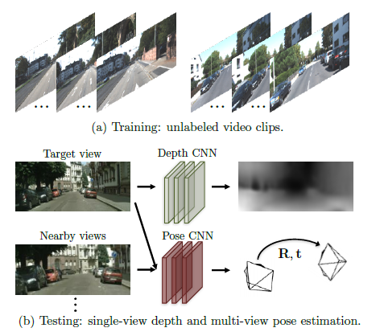

  + 现有系统问题  --  一个几何视角合成系统只有在对于场景的几何和相机姿态的中间预测相对于*真实的物理场景*相匹配时才能表现得好，尽管不完美的几何或姿态估计可以对某些场景(如无纹理)用*似乎合理的合成视图*进行欺骗，但是如果呈现出另外一组布局和外观结构更加多样的场景，相同的模型将还原失败。因此**网络需要学习深度和相机姿态估计**的中间任务。

  + 数据集  --  KITTI、Make3D

#### 相关工作  **[TODO]**

  + structure from motion*从运动中恢复结构*  
    需要依赖图像间准确的关联关系，会在低纹理、复杂的几何/光照、薄结构和遮挡等区域造成问题

  + warping-based biew synthesis*基于图像变形的视角合成*  
    通过新的照相机的观察视角合成场景,估计3D底层信息/在输入视图间建立对应关系,随后将输入视图的图像块合成新的视图

  + learning single-view 3D from registered 2D views从配准的2D视图中学习单视图3D  
    只是从世界的图像观测中学习，而不需要显式深度表示的训练方法

  + unsupervised/self-supervised learning from video*通过视频的无监督和自监督学习*  

#### 本文方法

  + **联合训练**,但是得到的位姿估计模型和深度模型可以*单独使用*  

    训练使用短视频序列由移动相机拍摄,**期望的场景是刚体**,运动由相机移动控制

  + 监督来自于**新视角合成任务**,训练集图像序列 $<I_1,\ldots,I_n>$ ,target view $I_t$,source views $I_s$  
    $$L_{v,s}=\displaystyle \sum_s \sum_p |I_t(p)-\hat I_s(p)|$$
    > photomatric reconstruction loss 光度重建误差  

    **其中p为图像像素坐标的索引, $\hat I_s$为源视角Is基于深度图像的渲染模块扭曲到目标帧**  

    **输入为：$I_s$, 深度预测 $\hat D_t$, 相机移动矩阵 $\hat T_{t\rightarrow s}^{R_{4*4}}$**

    
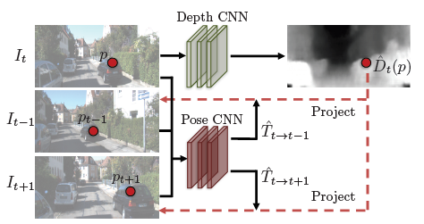

    将目标帧$I_t$输入深度预测网络得到预测深度图 $\hat D_t(p)$，取临近视角 *$I_{t-1}及I_{t+1}$*，将它们以及目标帧输入至姿态估计网络得到两个相机位置变换 *$\hat T_{t\rightarrow t-1}及\hat T_{t\rightarrow t+1}$*。随后使用两个网络的输出将源视角扭曲至目标视角。

  + 可微深度图像渲染

    用于上一块的视角合成，由$I_s、\hat D_t、\hat T_{t\rightarrow s}$ 生成 $I_t$  
    $p_t$表示目标视角每一个像素的齐次坐标、K表示相机的内参矩阵，则$p_t$在$p_s$视角下的投影坐标为
    $$p_s\text{~} K\hat T_{t\rightarrow s}\hat D_t(p_t)K^{-1}p_t$$
    > <small>
将pt转换到像素坐标系，加上深度预测乘上转移矩阵得到目标视角下像素在源视角中像素坐标系的位置，最后乘上相机内参矩阵得到源视角像素所在的相机坐标
</small>

    随后使用可微双线性采样的[空间变换网络](#STN)得到由
    $$I_t(p_t)\rightarrow I_s(p_s)\rightarrow \hat I_s(p_t)$$
    i.e.[ 双线性插值](#interpolation)`bilinear interpolation`
    $$\hat I_s(p_t)=I_s(p_s)=\Sigma_{i\in\text{{t,b}},j\in\text{{l,r}}}w^{ij}I_s(p^{ij}_s)$$

    
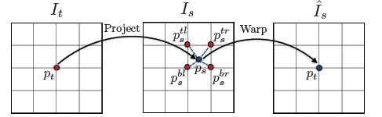

  + 模型限制
    * 背景是静态的不包含运动物体的

    * 目标和源视角间没有遮挡和非遮挡情况

    * 表面是[朗伯体](#lambertian)`lambertian`，使得光一致性误差具有一定的意义  

    为了提升鲁棒性，与深度和位姿网络一同训练一个可解释性的预测网络，其输出一个逐像素的soft mask $\hat E_s$对每一个目target-source对，展示对每个像素合成成功的概率。视角合成任务目标Loss可以表示为:
    $$L_{v\ s} = \sum_{<I_1,\ldots,I_n>\in S}\sum_p\hat E_s(p)|I_t(p) - \hat I_s(p)|$$

    但是对于置信度没有明确的直接监督,使用上述监督会使网络预测 $\hat E_s$ **始终为0**。于是需要添加一个正则化项 $L_{reg}(\hat E_s)$,以在每个像素位置用常数标签1最小化交叉熵损失来产生非零的预测。

  + 克服梯度局限性

    以上流程梯度仅来自于 $I(p_t)以及I(p_s)的周围四个像素$，于是当通过GT的深度和位姿投影后的 $p_s$**与当前预测距离很远** 或是落在 **低纹理的区域** 则会抑制训练过程(*一个运动估计中很著名的问题*)。根据经验有两种策略：

    * [在深度网络中使用一个带有*小瓶颈层*的卷积编解码结构](#google-net)  

      隐式得使全局输出平滑并使梯度从有意义的区域传播到相邻区域

    * 显式多尺度和平滑损失  
      > **Unsupervised CNN for single view depth estimation: Geometry to the rescue**  
        $$ E^i_{smooth}=||\nabla D^i(x)||^2$$
      > 使用了L2正则化处理了视差不连续造成的孔径问题。

      >  **Unsupervised monocular depth estimation with left-right consistency**  
        $$ C^l_{ds}=\frac{1}{N}\sum_{i,j}|\partial_xd^l_{ij}|e^{-||\partial_xI^l_{ij}||}+|\partial_yd^l_{ij}|e^{-||\partial_yI^l_{ij}||} $$
      >  鼓励在局部的平滑差异，对 $\partial d$ 的差异梯度进行L1惩罚，得到`Disparity Smoothness Loss`

      这允许了梯度较大的空间区域直接产生.  

    文中使用了第二种策略，他对框架的选择更不敏感。为了平滑度，最小化为了预测深度图的二阶梯度的L1范数。
    > SfM-Net: Learning of structure and motion from video  
      通过惩罚相邻像素梯度的L1范数，在光流场、深度和推断的运动图上添加了健壮的空间平滑惩罚。对于深度预测，我们惩罚二阶梯度的范数，以鼓励不是恒定的，而是平稳变化的深度值。  
      $\rightarrow$ Intrinsic depth: Improving depth transfer with intrinsic images
      $$E_{spat}(D_t)=\sum_xs^x_t(x)\rho(\nabla_xD_t(x))+s^y_t(x)\rho(\nabla_yD_t(x))$$
    > 其中 $\rho$ 中的值为水平和垂直深度梯度，$\rho(x)=\sqrt[2]{x^2+\epsilon^2},\epsilon=0.01。s^x_t和s^y_t$控制了预测深度图的平滑程度，它保证了更高的平滑程度，保证了轮廓不在图像中出现。

    * 最终得到的Loss为：
    $$L_{final} = \sum_lL^l_{v s}+\lambda_sL^l_{smooth}+\lambda_e\sum_sL_{reg}(\hat E^l_s)$$
    > l为不同尺度图像上的索引，s为源图像上的索引，$\lambda_s与\lambda_s$分别为深度平滑损失和可解释性正则化的权重

  + 网络结构

    * 单视角深度

      DispNet结构基于*跳连接*和*多尺度预测*的编解码设计，卷积层大小的*增加*或*减少*因子都为2。除前四层的**核大小**为7,7,7,5,其余**卷积核大小**均为3。第一层**卷积输出通道**为32。除预测层外所有卷积层后都是用ReLU激活，预测层使用 $1/(\alpha * sigmoid(x) + \beta)$ 其中 $\alpha=10,\beta=0.01$，使其预测的深度始终为正且在一个可约定的范围内。
      > 尝试将多视角图像输入至深度网络中，但这并没有提升预测的效果。  
      DeMoN: Depth and motion network for learning monocular stereo 也得到这样的结果并提出需要使用光流的约束来使用多视角。

      
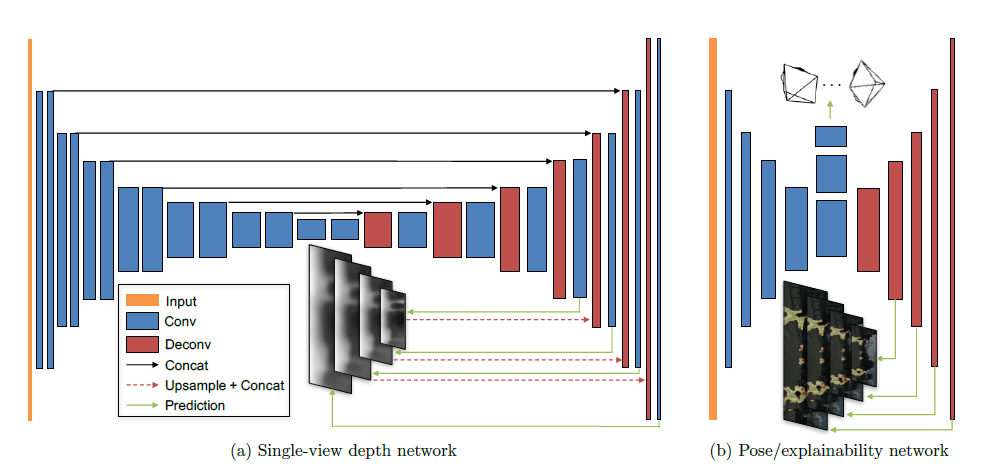

    * 位姿

      *输入*: 目标视角和所有源视角，*输出*:  视角间转换的相关位姿。  

      网络包含七个步长为2并后面跟着1\*1卷积层的卷积层，最终有6\*(N-1)个通道输出`每个视角间3个欧拉角和3D平移参数`，最后全局平均池化被用于所有空间位置的综合预测。除最后一层外所有卷积层都是用ReLU激活。

    * Explainability mask

      与姿态预测网络共享了前五层，随后加上五个带有多尺度预测的反卷积层。每一个预测层输出有2\*(N-1)个通道，利用softmax对每两个通道进行归一化，得到对应源-目标对的可解释性预测。

  + 实验

    对上述Loss中 $\lambda_s=0.5/l\ \ (l为对应尺度的降尺度因子)，\lambda_e=0.2$。使用Batch normalizztion，Adam优化中 $\beta_1=0.9,\beta_2=0.999$ ,学习率设置为0.0002，mini-batch为4，进行15W次迭代。视频在训练时被resize到128*416.

    
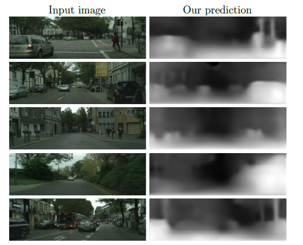

    深度预测网络首先在较大的数据集Cityscapes上进行训练，随后在KITTI上进行微调，得到以上结果效果得到轻微的改善。下表由本文的无监督方法与多个有监督方法进行比较。*效果不及使用左右循环一致性损失训练的Godard方法*。表中还包含了对explainability mask的消融实验，其只得到了部分的提升可能因为：
      * KITTI大部分场景是静止的，没有明显的运动场景
      * 遮挡只会出现在较短时间序列中的小范围区域 *会使得这个模块不能够被成功得训练*

    
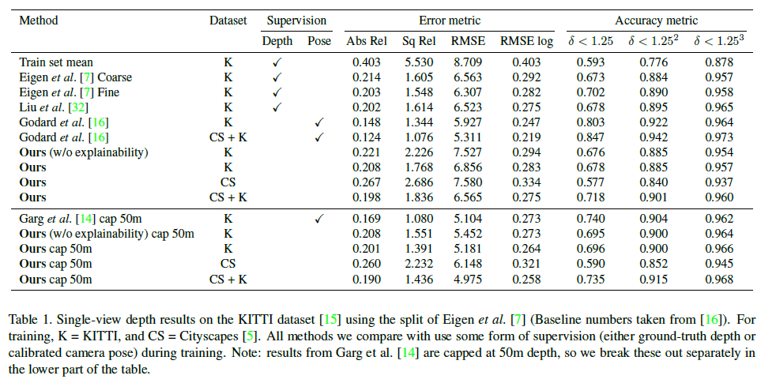

    
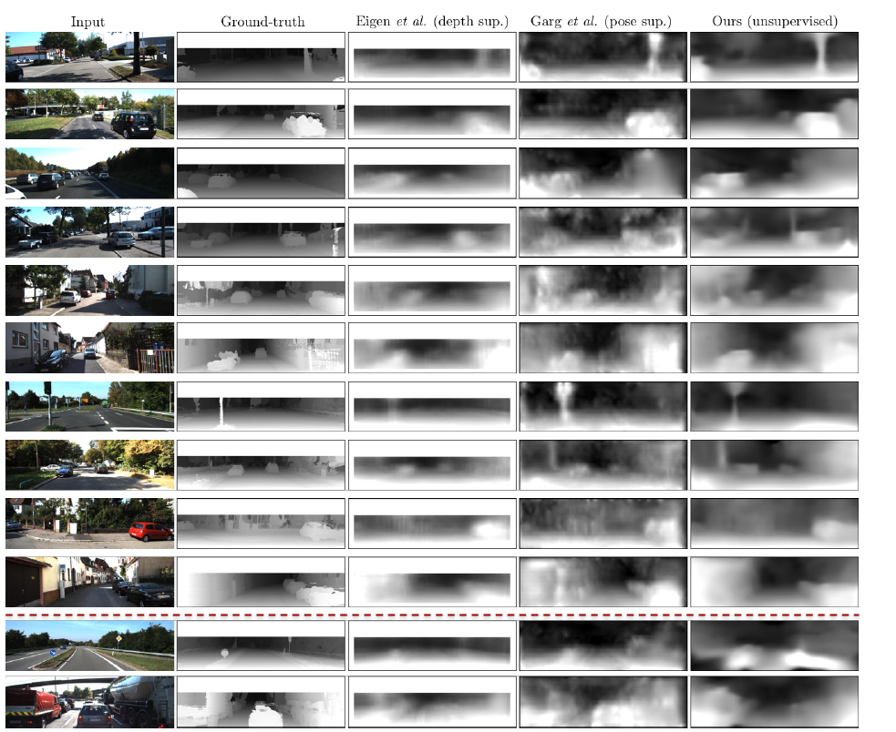

    相比发现本文方法可以保持深度边界和薄结构，如树木和街灯更好。

    
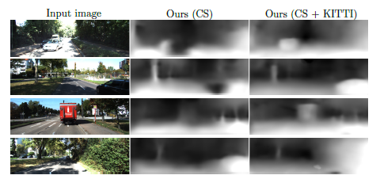

    在KITTI数据集上对仅在CS数据集训练的模型和CS+KITTI训练的模型进行比较，可以发现仅在CS的模型会经常产生结构性的错误，例如车身上的洞。随后直接将模型使用至在训练中没有出现的数据集Make3D中，可以发现与现有有监督学习的结果有一定的差距

    
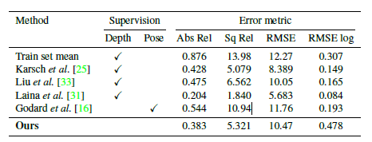

    但是本文方法能够将全局结构较好得恢复
    

    对于姿态预测网络，使用KITTI给出的11组由真实场景下IMU/GPS测量得到的数据，将输入图像序列设置成五帧，与两个变种的单目ORB-SLAM比较。结果由绝对轨迹错误`Absolute Trajectory Error(ATE)`度量。当车辆左右旋转大小更小时，方法所得到的效果更优，比ORB-SLAM(short)更优的原因可能是因为帧间运动的学习可以作为单目SLAM系统中局部估计模块的应用。ORB-SLAM(short)*没有丢失后的重定位以及以关键帧的全局BA为核心力量的回环检测*

    
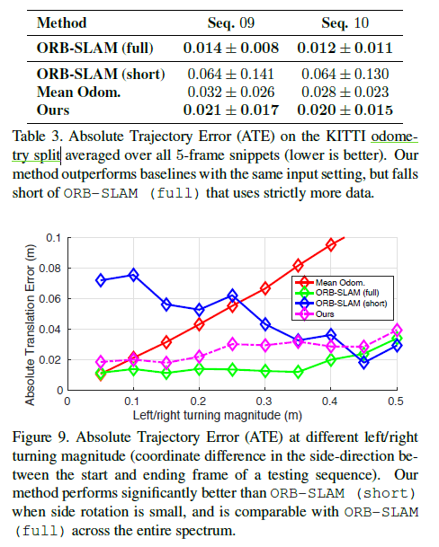

    explainability mask结果展示了，对运动物体，遮挡物体的预测，也体现了深度CNN对于细小结构的缺点。

    

***

### 
线性插值

* 单线性插值

  已知数据(x0,y0)与(x1,y1)，要在[x0,x1]区间内某一位置x在直线上的y值。则
  $$y=\frac{x_1-x}{x_1-x_0}y_0+\frac{x-x_0}{x_1-x_0}y_1$$
  双线性插值本质上就是在*两个方向*做线性插值

* 双线性插值

  核心思想是在**两个方向分别进行一次线性插值**。  
  假设需求点P=(x,y)，其周围四个点为$Q_{11}=(x_1,y_1),Q_{12}=(x_1,y_2),Q_{21}=(x_2,y_1),Q_{22}=(x_2,y_2)$
  首先在x方向上进行线性插值，则可以得到
  $$f(R_1)\approx\frac{x_2-x}{x_2-x_1}f(Q_{11})+\frac{x-x_1}{x_2-x_1}f(Q_{21}) \ \ R_1=(x,y_1)$$
  $$f(R_2)\approx\frac{x_2-x}{x_2-x_1}f(Q_{12})+\frac{x-x_1}{x_2-x_1}f(Q_{22}) \ \ R_2=(x,y_2)$$
  随后在y方向上进行线性插值，则可以得到
  $$f(P)\approx\frac{f(Q_{11})}{(x_2-x_1)(y_2-y_1)}(x_2-x)(y_2-y)+\frac{f(Q_{21})}{(x_2-x_1)(y_2-y_1)}(x-x_1)(y_2-y)$$

  综合可以得到双线性插值的结果
  $$f(x,y)\approx\frac{f(Q_{11})}{(x_2-x_1)(y_2-y_1)}(x_2-x)(y_2-y)+\frac{f(Q_{21})}{(x_2-x_1)(y_2-y_1)}(x-x_1)(y_2-y)$$
  $$+\frac{f(Q_{12})}{(x_2-x_1)(y_2-y_1)}(x_2-x)(y-y_1)+\frac{f(Q_{22})}{(x_2-x_1)(y_2-y_1)}(x-x_1)(y-y_1)$$
  > 由于图像坐标系以左上角为原点(0,0)，需要将源图像和目标图像做中心对齐，以达到更好的效果。  
    另外，在图像仿射变换中还有其他常见的插值方法如:最邻近插值，双三次插值，兰索思插值等

  在由源图像向目标图像变换时很容易出现非整数数值，所以由目标图像的整数坐标反向变换至源图像，得到f(i+u,j+v)`其中i、j为整数部分，u、v为小数部分`。则该点像素值可由(i,j)、(i+1,j)、(i,j+1)、(i+1,j+1)得到。
  $$f(i+u,j+v)=(1-u)(1-v)f(i,j)+(1-u)vf(i,j+1)+u(1-v)f(i+1,j)+uvf(i+1,j+1)$$

  > 如果直接进行四舍五入不仅会导致各个坐标点的值不准确，还会在梯度下降时造成困难。

***

### 
spatial transform network

> Spatial Transformer Networks 提出可以使模型具有空间不变性

  * 为了使模型对任务具有*尺度不变性、平移不变性、旋转不变性*。

  * STN可以作为一个单独的模块，输入不仅可以为一幅图像也可以是一个网络层输出的feature map。

  * 实现

      
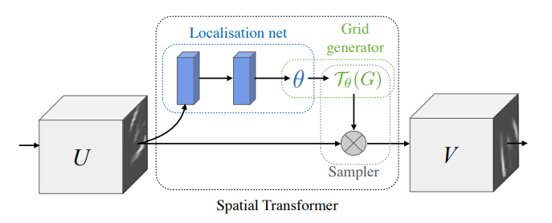

      + 一个localisation net，输入$U\in R^{H*W*C}$，输出 $\Theta={a,b,c,d,e,f}$ 在仿射变换中的变量,即旋转以及平移参数。

      + 随后数一个网格生成器，由目标图坐标为自变量，$\Theta$为参数得到输入图中的坐标点

      
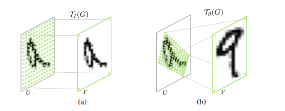

      + 最后进入一个采样器，对扭曲后的图像进行填充。

***

### 
lambertian反射

  **理想散射**，在一个固定的照明分布下从所有的视场方向上观测都具有相同的亮度，不吸收任何*入射光*，也可以成为**散光反射**。不管照明分布如何，lambertian表面在所有的表面方向上接受并散发所有的入射照明。

  $$surfacecolor \ = \ Emissive \ + \ Ambient \ + \ Diffuse \ + \ Specular$$
  $$最终表面 \ = \ 放射光 \ + \ 环境光 \ + \ 漫反射 \ + \ 镜面反射$$

***

### 
Bottleneck

  > Going Deeper with Convolutions 中google提出了第一个inception结构

  受NIN`MLPconv`的启发,为了减少每一层的特征过滤器的数目，从而减少运算量。使用了1*1的卷积块减少特征数量。一般被称为**瓶颈层**。*inception模块保证了网络深度和宽度增加的同时减少了参数*，增加了网络对尺度的适应性。

  随后谷歌团队还提出v1-v4版本的inception模块
  * v2  -  Batch Normalization: Accelerating Deep Network Training by Reducing Internal Covariate Shift

    **batch-normalized inception** 被引入

  * v3  -  Rethinking the Inception Architecture for Computer Vision

    平衡了深度和宽度，当深度增加时，在前往下一层之前**增加特征的结合**。只是用3\*3的卷积，5\*5和7\*7的卷积核能分成多个3*3的卷积核

  * v4

    将**inception模块**和**resnet模块**相结合

***

### 
L1、L2正则化以及L1、L2 loss

  * L1正则化可以使参数稀疏化，得到的参数是一个*稀疏矩阵*，可用于特征选择

  $$\Omega(\theta)=||w||_ 1=\sum_i|w_i|\tag{l1-norm}$$
  $$J=J_0+\lambda\sum_w|w|\tag{l1-loss}$$  

  即为原始损失加上正则化项, 并由 $\lambda$ 系数控制。根据公式可以得到L1正则的等值线是一个方形的，空间中J与等值线相交的点**大概率会交于顶点**即坐标轴上，因此 $w_i=0$的概率会很大，这也使得L1正则具有稀疏性。

  * L2正则化*非稀疏输出*，有解析解，抗扰动能力强。也被称作"权重衰减"，较L1而言更能防止过拟合。

  $$\Omega(\theta)=||w||_ 2^2=\sum_i|w_i|_ 2^2\tag{l2-norm}$$
  $$J=J_0+\lambda\sum_w|w|_ 2^2\tag{l2-loss}$$  

  同样可以画出L2正则的等值线，是一个更为光滑的圆形，J与等值线相交时 $w_i=0$的概率就会小了许多。

  * 正则对于偏导的影响

    L1相比L2，L1减少的是一个**常量**，L2减少的是**权重的固定比例**。  

    收敛速度取决于权重本身，权重大时L2会收敛更快。并且就计算效率上来讲L2能使计算更加高效。

  * L1、L2范数最为损失函数  

    + L1范数损失函数，**最小绝对值偏差(LAD),最小绝对值误差(LAE)**
    $$S=\sum^n_{i=1}|Y_i-f(x_i)|$$

    + L2范数损失函数，**最小平方误差(LSE)**
    $$S=\sum^n_{i=1}(Y_i-f(x_i))^2$$

    + | L2 | L1 |
      | :-: | :-: |
      | 不是非常鲁棒 | 鲁棒 |
      | 稳定解 | 不稳定解 |
      | 总是一个解 | 可能有多个解 |
