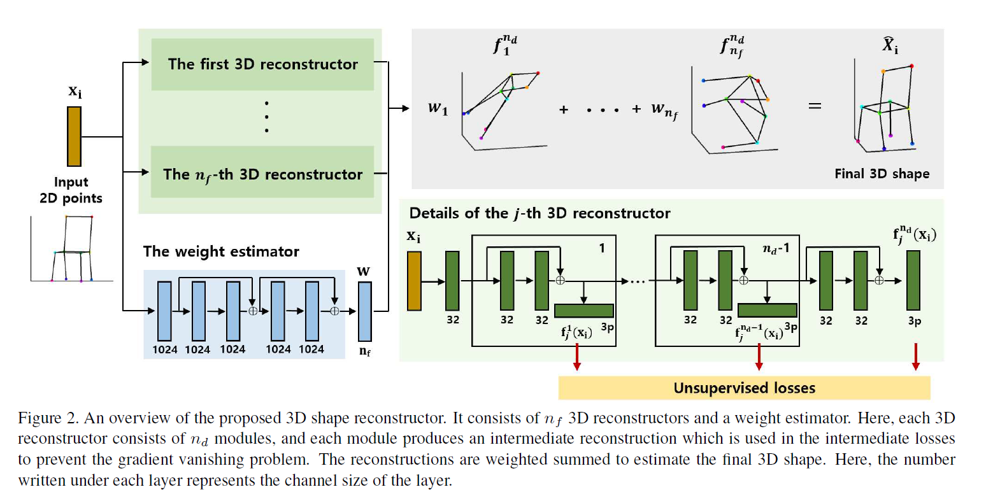
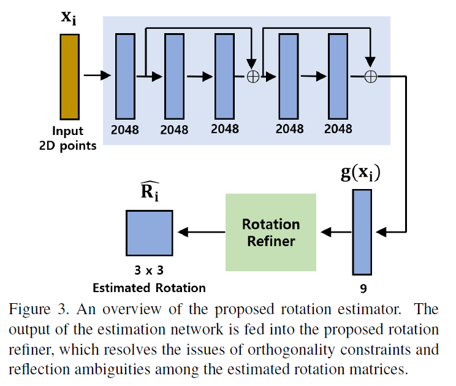

## Unsupervised_3D_Reconstruction_Networks
> 无监督三维重建网络
***

* 提出了一个无监督三维重建网络**3D-URN**

  通过正交相机模型下的2D特征点重建给定目标类别实例  

  包含一个3D形状重建模块和一个旋转估计模块，分别负责

  - 从2D特征点重建

    引入了多个3D重建模块，最终三维模型由多个三维重建加权得到，这个权重也由神经网络得到。

  - 估计相机位姿

    旋转需满足正交性约束，提出了一个rotation refiner分解输出的旋转估计使其正交，并且每一步都是可微的

* SFM和NRSFM

  重建二维特征轨迹标记至三维轨迹，处理刚体以及非刚体目标。NRSFM是一个病态问题，它提升了自由度。

  shape space model和trajectory space model表明非刚体的变形可以用低秩矩阵表示，但是大多数NRSFM需要一个平滑的运动轨迹输入

* SFC

  从一个特定类别中重建结构，不需要平滑的特征点预测。不像NRSFM仅局限于人脸和人的肢体。

* LOSS

  projection loss

  the low-rank prior loss

* 文章贡献

  - 提出了一个基于神经网络的框架来解决类别结构问题

  - 提出了一种新的旋转细化器，它是一种可微层，解决了旋转估计矩阵之间的正交约束和反射模糊问题

  - 该方案在流行的基准数据集上显示了最新的性能

***

* 相关工作

  - NRSFM(Non-srigid structure from motion)

    低维估计，局部刚体先验、稀疏预测

    但是在给定的类别中重建任意一个实体是困难的，所以关注于有限的类别对象，如人脸及人体

  - Structure from category

    在不假设平滑输入轨迹的情况下，重构一个对象类别的多个任意实例

    * 在现有的两种方法上利用了提出的对称约束
    * 提出了一种基于对偶低秩形状表示的公式，学习来自于一个概率线性区分分析的变种
    * 增广稀疏形状空间模型，重建刚性类别物体

    以上仅能处理刚体

    * 建立了基于子空间多个并集的物体变形模型、增强拉格朗日乘数法

***
* 网络

  

  - 参数、输入输出

    $x_i\in \mathbb{R^{2*p}}$ 为二维特征点(向量输入，网络中可能没有卷积操作)。$\hat{X_i}\in \mathbb{R^{3*p}}$ 为三维特征点，$\hat{R_i}\in \mathbb{R^{3*3}}$ 相机参数。

    最终的三维模型被处理为均值为0

  - 3D shape reconstructor
    > inspired by shape-space-based model

    单个重建模块可以被视为 $\hat{X_i}=f(x_i)$,但是由于重建过程是一个高度非线性的，所以一个模块显然是不够的，需要多个这样的模块,则 $\hat{X_i}=\displaystyle\sum_{j=1,\cdots,n_f}w_jf_j(x_i)$。

    二维特征点经过一个全连接层后输入$n_d$个级联模块,每个模块输出作为中间输出,并计算loss，以避免梯度消失问题。

    设计时考虑到两个问题
    * 权重与重建模块数维数不同的问题，避免出现模糊的合成，即不同的weight可能和惩处相似的最终结果。于是添加了对矩阵的**Frobenius Norm**操作
    * 当$n_d$较大时，可能出现梯度的消失，即提出了一个loss

  - weight estimator

    有六个FC层构成，经验得认为将网络输出的绝对值合并为权重可以提高性能

  - rotation estimator

    

    可以表示为 $\hat{R_i}=g(x_i)$,与weight estimator结构类似，但拥有不同的通道数量

    另外的需要满足：
    * 正交约束 $\hat{R_i}\hat{R_i^T}=I$
    * 估计旋转矩阵时的反射模糊

    提出了一个rotation refining模块，将9\*1的矩阵转换为3\*3，
    $$g(x_i)=U\Sigma V$$
    $$\tilde{R_i}\leftarrow UV^T$$
    $$\hat{R_i}\leftarrow U\begin{bmatrix}1&0&0\\0&1&0\\0&0&\tilde{R_i}\end{bmatrix}V^T$$
    > 现有深度学习框架中内置了对于SVD的反向传播

  - Loss

    projection loss和low-rank loss

    * 一些定义

      $S_j^k=[vec(f_j^k(x_1)),\cdots,vec(f_j^k(x_{n_b}))]^T$，其中k为第k个级联模块，j为第j个reconstructor模块，$n_b$为batch size

      $\hat{X_i^k}=\sum_{j=1,\cdots,n_f}w_jf_j^k(x_i)$

    * 投影损失

      $$L_{proj}=\frac{1}{pn_dn_b}\displaystyle\sum_{i\in B}\sum_{k=1,\cdots,n_d}||P\hat{R_i}\hat{X_i^k}-x_i||_ F^2$$

      其中使用Frobenius Norm，P为投影矩阵，B为一组batch。考虑到使用的正交相机模型，目标物体距离相机相比深度变化足够大，可以令

      $$P=\begin{bmatrix}1&0&0\\0&1&0\end{bmatrix}$$

    * low-rank prior loss

      $$L_{lr}=\frac{1}{n_dn_f}\sum_{k=1,\cdots,n_d}\sum_{j=1,\cdots,n_f}||S_j^k(S_j^k)^T||_ * $$

      其中使用nuclear norm。这一损失在NRsfm无监督方法中普遍使用，使用log(det())也可以替代nuclear norm，但经验上nuclear norm表现更优

    * total

      $$L_{total}=\lambda_1L_{proj}+\lambda_2L_{lr}+\lambda_3L_{reg}$$

      其中$L_{reg}=||w||_ F^2$,避免梯度消失问题。
